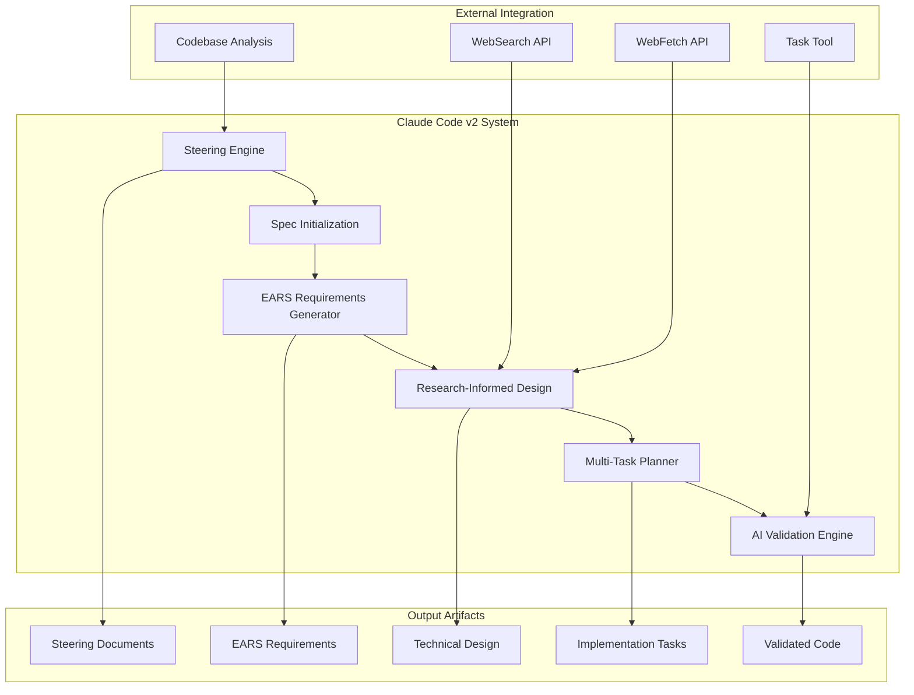
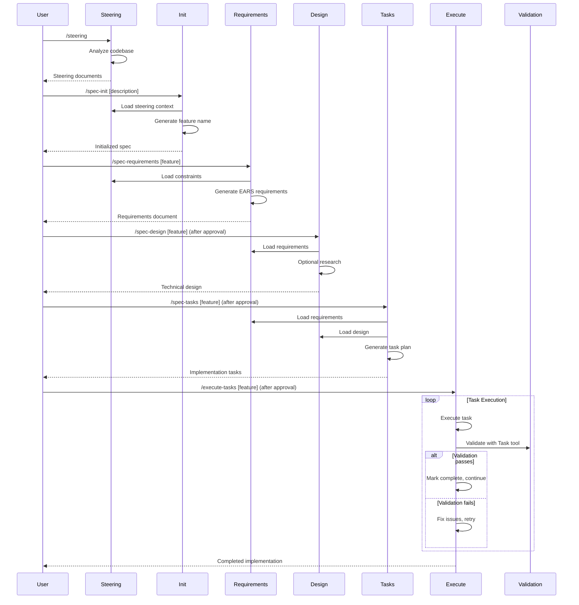

# Claude Code v2: Implementation Guide

A comprehensive guide for setting up and using the enhanced spec-driven development system with EARS methodology, research integration, and multi-task execution.

## Table of Contents

1. [Installation and Setup](#installation-and-setup)
2. [System Architecture](#system-architecture)
3. [Workflow Configuration](#workflow-configuration)
4. [Command Deep Dive](#command-deep-dive)
5. [Advanced Configuration](#advanced-configuration)
6. [Troubleshooting](#troubleshooting)
7. [Migration Guide](#migration-guide)
8. [Best Practices](#best-practices)

## Installation and Setup

### Prerequisites

- **Claude Code CLI**: Latest version installed and configured
- **Project Structure**: Valid project directory with code files
- **Development Environment**: Access to project dependencies and tools
- **Understanding**: Basic familiarity with spec-driven development concepts

### System Requirements

- **Operating System**: Windows, macOS, or Linux
- **Node.js**: Version 16+ (for JavaScript/TypeScript projects)
- **Python**: Version 3.8+ (for Python projects)
- **Git**: For version control and change tracking
- **Text Editor**: VS Code, vim, or any editor for reviewing generated files

### Installation Steps

#### Step 1: Backup Existing Configuration

```bash
# If you have existing .claude configuration
cp -r .claude .claude-v1-backup
```

#### Step 2: Install Claude Code v2

```bash
# Option A: Copy from source
cp -r /path/to/claude-code-spec/.claude-v2/* .claude/

# Option B: Download and extract
# [Download instructions based on distribution method]
```

#### Step 3: Verify Installation

```bash
# Check command structure
ls .claude/commands/kiro/
# Expected output:
# execute-tasks.md
# spec-design.md
# spec-init.md
# spec-requirements.md
# spec-status.md
# spec-tasks.md
# steering.md
```

#### Step 4: Test Basic Functionality

```bash
# Test steering command
/steering

# Check if it creates steering directory
ls .kiro/steering/
```

### Directory Structure After Installation

```
project-root/
├── .claude/
│   └── commands/
│       └── kiro/
│           ├── execute-tasks.md      # Multi-task execution engine
│           ├── spec-design.md        # Research-informed design generation
│           ├── spec-init.md          # Enhanced project initialization
│           ├── spec-requirements.md  # EARS methodology requirements
│           ├── spec-status.md        # Progress tracking and status
│           ├── spec-tasks.md         # Multi-task implementation planning
│           └── steering.md           # Codebase analysis and steering
├── .kiro/
│   ├── steering/                     # Project context documents
│   │   ├── product.md
│   │   ├── tech.md
│   │   └── structure.md
│   └── specs/                        # Active specifications
│       └── [feature-name]/
│           ├── spec.json             # Metadata and approvals
│           ├── requirements.md       # EARS-format requirements
│           ├── design.md             # Research-informed design
│           └── tasks.md              # Multi-task implementation plan
└── [your project files]
```

## System Architecture

### Component Overview



### Core Components

#### 1. Steering Engine (`steering.md`)

- **Purpose**: Analyze and document project context
- **Capabilities**: Codebase pattern detection, technology stack analysis
- **Output**: Product, technical, and structural steering documents

#### 2. Specification Initialization (`spec-init.md`)

- **Purpose**: Create new specifications with intelligent analysis
- **Capabilities**: Feature name generation, complexity assessment, codebase integration
- **Output**: Initialized spec structure with contextual templates

#### 3. EARS Requirements Generator (`spec-requirements.md`)

- **Purpose**: Generate structured, testable requirements
- **Capabilities**: EARS methodology, optional research, validation
- **Output**: WHEN/THEN/IF formatted requirements with acceptance criteria

#### 4. Research-Informed Design (`spec-design.md`)

- **Purpose**: Create technical designs with research backing
- **Capabilities**: WebSearch/WebFetch integration, citation management
- **Output**: Comprehensive technical design with research citations

#### 5. Multi-Task Planner (`spec-tasks.md`)

- **Purpose**: Generate implementation plans with requirement traceability
- **Capabilities**: Hierarchical task structure, EARS mapping, parallel execution support
- **Output**: Detailed implementation plan with validation framework

#### 6. AI Validation Engine (`execute-tasks.md`)

- **Purpose**: Execute tasks with self-correcting validation loops
- **Capabilities**: Task tool integration, error resolution, progress tracking
- **Output**: Validated, requirement-compliant implementations

### Data Flow Architecture



## Workflow Configuration

### Standard Workflow Setup

#### Phase 1: Project Context (Optional but Recommended)

```bash
# Generate or update steering documents
/steering

# Expected output:
# ✅ Steering documents created/updated:
# - .kiro/steering/product.md
# - .kiro/steering/tech.md  
# - .kiro/steering/structure.md
```

#### Phase 2: Specification Initialization

```bash
# Initialize new specification
/spec-init Create a real-time notification system with WebSocket connections and push notifications

# Expected output:
# 📝 Feature Name Generated: notification-system
# 🎯 Complexity Assessment: Medium (3-5 components)
# 📁 Created: .kiro/specs/notification-system/
# ✅ Ready for requirements generation
```

#### Phase 3: Requirements Generation

```bash
# Generate EARS-format requirements
/spec-requirements notification-system

# Expected output:
# ✅ EARS requirements generated
# 📋 Requirements: 8 WHEN/THEN statements
# 🔍 Validation: EARS format compliance verified
# ⏳ Status: Awaiting human review and approval
```

#### Phase 4: Human Review and Approval

```bash
# Review generated requirements
cat .kiro/specs/notification-system/requirements.md

# Edit if needed
nano .kiro/specs/notification-system/requirements.md

# Approve by updating spec.json
# Update: "requirements": {"approved": true}
```

#### Phase 5: Design Generation

```bash
# Generate research-informed design (after requirements approval)
/spec-design notification-system

# Expected output:
# 🔬 Research conducted: WebSocket best practices
# 🏗️ Technical design generated
# 📊 Architecture diagrams included
# ⏳ Status: Awaiting human review and approval
```

#### Phase 6: Task Generation

```bash
# Generate multi-task implementation plan (after design approval)
/spec-tasks notification-system

# Expected output:
# 📝 Implementation plan generated
# 🎯 EARS requirement traceability: 100%
# ⚡ Multi-task execution ready
# ⏳ Status: Awaiting human review and approval
```

#### Phase 7: Implementation Execution

```bash
# Execute multi-task implementation (after tasks approval)
/execute-tasks notification-system

# Expected output:
# 🚀 Multi-task execution started
# 📊 Progress: 1/12 tasks (8%)
# ✅ Task 1.1.1: Setup completed and validated
# 🔄 Executing task 1.1.2...
```

### Workflow Customization

#### Research Integration Configuration

Control when research is triggered:

```markdown
# In spec-design.md, research triggers for:
- Complex architectural decisions
- Unfamiliar technology integration
- Performance-critical implementations
- Security-sensitive features
- External API integrations
```

#### Validation Criteria Customization

Modify validation requirements in `execute-tasks.md`:

```markdown
# Custom validation criteria:
1. Code Correctness: Compilation and runtime validation
2. Requirement Fulfillment: EARS requirement satisfaction
3. Integration Quality: Codebase compatibility
4. Testing Coverage: Minimum 80% coverage for new code
5. Security Standards: No hardcoded secrets or vulnerabilities
6. Performance Standards: Response time requirements met
```

#### Multi-Task Execution Modes

Configure execution behavior:

- **Single Task Mode**: Execute one task, validate, prompt for next
- **Sequential Mode**: Execute multiple tasks in sequence (default)
- **Parallel Mode**: Independent tasks simultaneously (advanced)

## Command Deep Dive

### `/steering` - Enhanced Steering Management

#### Purpose

Analyze project codebase and create/update steering documents that provide context for all subsequent specifications.

#### When to Use

- **New projects**: Establish initial project context
- **Existing projects**: Document current state and patterns
- **After major changes**: Refresh outdated steering information
- **Before complex features**: Ensure current context for decision-making

#### Detailed Process

1. **Codebase Analysis**: Scans project structure, dependencies, patterns
2. **Technology Detection**: Identifies frameworks, libraries, conventions
3. **Pattern Recognition**: Discovers architectural and coding patterns
4. **Context Generation**: Creates comprehensive project documentation

#### Output Analysis

```bash
# Check generated steering quality
ls -la .kiro/steering/
wc -l .kiro/steering/*.md  # Line count for completeness
grep -c "framework\|pattern\|convention" .kiro/steering/tech.md
```

### `/spec-init [description]` - Enhanced Initialization

#### Purpose

Initialize new specifications with intelligent project analysis and feature name generation.

#### Input Processing

- **Natural Language Analysis**: Extracts key entities and relationships
- **Complexity Assessment**: Determines scope and technical requirements
- **Context Integration**: Aligns with existing project patterns

#### Feature Name Generation Algorithm

1. Extract core functionality from description
2. Apply project naming conventions
3. Ensure uniqueness and clarity
4. Generate 2-4 word descriptive name

#### Metadata Structure

```json
{
  "feature_name": "notification-system",
  "complexity_assessment": {
    "level": "medium",
    "estimated_components": 4,
    "integration_points": ["websocket", "push-service"],
    "technical_challenges": ["real-time", "scalability"]
  },
  "codebase_context": {
    "technology_stack": "react-node-express",
    "architecture_patterns": ["component-based", "api-rest"],
    "testing_framework": "jest-react-testing-library"
  }
}
```

### `/spec-requirements [feature-name]` - EARS Requirements

#### EARS Methodology Implementation

Converts natural language descriptions to structured requirements:

#### Conversion Examples

```markdown
# Input Description:
"Users should be able to receive notifications in real-time"

# EARS Conversion:
WHEN user is online AND notification is triggered for that user
THEN system sends notification via WebSocket connection within 500ms

GIVEN user is offline 
WHEN notification is triggered
THEN system queues notification for delivery when user comes online

IF WebSocket connection fails
THEN system falls back to HTTP polling with 30-second intervals
```

#### Validation Process

1. **Format Validation**: Ensures WHEN/THEN/IF structure
2. **Completeness Check**: Covers normal, error, and edge cases
3. **Testability Verification**: Requirements can be directly tested
4. **Context Integration**: Aligns with project constraints

#### Research Integration

Research is triggered for:

- Complex business domains requiring industry context
- Technical approaches needing validation
- Integration with external standards
- Performance or security critical features

### `/spec-design [feature-name]` - Research-Informed Design

#### Research Process

1. **Need Assessment**: Identify areas requiring research
2. **Source Selection**: Choose authoritative sources
3. **Information Extraction**: Gather relevant technical details
4. **Integration**: Connect research to design decisions

#### Design Generation

- **Architecture Alignment**: Consistent with existing patterns
- **Technology Selection**: Research-informed choices
- **Component Design**: Clear interfaces and responsibilities
- **Integration Strategy**: Seamless codebase integration

#### Mermaid Diagram Generation

Automatically generates:

- System architecture diagrams
- Component interaction flows
- Data flow sequences
- API endpoint structures

### `/spec-tasks [feature-name]` - Multi-Task Planning

#### Task Structure Generation

```markdown
# Hierarchical Organization:
1. Setup and Infrastructure (Phase 1)
   1.1 Environment Configuration
       1.1.1 WebSocket server setup
       1.1.2 Client-side connection handling
   1.2 Database Integration
       1.2.1 Notification schema design
       1.2.2 User preference storage

2. Core Implementation (Phase 2)
   2.1 Real-time Engine
       2.1.1 WebSocket event handling
       2.1.2 Connection management
   2.2 Notification Service
       2.2.1 Push notification integration
       2.2.2 Fallback mechanisms
```

#### EARS Requirement Traceability

Each task includes:

- **EARS Mapping**: References specific requirements
- **Acceptance Criteria**: Clear success conditions
- **Validation Points**: How to verify completion
- **Time Estimates**: Planning information

#### Dependency Analysis

- **Sequential Dependencies**: Tasks that must complete before others
- **Parallel Opportunities**: Tasks that can run simultaneously
- **Critical Path**: Blocking tasks that affect timeline

### `/execute-tasks [feature-name]` - Multi-Task Execution

#### Pre-Execution Validation

```bash
# Checks performed before execution:
- ready_for_implementation: true
- tasks.approved: true
- Valid tasks.md structure
- All dependencies available
```

#### Task Execution Loop

1. **Task Selection**: Choose next pending task based on dependencies
2. **Context Loading**: Load requirements, design, current codebase state
3. **Implementation**: Execute task according to specifications
4. **Progress Update**: Mark task as completed in tasks.md
5. **AI Validation**: Use Task tool for independent quality assessment
6. **Resolution**: Address any validation failures with self-correction

#### Validation Framework

```markdown
# Task Tool Validation Prompt:
Review completed task: [TASK_DESCRIPTION]

Validation Criteria:
1. Code Correctness: Compiles and runs without errors
2. Requirement Fulfillment: Satisfies mapped EARS requirements
3. Integration Quality: Compatible with existing codebase
4. Testing Coverage: Appropriate tests included/updated
5. Code Quality: Follows project conventions

EARS Requirements: [SPECIFIC_REQUIREMENTS]
Acceptance Criteria: [TASK_CRITERIA]

Response Format:
VALIDATION_RESULT: [PASS/FAIL]
DETAILED_FEEDBACK: [Specific analysis]
CRITICAL_ISSUES: [Blocking problems]
IMPROVEMENT_SUGGESTIONS: [Optional enhancements]
```

#### Self-Correcting Process

When validation fails:

1. **Issue Analysis**: Parse specific problems from Task tool feedback
2. **Fix Implementation**: Address each identified issue
3. **Re-validation**: Test fixes with same validation criteria
4. **Iteration Control**: Maximum 3 attempts before manual intervention
5. **Escalation**: Complex issues require human decision-making

### `/spec-status [feature-name]` - Progress Monitoring

#### Comprehensive Status Display

- **Phase Progress**: Requirements, Design, Tasks completion percentages
- **Approval Status**: Current approval states for each phase
- **EARS Compliance**: Requirement structure quality metrics
- **Task Execution**: Implementation progress and validation status
- **Quality Metrics**: Overall specification quality assessment

#### Visual Progress Indicators

```
🎯 Overall Progress: 75%
🟢 Near completion

📊 Task Execution Progress: 8/10 tasks (80%)
✅ EARS compliance: 15 requirements
🔍 Validation status: All passed
```

## Advanced Configuration

### Custom Validation Rules

#### Project-Specific Validation

Extend validation criteria in `execute-tasks.md`:

```markdown
# Custom validation for this project:
project_validation:
  security:
    - No hardcoded credentials
    - Input sanitization implemented
    - HTTPS enforced for all endpoints
  performance:
    - Database queries optimized
    - Response times under 200ms
    - Caching implemented where appropriate
  accessibility:
    - ARIA labels present
    - Keyboard navigation supported
    - Color contrast ratios met
```

#### Framework-Specific Rules

Customize for your technology stack:

```markdown
# React-specific validation:
react_validation:
  - Components use TypeScript
  - PropTypes or TypeScript interfaces defined
  - React hooks used correctly
  - No inline styles (use styled-components/CSS modules)

# Python-specific validation:
python_validation:
  - Type hints provided for all functions
  - Docstrings follow Google/NumPy style
  - Code passes mypy type checking
  - No unused imports
```

### Research Configuration

#### Research Source Priorities

Configure research source preferences:

```markdown
research_sources:
  primary:
    - Official documentation
    - Authoritative technical blogs
    - Academic papers
    - Industry standards (W3C, RFC)
  secondary:
    - Stack Overflow (high-voted answers)
    - GitHub repositories (popular/well-maintained)
    - Technical tutorials (verified authors)
  avoid:
    - Personal blogs without verification
    - Outdated documentation
    - Forums without moderation
```

#### Research Triggers

Fine-tune when research is conducted:

```markdown
research_triggers:
  always:
    - Security implementations
    - Performance-critical features
    - External API integrations
  conditional:
    - Complex algorithms (if not well-understood)
    - New technology adoption (if team unfamiliar)
    - Architectural patterns (if significant change)
  never:
    - Simple CRUD operations
    - Basic UI components
    - Well-established internal patterns
```

### Multi-Task Execution Settings

#### Execution Modes

Configure task execution behavior:

```markdown
execution_config:
  mode: "sequential"              # sequential, parallel, hybrid
  validation_attempts: 3          # max validation retries
  progress_updates: "real_time"   # real_time, task_completion, phase_completion
  error_handling: "fix_and_retry" # fix_and_retry, escalate_immediately, skip_and_continue
  parallel_limit: 3               # max concurrent tasks (parallel mode)
```

#### Task Grouping Strategy

Optimize task execution order:

```markdown
task_grouping:
  setup_phase:
    - Environment configuration
    - Dependency installation
    - Initial file structure
  development_phase:
    - Core functionality
    - API endpoints
    - UI components
  integration_phase:
    - Service integration
    - End-to-end workflows
    - Error handling
  validation_phase:
    - Unit tests
    - Integration tests
    - Performance testing
```

### Quality Metrics Configuration

#### Custom Quality Scoring

Define project-specific quality criteria:

```markdown
quality_metrics:
  weights:
    ears_compliance: 25%      # Requirement structure quality
    research_integration: 15% # Evidence-based design
    task_completion: 30%      # Implementation progress
    validation_success: 20%   # Code quality validation
    documentation: 10%        # Code and user documentation
  
  thresholds:
    excellent: 90%
    good: 75%
    acceptable: 60%
    needs_improvement: < 60%
```

## Troubleshooting

### Common Issues and Solutions

#### Issue: "Specification directory not found"

```bash
# Diagnosis
ls .kiro/specs/[feature-name]/

# Solution
/spec-init [description]  # Re-initialize if needed
```

#### Issue: "Requirements not approved"

```bash
# Diagnosis
/spec-status [feature-name]
# Check: approvals.requirements.approved: false

# Solution
# 1. Review requirements.md
cat .kiro/specs/[feature-name]/requirements.md

# 2. Edit if needed
nano .kiro/specs/[feature-name]/requirements.md

# 3. Approve in spec.json
# Update: "requirements": {"approved": true}
```

#### Issue: "EARS format validation failed"

```bash
# Diagnosis
grep -c "WHEN.*THEN\|GIVEN.*WHEN.*THEN\|IF.*THEN" .kiro/specs/[feature-name]/requirements.md

# Solution - Convert user stories to EARS format:
# Before: "As a user, I want to search products"
# After: "WHEN user enters search term THEN system displays results"
```

#### Issue: "Task validation fails repeatedly"

```bash
# Diagnosis
# Check validation feedback in console output
# Common issues:
# - Missing test coverage
# - Code compilation errors
# - Requirements not fulfilled
# - Integration problems

# Solutions
# 1. Address specific validation feedback
# 2. Check code syntax and dependencies
# 3. Verify EARS requirement satisfaction
# 4. Test integration with existing code
# 5. Add/update tests as needed
```

#### Issue: "Multi-task execution stops unexpectedly"

```bash
# Diagnosis
/spec-status [feature-name]
# Check prerequisites:
# - ready_for_implementation: true
# - approvals.tasks.approved: true
# - Valid tasks.md structure

# Solution
# 1. Complete all approval phases
# 2. Verify tasks.md format
# 3. Check for parsing errors in task structure
```

#### Issue: "Research integration not working"

```bash
# Diagnosis
# Check network connectivity
# Verify WebSearch/WebFetch availability

# Solution
# 1. Ensure internet connection
# 2. Check Claude Code tool availability
# 3. Research is optional - proceed without if needed
# 4. Add research manually if automated research fails
```

### Debugging Commands

#### Status Verification

```bash
# Comprehensive status check
/spec-status [feature-name]

# File structure verification
find .kiro -name "*.md" -o -name "*.json" | sort

# Approval status check
jq '.approvals' .kiro/specs/[feature-name]/spec.json
```

#### Progress Analysis

```bash
# Task completion analysis
grep -c "^- \[x\]" .kiro/specs/[feature-name]/tasks.md  # Completed
grep -c "^- \[ \]" .kiro/specs/[feature-name]/tasks.md  # Pending

# EARS compliance check
grep -c "WHEN.*THEN\|GIVEN.*WHEN.*THEN\|IF.*THEN" .kiro/specs/[feature-name]/requirements.md
```

#### Log Analysis

```bash
# Check recent changes
git log --oneline -10

# Validate JSON structure
jq empty .kiro/specs/[feature-name]/spec.json && echo "Valid JSON" || echo "Invalid JSON"
```

### Performance Optimization

#### Large Project Optimization

```bash
# Optimize for large codebases:
# 1. Use .gitignore patterns in codebase analysis
# 2. Limit directory depth in pattern detection
# 3. Focus steering on core modules only
# 4. Break large features into smaller specs
```

#### Memory Usage Optimization

```bash
# For resource-constrained environments:
# 1. Reduce research frequency
# 2. Limit parallel task execution
# 3. Use incremental validation
# 4. Process tasks in smaller batches
```

## Migration Guide

### Migrating from Claude Code v1

#### Pre-Migration Assessment

```bash
# Backup existing configuration
cp -r .claude .claude-v1-backup

# Inventory existing specs
find .kiro -name "spec.json" | wc -l
find .kiro -name "requirements.md" | wc -l
```

#### Migration Process

##### Step 1: Install Claude Code v2

```bash
# Install new commands (backup first)
cp -r .claude-v2/* .claude/
```

##### Step 2: Convert Existing Specifications

```bash
# For each existing spec:
# 1. Review requirements.md
# 2. Convert user stories to EARS format
# 3. Update spec.json with new metadata structure
# 4. Re-approve with new workflow
```

##### Step 3: Update Steering Documents

```bash
# Regenerate steering with enhanced analysis
/steering

# Review and merge with any custom content
```

##### Step 4: Validate Migration

```bash
# Test each migrated spec
/spec-status [feature-name]

# Ensure all phases work correctly
/spec-requirements [feature-name]  # Should work with existing structure
```

#### Migration Checklist

- [ ] Existing .claude configuration backed up
- [ ] Claude Code v2 commands installed
- [ ] Existing specifications inventoried
- [ ] Requirements converted to EARS format
- [ ] spec.json metadata updated
- [ ] Steering documents regenerated
- [ ] Migration validated with test specification
- [ ] Team trained on new workflow

### Converting User Stories to EARS

#### Conversion Examples

##### Basic User Story Conversion

```markdown
# Before (User Story):
"As a user, I want to login so I can access my account"

# After (EARS):
WHEN user enters valid username AND password AND clicks login button
THEN system authenticates user and redirects to dashboard

GIVEN user enters invalid credentials
WHEN user clicks login button
THEN system displays error message "Invalid credentials" and remains on login page

IF user fails authentication 3 times within 15 minutes
THEN system temporarily locks account for 30 minutes
```

##### Complex Feature Conversion

```markdown
# Before (Feature Description):
"Users should be able to search for products and see results with filtering"

# After (EARS Requirements):
WHEN user enters search term in search box AND clicks search button
THEN system displays products matching search term within 2 seconds

GIVEN user applies price filter
WHEN search is performed
THEN system displays only products within selected price range

WHEN user selects category filter
THEN system updates results to show only products in selected category

IF no products match search criteria
THEN system displays "No results found" message with suggested alternatives

IF search term contains special characters
THEN system sanitizes input and performs safe search
```

#### Conversion Guidelines

1. **Identify trigger conditions** → WHEN clauses
2. **Define expected outcomes** → THEN clauses
3. **Consider error scenarios** → IF/THEN clauses
4. **Add context where needed** → GIVEN clauses
5. **Make conditions specific** → Avoid vague terms
6. **Ensure testability** → Each requirement can be verified

## Best Practices

### Project Setup Best Practices

#### Initial Project Setup

1. **Start with steering** for established projects
2. **Understand existing patterns** before creating new specs
3. **Align with team conventions** in naming and structure
4. **Document assumptions** in steering documents
5. **Establish quality standards** early in the process

#### Specification Planning

1. **Break large features** into manageable specifications
2. **Start with core functionality** before advanced features
3. **Consider dependencies** between different specifications
4. **Plan for integration** with existing systems
5. **Document external constraints** that affect implementation

### EARS Requirements Best Practices

#### Writing Effective EARS Requirements

1. **Use specific conditions**: Avoid vague terms like "user-friendly"
2. **Include timing requirements**: Response times, timeout values
3. **Cover error scenarios**: What happens when things go wrong
4. **Consider edge cases**: Boundary conditions and unusual inputs
5. **Make requirements testable**: Each requirement can be directly verified

#### EARS Quality Checklist

- [ ] All functional requirements use WHEN/THEN structure
- [ ] Exception handling uses IF/THEN structure
- [ ] Complex scenarios use GIVEN/WHEN/THEN structure
- [ ] Requirements are specific and measurable
- [ ] Error conditions are comprehensively covered
- [ ] Requirements can be directly mapped to test cases

### Research Integration Best Practices

#### When to Conduct Research

1. **Complex architectural decisions** requiring industry validation
2. **New technology adoption** unfamiliar to the team
3. **Security implementations** requiring compliance standards
4. **Performance-critical features** needing proven approaches
5. **External integrations** requiring API understanding

#### Research Quality Standards

1. **Use authoritative sources**: Official documentation, standards, academic papers
2. **Cite sources properly**: Include URLs and publication dates
3. **Summarize key findings**: Don't copy large text blocks
4. **Connect to decisions**: Explain how research influences design
5. **Update periodically**: Refresh research for evolving technologies

### Multi-Task Execution Best Practices

#### Task Planning

1. **Right-size tasks**: 2-4 hours per task for focused work
2. **Ensure testability**: Each task has clear acceptance criteria
3. **Map to requirements**: Explicit EARS requirement traceability
4. **Consider dependencies**: Order tasks logically
5. **Plan for validation**: Include testing in task structure

#### Execution Management

1. **Monitor validation feedback**: Learn from AI validation insights
2. **Address issues promptly**: Don't accumulate validation failures
3. **Escalate appropriately**: Seek human help for complex decisions
4. **Track progress actively**: Use status monitoring throughout
5. **Maintain quality focus**: Don't skip validation for speed

### Quality Assurance Best Practices

#### Continuous Quality Monitoring

1. **Validate incrementally**: Don't batch multiple tasks before validation
2. **Maintain EARS traceability**: Every implementation maps to requirements
3. **Follow project conventions**: Maintain consistency with existing code
4. **Document thoroughly**: Keep code documentation current
5. **Test comprehensively**: Include unit, integration, and E2E testing

#### Quality Metrics Tracking

1. **Monitor EARS compliance**: Track requirement structure quality
2. **Assess research integration**: Evaluate evidence-based design quality
3. **Track validation success**: Monitor implementation quality trends
4. **Measure completion efficiency**: Time and effort tracking
5. **Review and improve**: Use metrics to enhance workflow

### Team Collaboration Best Practices

#### Team Onboarding

1. **Train on EARS methodology**: Ensure understanding of requirement structure
2. **Demonstrate research integration**: Show when and how to use research
3. **Practice multi-task execution**: Familiarize with validation loops
4. **Establish review standards**: Define approval criteria and processes
5. **Share best practices**: Document successful patterns and anti-patterns

#### Collaborative Workflows

1. **Standardize approval processes**: Clear criteria and responsibilities
2. **Share steering documents**: Common understanding of project context
3. **Review specifications together**: Collaborative requirement validation
4. **Coordinate implementation**: Avoid conflicts in multi-developer scenarios
5. **Learn from validation**: Share insights from AI validation feedback

Claude Code v2 provides a sophisticated, research-driven approach to spec-driven development that combines the best of human oversight with AI-powered automation. This implementation guide should help you get the most out of the enhanced capabilities while maintaining high quality standards throughout your development process.
