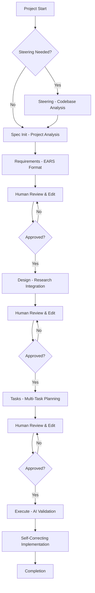

# Claude Code v2: Enhanced Spec-Driven Development

A sophisticated, research-driven approach to software development using enhanced Claude Code capabilities with EARS methodology, optional research integration, and self-correcting multi-task execution.

## Overview

Claude Code v2 represents a significant evolution of spec-driven development, incorporating advanced methodologies and automation capabilities that exceed the original Kiro system while preserving the benefits of the Claude Code v1 adaptation.

### Key Enhancements

- **🎯 EARS Methodology**: Structured, testable requirements using WHEN/THEN format
- **🔬 Optional Research Integration**: AI-powered research when beneficial for complex features
- **⚡ Multi-Task Execution**: Self-correcting implementation with validation loops
- **🤖 AI Validation**: Task tool integration for independent quality assurance
- **📊 Enhanced Progress Tracking**: Visual indicators and comprehensive status monitoring
- **🧠 Codebase Intelligence**: Smart integration with existing project patterns
- **🔄 Self-Correcting Loops**: Automatic issue resolution with validation feedback

## Quick Start

### Prerequisites

- Claude Code CLI installed and configured
- Project directory with `.claude/` configuration
- Basic understanding of spec-driven development principles

### Installation

1. Copy the `.claude-v2/` directory to your project root as `.claude/` (backup existing if needed)
2. Verify installation:

   ```bash
   ls .claude/commands/kiro/
   # Should show: execute-tasks.md, spec-*.md, steering.md
   ```

### Your First Enhanced Specification

1. **Initialize steering (recommended)**:

   ```bash
   /steering
   ```

2. **Create your first spec**:

   ```bash
   /spec-init Create a user authentication system with JWT tokens and role-based access control
   ```

3. **Follow the enhanced workflow**:

   ```bash
   /spec-requirements [feature-name]  # Generate EARS requirements
   # Review and approve in spec.json
   /spec-design [feature-name]        # Generate research-informed design
   # Review and approve in spec.json  
   /spec-tasks [feature-name]         # Generate multi-task implementation plan
   # Review and approve in spec.json
   /execute-tasks [feature-name]      # Multi-task execution with AI validation
   ```

## Enhanced 5-Phase Workflow



## Core Features

### 1. EARS Methodology Integration

**EARS (Easy Approach to Requirements Syntax)** provides structured, testable requirements:

#### EARS Format Examples

```markdown
# Traditional User Story (AVOID):
"As a user, I want to login so I can access my account"

# EARS Format (USE):
WHEN user enters valid credentials AND clicks login button 
THEN system authenticates user and redirects to dashboard

GIVEN user has invalid credentials 
WHEN user attempts login 
THEN system displays error message and remains on login page

IF user fails authentication 3 times 
THEN system temporarily locks account for 15 minutes
```

#### Benefits of EARS

- **Testable**: Direct mapping to test cases
- **Specific**: Clear conditions and outcomes
- **Complete**: Covers normal, error, and edge cases
- **Traceable**: Links design and implementation to requirements

### 2. Optional Research Integration

Research is conducted when beneficial for complex features:

#### When Research Helps

- Complex business requirements needing industry context
- Technical approaches requiring best practice validation
- Integration with external systems or standards
- Performance, security, or compliance-critical features

#### Research Process

```bash
# Automatic research integration in design phase
/spec-design feature-name
# System identifies research needs
# Uses WebSearch/WebFetch for technical information
# Integrates findings with source citations
# Informs design decisions with research evidence
```

#### Research Documentation

```markdown
## Research-Driven Design Decisions

### Technology Selection Research
- **[React Query](https://react-query.tanstack.com/)** - State management for API data
  - **Pros**: Automatic caching, background updates, optimistic updates
  - **Cons**: Learning curve, additional dependency
  - **EARS Requirements Alignment**: Supports WHEN user actions THEN immediate feedback

### Architecture Pattern Research  
- **[Hexagonal Architecture](https://alistair.cockburn.us/hexagonal-architecture/)** - Clean separation of concerns
  - **Implementation**: Core business logic isolated from external dependencies
  - **Scalability**: Easy to test and modify individual components
  - **EARS Requirements Support**: Clear handling of WHEN/THEN business logic
```

### 3. Multi-Task Execution with AI Validation

Revolutionary self-correcting implementation system:

#### Multi-Task Execution Flow

```markdown
1. Parse tasks.md for pending tasks
2. Execute multiple tasks automatically in sequence
3. After each task completion:
   - Update progress in tasks.md
   - Use Task tool for independent validation
4. If validation passes: Continue to next task
5. If validation fails: Address issues, re-validate
6. Repeat until all tasks complete or manual intervention needed
```

#### AI Validation Integration

```markdown
# Task tool validation prompt:
"Review completed task: [task description]
- Analyze code changes for correctness
- Verify requirement fulfillment
- Check integration with existing code
- Provide pass/fail with specific feedback"
```

#### Self-Correcting Loop Benefits

- **Quality Assurance**: Every task validated before proceeding
- **Error Prevention**: Issues caught and fixed immediately
- **Learning Integration**: System improves validation over time
- **Reduced Manual Review**: Automated quality control

### 4. Enhanced Progress Tracking

Comprehensive monitoring and status reporting:

#### Visual Progress Indicators

```bash
/spec-status feature-name
# Shows:
# 🎯 Overall Progress: 75%
# 🟢 Near completion
# 📊 Task Execution Progress: 8/10 tasks (80%)
# ✅ EARS compliance: 15 requirements
# 🔍 Validation status: All passed
```

#### Quality Metrics

- **EARS Compliance**: Percentage of requirements using EARS format
- **Research Integration**: Sources cited and research quality
- **Validation Success Rate**: First-pass vs iterative validation
- **Task Completion**: Progress with time estimates

### 5. Codebase Intelligence

Smart integration with existing project patterns:

#### Automatic Pattern Detection

```bash
# During steering and spec-init:
🔍 Codebase Analysis:
- React hooks pattern detected
- Redux Toolkit pattern detected
- REST API pattern detected
- Unit testing pattern detected

📊 Integration Strategy:
- Follow existing component structure
- Use established API patterns
- Integrate with current testing framework
```

#### Context-Aware Implementation

- **Naming Conventions**: Follow existing file and component naming
- **Architecture Consistency**: Align with current patterns
- **Testing Integration**: Use existing frameworks
- **API Design**: Follow established conventions

## Command Reference

### Steering Commands

#### `/steering`

Enhanced steering document management with codebase analysis

```bash
/steering
# Intelligently creates or updates:
# - .kiro/steering/product.md (product context)
# - .kiro/steering/tech.md (technology stack)
# - .kiro/steering/structure.md (code organization)
```

### Specification Commands

#### `/spec-init [description]`

Initialize specification with project analysis

```bash
/spec-init Create a real-time chat system with message encryption and file sharing
# Creates enhanced spec structure with:
# - Intelligent feature name generation
# - Codebase pattern integration
# - EARS methodology preparation
# - Research readiness assessment
```

#### `/spec-requirements [feature-name]`

Generate EARS-format requirements with optional research

```bash
/spec-requirements chat-system
# Generates requirements using:
# - EARS methodology (WHEN/THEN format)
# - Optional WebSearch for complex domains
# - Codebase integration context
# - Quality validation checks
```

#### `/spec-design [feature-name]`

Create research-informed technical design

```bash
/spec-design chat-system
# Creates design with:
# - Optional research integration
# - EARS requirement traceability
# - Codebase pattern consistency
# - Comprehensive architecture diagrams
```

#### `/spec-tasks [feature-name]`

Generate multi-task implementation plan

```bash
/spec-tasks chat-system
# Creates task structure with:
# - Multi-task execution support
# - EARS requirement mapping
# - Hierarchical task organization
# - Validation framework integration
```

#### `/spec-status [feature-name]`

Enhanced progress tracking and status

```bash
/spec-status chat-system
# Shows comprehensive status:
# - Phase progress and approvals
# - EARS compliance metrics
# - Task completion analysis
# - Quality assessment scores
# - Next steps guidance
```

### Execution Commands

#### `/execute-tasks [feature-name]`

Multi-task execution with AI validation loops

```bash
/execute-tasks chat-system
# Executes with:
# - Multi-task sequential processing
# - Task tool validation after each task
# - Self-correcting error resolution
# - Real-time progress tracking
# - Quality assurance validation
```

## Advanced Features

### 1. Research Integration Configuration

Control when research is conducted:

```markdown
# In design phase, research is triggered for:
- Complex architectural decisions
- Technology stack choices
- Integration patterns
- Performance optimization
- Security implementations
```

### 2. Multi-Task Execution Modes

Different execution strategies:

- **Single Task Mode**: Execute one task, validate, prompt for next
- **Multi-Task Sequential**: Execute multiple tasks with validation checkpoints
- **Parallel Execution**: Independent tasks simultaneously (advanced)

### 3. Validation Customization

Configure validation criteria:

```markdown
# Validation checks:
1. Code Correctness: Compilation and runtime validation
2. Requirement Fulfillment: EARS requirement satisfaction
3. Integration Quality: Codebase compatibility
4. Testing Coverage: Appropriate test inclusion
5. Code Quality: Project conventions adherence
```

### 4. Quality Metrics and Reporting

Comprehensive quality tracking:

- **EARS Compliance Score**: Requirement structure quality
- **Research Integration Score**: Evidence-based design quality
- **Validation Success Rate**: Implementation quality metrics
- **Task Completion Efficiency**: Time and effort tracking

## Best Practices

### 1. Steering Document Management

- **Create steering first** for established projects
- **Update steering periodically** as project evolves
- **Preserve custom content** during steering updates
- **Use steering context** to inform all specifications

### 2. EARS Requirements Writing

- **Use specific conditions**: Avoid vague language like "user-friendly"
- **Cover all scenarios**: Normal, error, and edge cases
- **Include acceptance criteria**: Make requirements testable
- **Map to design elements**: Ensure design addresses all requirements

### 3. Research Integration

- **Research complex decisions**: Don't research obvious implementations
- **Cite sources properly**: Include URLs and key insights
- **Integrate findings**: Connect research to design decisions
- **Update research periodically**: Keep current with best practices

### 4. Multi-Task Execution

- **Review tasks before execution**: Ensure quality task structure
- **Monitor validation feedback**: Learn from AI validation insights
- **Address issues promptly**: Don't skip validation failures
- **Escalate when appropriate**: Seek human help for complex decisions

### 5. Quality Assurance

- **Validate incrementally**: Don't batch multiple tasks before validation
- **Maintain EARS traceability**: Every implementation maps to requirements
- **Follow project conventions**: Maintain consistency with existing code
- **Document thoroughly**: Keep code documentation current

## Troubleshooting

### Common Issues and Solutions

#### "Requirements not approved" Error

```bash
# Check approval status
/spec-status feature-name
# Update spec.json manually:
"approvals": {
  "requirements": {
    "approved": true
  }
}
```

#### "EARS format validation failed"

```bash
# Check requirements format
grep -c "WHEN.*THEN" .kiro/specs/feature-name/requirements.md
# Convert user stories to EARS format:
# Before: "As a user, I want to..."
# After: "WHEN user performs action THEN system responds"
```

#### "Task validation fails repeatedly"

```bash
# Check validation feedback in console output
# Common issues:
# - Missing test coverage
# - Code doesn't compile
# - Requirements not fulfilled
# - Integration problems
```

#### "Multi-task execution stops"

```bash
# Check prerequisites:
/spec-status feature-name
# Ensure:
# - ready_for_implementation: true
# - tasks approved: true
# - valid tasks.md structure
```

### Getting Help

1. **Check status first**: `/spec-status feature-name`
2. **Review validation feedback**: Task tool provides specific guidance
3. **Verify prerequisites**: Each phase requires approval before proceeding
4. **Check file structure**: Ensure all required files exist and are valid
5. **Escalate complex issues**: Some problems require human decision-making

## Migration from Claude Code v1

### Upgrading Existing Projects

1. **Backup current setup**:

   ```bash
   cp -r .claude .claude-v1-backup
   ```

2. **Install Claude Code v2**:

   ```bash
   cp -r .claude-v2/* .claude/
   ```

3. **Migrate existing specs**:
   - Convert requirements to EARS format
   - Update spec.json with new metadata structure
   - Review and approve with new workflow

### Converting User Stories to EARS

```markdown
# Before (v1):
"As a user, I want to search for products so I can find items to purchase"

# After (v2):
WHEN user enters search term in search box AND clicks search button
THEN system displays relevant products matching search criteria

GIVEN no products match search criteria
WHEN user performs search
THEN system displays "No results found" with suggested alternatives

IF search term contains special characters
THEN system sanitizes input and performs safe search
```

## Advanced Configuration

### Custom Validation Rules

Extend validation criteria:

```markdown
# In execute-tasks.md, customize validation prompts:
"Additional validation criteria for this project:
- Security: Check for SQL injection vulnerabilities
- Performance: Ensure database queries are optimized
- Accessibility: Verify ARIA labels and keyboard navigation"
```

### Research Integration Settings

Configure research behavior:

```markdown
# Control research triggering:
research_triggers:
  - complexity_threshold: "high"
  - unknown_technologies: true
  - external_integrations: true
  - performance_critical: true
```

### Multi-Task Execution Settings

Customize execution behavior:

```markdown
# Execution configuration:
execution_mode: "sequential"  # or "parallel"
validation_attempts: 3
escalation_threshold: "3_failures"
progress_updates: "real_time"
```

## Contributing and Feedback

### Improvement Areas

The Claude Code v2 system is designed for continuous improvement:

- **Validation Intelligence**: Improve AI validation accuracy
- **Research Quality**: Enhance research source selection
- **Task Optimization**: Better task dependency analysis
- **Pattern Recognition**: Smarter codebase integration

### Feedback Channels

- **Issue Reporting**: Document specific problems with reproduction steps
- **Enhancement Requests**: Suggest new features or improvements
- **Usage Patterns**: Share successful workflow adaptations
- **Quality Metrics**: Report validation success rates and common issues

Claude Code v2 represents a significant advancement in spec-driven development, combining the best of human oversight with AI-powered automation to deliver high-quality, requirement-compliant software implementations.
