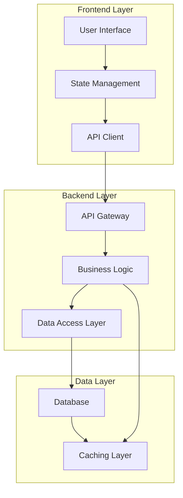
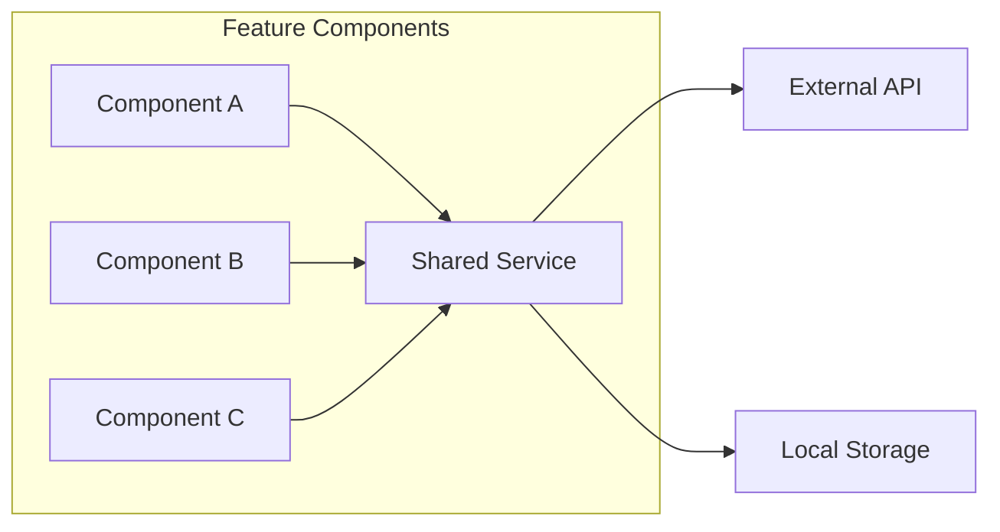
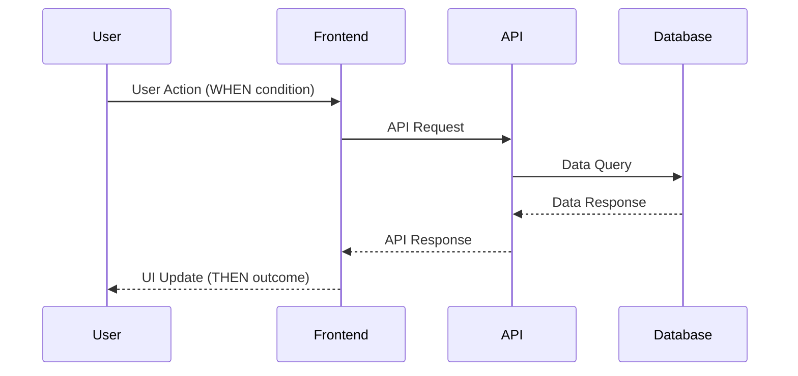

# Enhanced Technical Design

Create comprehensive technical design with research integration for feature: **$ARGUMENTS**

## Approval Gate: Requirements Check

**CRITICAL**: Design can only be generated after EARS-format requirements are approved.

### Approval Status Check

- Spec metadata: @.kiro/specs/$ARGUMENTS/spec.json

**STOP HERE** if spec.json shows:

```json
"approvals": {
  "requirements": {
    "approved": false
  }
}
```

**Required Actions for Requirements Approval**:

1. **Review requirements.md** - Ensure EARS format compliance and completeness
2. **Edit if needed** - Make necessary changes directly in requirements.md
3. **Manual approval required** - Update spec.json to set `"requirements": {"approved": true}`
4. **Reasoning**: Human review ensures EARS requirements accuracy before design phase

**Only proceed to design generation after requirements are explicitly approved by human review.**

## Context Analysis

### Steering Context

- Current architecture: @.kiro/steering/structure.md
- Technology stack: @.kiro/steering/tech.md
- Product constraints: @.kiro/steering/product.md

### EARS Requirements Context (APPROVED)

- EARS requirements: @.kiro/specs/$ARGUMENTS/requirements.md
- Current design: @.kiro/specs/$ARGUMENTS/design.md
- Spec metadata: @.kiro/specs/$ARGUMENTS/spec.json

### Codebase Context Analysis

Use available tools to understand existing system:
!`find . -name "*.ts" -o -name "*.js" -o -name "*.py" | head -10`
!`ls -la src/ 2>/dev/null || ls -la app/ 2>/dev/null || echo "No standard src structure found"`

## Optional Research Integration

**Conduct research when beneficial for informed design decisions**:

### When to Research

- **Complex architectural decisions** requiring industry best practices
- **Technology stack choices** needing comparative analysis
- **Integration patterns** with external systems or services
- **Performance optimization** requiring proven approaches
- **Security implementations** needing standards compliance
- **Scalability patterns** for anticipated load requirements

### Research Process

1. **Identify research needs** based on EARS requirements complexity
2. **Use WebSearch** for architectural patterns and best practices
3. **Use WebFetch** for technical documentation and API references
4. **Analyze findings** for applicability to current context
5. **Document research conclusions** with source citations

### Research Documentation Requirements

When research is conducted, structure findings as:

```markdown
## Research-Driven Design Decisions

### Technology Selection Research
- **[Technology/Pattern Name](Source URL)** - Why this technology fits our requirements
  - **Pros**: [Specific advantages for our use case]
  - **Cons**: [Limitations and trade-offs]
  - **EARS Requirements Alignment**: [How this supports specific EARS requirements]

### Architecture Pattern Research  
- **[Pattern Name](Source URL)** - Selected architectural approach
  - **Implementation**: [How to implement in our context]
  - **Scalability**: [Performance characteristics and limits]
  - **EARS Requirements Support**: [Which requirements this pattern addresses]

### Integration Research
- **[Service/API Name](Documentation URL)** - External integration approach
  - **Integration Pattern**: [How to integrate securely and efficiently]
  - **Error Handling**: [Research-based error handling strategies]
  - **EARS Alignment**: [Specific EARS requirements this integration satisfies]

### Research Summary
**Key Design Implications**: How research findings inform our technical decisions
**Implementation Priorities**: Research-based recommendations for development order
**Risk Mitigation**: Research-identified risks and mitigation strategies
```

## Task: Create Research-Driven Technical Design

**Prerequisites Verified**: EARS requirements are approved and ready for design phase.

Generate comprehensive design document in the language specified in spec.json:

### 1. Design Document Structure

Create design.md in the language specified in spec.json:

```markdown
# Technical Design

## Overview
[Technical overview informed by EARS requirements and research findings]

## Research-Driven Design Decisions
[Include this section only if research was conducted - see Research Documentation Requirements above]

## EARS Requirements Integration
Reference specific EARS requirements that drive design decisions:

### Requirements Summary
- **Requirement 1**: [Brief summary] → Design Impact: [How design addresses this]
- **Requirement 2**: [Brief summary] → Design Impact: [How design addresses this]
- **Requirement 3**: [Brief summary] → Design Impact: [How design addresses this]

## System Architecture

### High-Level Architecture


### Component Architecture



## Technology Stack (Research-Informed)

### Frontend Technology Selection

- **UI Framework**: [React/Vue/Next.js] + [TypeScript]
  - **Research Justification**: [Why this choice based on requirements]
  - **EARS Alignment**: [Which EARS requirements this supports]

### Backend Technology Selection  

- **API Framework**: [FastAPI/Express/Django] + [Language]
  - **Research Justification**: [Performance/scalability considerations]
  - **EARS Alignment**: [Requirements this choice satisfies]

### Data Technology Selection

- **Database**: [PostgreSQL/MySQL/MongoDB]
  - **Research Justification**: [Data model and performance requirements]
  - **EARS Alignment**: [Data-related EARS requirements]

### Additional Technologies

- **Authentication**: [JWT/OAuth/Auth0] - [Research-based selection reasoning]
- **Testing**: [Jest/pytest] + [Testing Library/Playwright] - [Coverage requirements]
- **Deployment**: [Docker/Vercel/AWS] - [Scalability and deployment requirements]

## Detailed Component Design

### API Endpoints Design

Map each endpoint to specific EARS requirements:

```markdown
### Core API Endpoints
- **GET /api/[resource]** 
  - **EARS Requirement**: [Reference specific WHEN/THEN requirement]
  - **Response Format**: [JSON structure]
  - **Error Handling**: [Based on IF/THEN error requirements]

- **POST /api/[resource]**
  - **EARS Requirement**: [Reference creation requirement]
  - **Request Validation**: [Based on GIVEN/WHEN/THEN validation requirements]
  - **Success Response**: [THEN outcome specification]

- **PUT /api/[resource]/:id**
  - **EARS Requirement**: [Reference update requirement]
  - **Idempotency**: [Based on WHEN/THEN consistency requirements]

- **DELETE /api/[resource]/:id**
  - **EARS Requirement**: [Reference deletion requirement]
  - **Cascade Logic**: [Based on IF/THEN business rules]
```

### Data Flow Design



## Data Models and Schema

### Core Data Models

Design models that support EARS requirements:

```typescript
// Data models aligned with EARS requirements
interface [ModelName] {
  id: string;
  // Fields that support WHEN conditions
  [conditionalField]: [type];
  // Fields that represent THEN outcomes
  [outcomeField]: [type];
  // Validation fields for IF conditions
  [validationField]: [type];
  created_at: Date;
  updated_at: Date;
}
```

### Database Schema Considerations

- **Indexing Strategy**: Based on WHEN condition query patterns
- **Constraints**: Enforce IF/THEN business rules at database level
- **Relationships**: Support GIVEN context requirements

## Error Handling and Validation

### EARS-Driven Error Handling

Map error handling to EARS IF/THEN requirements:

```markdown
### Error Scenarios (from EARS requirements)
1. **IF [condition from requirements] THEN [error response]**
   - **HTTP Status**: [Appropriate status code]
   - **Error Format**: [Consistent error response structure]
   - **User Experience**: [How frontend handles this error]

2. **IF [validation failure] THEN [validation error response]**
   - **Field Validation**: [Specific field error handling]
   - **Business Rule Validation**: [Business logic error handling]
```

### Validation Strategy

- **Input Validation**: Based on WHEN condition constraints
- **Business Rule Validation**: Enforce EARS business logic
- **Output Validation**: Ensure THEN outcomes are valid

## Security Considerations

### Authentication and Authorization

Map security to EARS requirements:

- **Authentication Requirements**: [Based on WHEN user access conditions]
- **Authorization Logic**: [Based on GIVEN user context requirements]
- **Session Management**: [Based on security WHEN/THEN requirements]

### Data Protection

- **Input Sanitization**: [Prevent security violations from IF conditions]
- **Data Encryption**: [Protect sensitive data in THEN outcomes]
- **Audit Logging**: [Track security-relevant WHEN/THEN events]

## Performance and Scalability

### Performance Requirements

Address performance EARS requirements:

- **Response Time Targets**: [From WHEN/THEN performance requirements]
- **Throughput Requirements**: [From concurrent user EARS requirements]
- **Caching Strategy**: [Support performance THEN outcomes]

### Scalability Design

- **Horizontal Scaling**: [Support load WHEN conditions]
- **Database Scaling**: [Handle data growth from THEN outcomes]
- **CDN Strategy**: [Support geographic WHEN conditions]

## Testing Strategy

### EARS-to-Test Mapping

Convert EARS requirements directly to test cases:

```markdown
### Test Categories
1. **WHEN/THEN Tests**: Direct mapping of functional requirements to test cases
2. **GIVEN/WHEN/THEN Tests**: Context-dependent scenario testing
3. **IF/THEN Tests**: Exception and error handling test cases
4. **Integration Tests**: Cross-component EARS requirement validation
5. **End-to-End Tests**: Complete user journey EARS requirement verification
```

### Test Implementation

- **Unit Tests**: [Framework] for component-level EARS requirement testing
- **Integration Tests**: API endpoint testing for WHEN/THEN behavior
- **E2E Tests**: [Playwright/Cypress] for complete EARS requirement flows

## Implementation Phases

### Phase-Based Development

Order implementation based on EARS requirement dependencies:

1. **Core Data Layer**: Support fundamental WHEN conditions
2. **API Layer**: Implement WHEN/THEN endpoint behavior
3. **Frontend Components**: Create UI for WHEN user actions and THEN outcomes
4. **Integration Layer**: Connect GIVEN/WHEN/THEN scenarios
5. **Error Handling**: Implement IF/THEN exception handling
6. **Testing and Validation**: Verify all EARS requirements

```

### 2. Design Quality Guidelines
- **EARS Alignment**: Every design decision should map to specific EARS requirements
- **Research Integration**: Include research findings that inform technical choices
- **Architecture Consistency**: Follow existing architectural patterns from steering
- **Component Clarity**: Define clear interfaces and responsibilities
- **Error Completeness**: Address all IF/THEN error scenarios from requirements
- **Testing Readiness**: Design supports direct EARS-to-test mapping

### 3. Mermaid Diagram Requirements
Include comprehensive visual documentation:
- **System Architecture**: High-level component relationships
- **Data Flow**: Request/response sequences aligned with WHEN/THEN flows
- **Component Interaction**: Detailed service communication patterns
- **Database Schema**: Entity relationships supporting EARS requirements

### 4. Research Integration Validation
If research was conducted, validate integration:
!`grep -c "Research-Driven Design Decisions" .kiro/specs/$ARGUMENTS/design.md || echo "⚠️  Consider adding research section if beneficial"`
!`grep -c "Source URL\|Documentation URL" .kiro/specs/$ARGUMENTS/design.md || echo "⚠️  Add source citations if research was conducted"`

### 5. EARS Requirement Traceability
Ensure design addresses all EARS requirements:
!`grep -c "EARS Requirement" .kiro/specs/$ARGUMENTS/design.md || echo "⚠️  Add EARS requirement traceability"`

### 6. Update Metadata
Update spec.json with:
```json
{
  "phase": "design-generated",
  "progress": {
    "requirements": 100,
    "design": 100,
    "tasks": 0
  },
  "approvals": {
    "requirements": {
      "generated": true,
      "approved": true,
      "methodology": "EARS"
    },
    "design": {
      "generated": true,
      "approved": false,
      "research_integrated": true
    }
  },
  "updated_at": "current_timestamp"
}
```

### 7. Research Tracking

If research was conducted, add to spec.json:

```json
{
  "research": {
    "design_phase": true,
    "research_areas": ["architecture", "technology", "patterns"],
    "sources_count": "[number of research sources]"
  }
}
```

---

## REVIEW AND APPROVAL PROCESS (Not included in document)

### Human Review Required

After generating design.md, inform the user:

**NEXT STEP**: Human review required before proceeding to tasks phase.

### Research-Enhanced Review Checklist

- [ ] Technical design comprehensively addresses all EARS requirements
- [ ] Research findings are properly integrated and cited (if applicable)
- [ ] Architecture aligns with existing system patterns
- [ ] Technology choices are well-justified and appropriate
- [ ] Components and interfaces are clearly defined
- [ ] Error handling covers all IF/THEN scenarios from requirements
- [ ] Performance and security considerations address EARS requirements
- [ ] Mermaid diagrams clearly illustrate system design

### To Approve

After reviewing, update `.kiro/specs/$ARGUMENTS/spec.json`:

```json
{
  "approvals": {
    "requirements": {
      "generated": true,
      "approved": true,
      "methodology": "EARS"
    },
    "design": {
      "generated": true,
      "approved": true,
      "research_integrated": true
    }
  },
  "phase": "design-approved"
}
```

**Only after approval can you proceed to `/spec-tasks $ARGUMENTS`**

## Instructions

1. **Verify EARS requirements approval** - Ensure requirements phase is complete
2. **Assess research needs** - Determine if WebSearch/WebFetch would improve design quality
3. **Conduct targeted research** - Focus on complex technical decisions and unknowns
4. **Map design to EARS requirements** - Ensure every requirement is addressed in design
5. **Follow architectural patterns** - Reference and extend existing system patterns
6. **Create comprehensive diagrams** - Use mermaid for clear visual communication
7. **Plan implementation phases** - Order development by EARS requirement dependencies
8. **Include research citations** - Properly document and cite all research sources
9. **Update tracking metadata** - Include research status and design completion

Generate design that provides research-informed, detailed blueprint for implementation phase with clear EARS requirement traceability.
