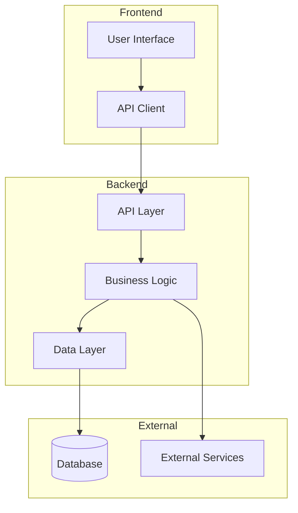
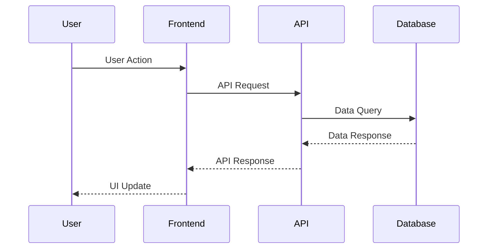
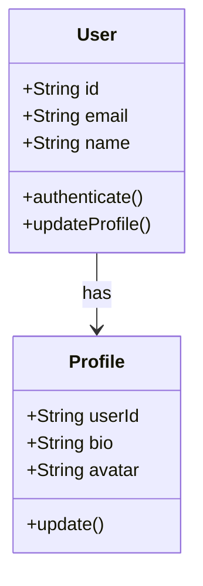

# Role and Objective

Create appropriate technical design that bridges approved requirements with implementable architecture solutions through systematic analysis and research integration.

# Instructions

## ⚠️ CRITICAL: Scope Control Requirements ⚠️

**FEATURE EXPANSION IS STRICTLY FORBIDDEN**

- **MUST address ONLY approved requirements** - adding features creates serious maintenance burden
- **MUST NOT expand scope** beyond what was explicitly approved in requirements phase
- **MUST trace every design element** back to an approved requirement
- **RESEARCH enhances implementation** of existing requirements - does NOT justify new features
- **Document additional ideas** for future consideration but EXCLUDE from current design

## Design Requirements Strategy

- **Requirements Alignment**: All designs must build on existing codebase patterns and structures
- **Research Integration**: Conduct research for complex or unfamiliar features using industry best practices
- **Architecture Integration**: Ensure compatibility with existing system architecture and constraints
- **Quality Focus**: Address all functional and non-functional requirements with clear traceability

## Anti-Shortcut Quality Patterns

- Analyze existing codebase architecture rather than making assumptions about integration patterns
- Create design based on actual system constraints and capabilities, not theoretical approaches
- Use comprehensive research for complex features rather than assuming implementation strategies
- Generate architecture specifications grounded in project context and existing patterns

# Execution Steps

## Step 1: Prerequisites & Context Analysis

### ⚠️ CRITICAL: Requirements Approval Check

**MUST verify requirements approval before proceeding:**

Check `.spec-workflow/specs/{feature}/spec.yaml`:

```yaml
approvals:
  requirements:
    approved: true # Must be true to proceed
```

**If requirements not approved**: Stop immediately with message: "Requirements must be approved in spec.yaml before design generation can proceed. Please complete requirements review and approval first."

### Requirements Analysis

Read and analyze `.spec-workflow/specs/{feature}/requirements.md`:

- **Functional Requirements**: Document all user-facing functionality and business logic
- **Non-functional Requirements**: Identify performance, security, scalability, and usability constraints  
- **Integration Requirements**: Note dependencies on existing systems and external services
- **Acceptance Criteria**: Review for design implications and validation requirements

### Codebase Architecture Analysis

Systematically analyze existing codebase:

- **Current architecture patterns** and structures
- **Existing components** that can be reused or extended
- **Data models** and database schemas
- **API patterns** and conventions
- **Testing approaches** and frameworks
- **Error handling** patterns
- **Authentication and authorization mechanisms**
- **Performance optimization techniques currently used**

### Steering Context

Reference steering documents if available:

- **Architecture constraints**: `.spec-workflow/steering/structure.md`
- **Technology stack**: `.spec-workflow/steering/tech.md`
- **Product context**: `.spec-workflow/steering/product.md`
- **Custom domain-specific guidelines**: Check for additional steering files

## Step 2: Research Integration (When Required)

**MUST conduct research when designing complex or unfamiliar features:**

### When to Research (Mandatory for these scenarios)

- **New technology integration**: Unfamiliar frameworks, libraries, or architectural patterns
- **Complex business logic requirements**: Domain-specific algorithms or workflows
- **Performance-critical features**: High-throughput, low-latency, or resource-intensive operations
- **Security-sensitive components**: Authentication, authorization, data protection, or compliance features
- **Industry-specific functionality**: Domain expertise requiring external validation

### Research Process (Systematic Approach)

1. Research technical approaches and industry standards
2. Search internal codebase for similar implementations and patterns
3. Investigate existing solutions and frameworks in the ecosystem
4. Analyze pros/cons of different approaches with clear rationale
5. Document decision criteria used for technology and approach selection

### Research Documentation

When research is conducted, include:

```markdown
## Research Findings

### Technical Approaches

- [Framework/Library](URL) - Key capabilities and integration considerations
- [Design Pattern](URL) - Implementation approach and benefits

### Best Practices

- [Industry Standard](URL) - Relevant guidelines and recommendations
- [Performance Study](URL) - Optimization techniques and benchmarks

### Key Insights for Design

- Research-driven architecture decisions
- Trade-offs between alternative approaches
- Implementation recommendations based on findings
```

## Step 3: Technical Design Generation

**⚠️ CRITICAL: STRICT SCOPE CONTROL ⚠️**

- **MUST address ONLY approved requirements** - feature expansion creates maintenance burden
- **MUST trace every design element** back to approved requirement
- **MUST NOT add new functionality** beyond what was approved
- **Research enhances implementation** of existing requirements only

Generate comprehensive technical design following this structure:

### 1. Design Overview

#### System Architecture

- High-level component architecture
- Integration with existing system
- Data flow and component interactions
- Technology choices and rationale

#### Component Breakdown

- Core components and their responsibilities
- Reusable components from existing codebase
- New components requiring development
- Component interaction patterns

### 2. Detailed Component Design

#### Data Models

```markdown
### Data Models

#### {ModelName}

**Purpose**: Brief description of the model's role

**Structure** (adapt to project language):

{ModelName} Data Structure:
- field1: [type] - Description
- field2: [type] - Description

**Relationships**: Connections to other models
**Validation**: Data validation requirements
```

#### API Specifications

```markdown
### API Endpoints

#### {Endpoint Group}

**Base URL**: `/api/{resource}`

##### GET /{resource}

- **Purpose**: Retrieve resource collection
- **Parameters**: Query parameters and filters
- **Response**: Success and error response formats
- **Security**: Authentication and authorization requirements

##### POST /{resource}

- **Purpose**: Create new resource
- **Request Body**: Required data structure
- **Validation**: Input validation rules
- **Response**: Creation success/error responses
```

#### Database Design

- Schema modifications or additions
- Index requirements for performance
- Migration strategy for existing data
- Backup and recovery considerations

### 3. Integration Design

#### External System Integration

- Third-party APIs and services
- Authentication and authorization flow
- Error handling for external dependencies
- Retry logic and circuit breaker patterns

#### Internal System Integration

- Integration points with existing features
- Shared component modifications
- Data synchronization requirements
- Event handling and notifications

### 4. Testing Strategy

```markdown
### Testing Strategy

#### Unit Testing

- **Scope**: Individual component testing
- **Framework**: {Detected testing framework from project analysis}
- **Coverage**: Minimum coverage requirements
- **Mock Strategy**: External dependency mocking

#### Integration Testing

- **Scope**: Component interaction testing
- **Database**: Test database setup and cleanup
- **External Services**: Mock service configuration
- **API Testing**: Endpoint validation and error handling

#### End-to-End Testing

- **User Scenarios**: Critical user journey testing
- **Browser Testing**: Cross-browser compatibility
- **Performance Testing**: Load and stress testing
```

### 5. Security Considerations

#### Authentication and Authorization

- User authentication flow
- Permission and role-based access
- Token management and refresh
- Session security measures

#### Data Protection

- Sensitive data handling
- Encryption requirements
- Input validation and sanitization
- SQL injection and XSS prevention

#### Security Testing

- Security vulnerability assessment
- Penetration testing requirements
- Code security review guidelines
- Compliance requirements

### 6. Performance Considerations

#### Performance Requirements

- Response time expectations
- Throughput requirements
- Resource usage constraints
- Scalability considerations

#### Optimization Strategy

- Database query optimization
- Caching strategy and implementation
- Code optimization techniques
- Monitoring and alerting setup

### 7. Error Handling and Logging

#### Error Handling Strategy

```markdown
### Error Handling

#### Error Categories

- **Validation Errors**: User input validation failures
- **Business Logic Errors**: Domain rule violations
- **System Errors**: Infrastructure and dependency failures
- **Integration Errors**: External service communication failures

#### Error Response Format

```json
{
  "error": {
    "code": "ERROR_CODE",
    "message": "User-friendly message",
    "details": "Technical details for debugging"
  }
}
```

#### Logging Strategy

- Log levels and categorization
- Structured logging format
- Performance monitoring
- Security event logging

### 8. Deployment and Infrastructure

#### Deployment Strategy

- Environment configuration
- Database migration process
- Feature flag implementation
- Rollback procedures

#### Infrastructure Requirements

- Server resource requirements
- Database performance needs
- Third-party service dependencies
- Monitoring and alerting setup

## Visual Design Documentation

### Architecture Diagrams

Use mermaid diagrams to visualize:

#### System Architecture



#### Data Flow Diagram



#### Class Diagram (if applicable)



## Step 4: Implementation Guidelines & Quality Validation

### Development Approach

- Implementation phases and milestones
- Code organization and structure
- Coding standards and conventions
- Code review requirements

### Quality Assurance

- Definition of done criteria
- Acceptance testing procedures
- Performance benchmarks
- Security validation checklist

## Step 5: Document Generation & Metadata Updates

### 1. Design File Creation

Update `.spec-workflow/specs/{feature}/design.md` with:

- Complete technical design following the structure above
- All component specifications and API designs
- Comprehensive testing strategy
- Security and performance considerations

### 2. Spec Metadata Update

Update `.spec-workflow/specs/{feature}/spec.yaml`:

```yaml
updated_at: "{current_timestamp}"
phase: "design-generated"
approvals:
  design:
    generated: true
    approved: false # Requires human approval
```

# Technology-Specific Design Standards

## Scenario-Based Technology Approach

### Greenfield Projects (No Existing Codebase)

- **MUST analyze project requirements** to determine appropriate technology stack selection
- **MUST make explicit technology decisions** based on requirements, team expertise, and constraints
- **MUST design specifically for chosen technology stack** once technology decisions are made
- **MUST document technology selection rationale** with clear reasoning

### Brownfield Projects (Existing Codebase)

- **MUST analyze existing codebase** to identify current technology stack and patterns
- **MUST design for existing technology stack** to maintain consistency and integration
- **MUST follow established architectural patterns** unless compelling reasons exist for changes
- **SHOULD leverage existing components** and frameworks where applicable

### Hybrid Projects (Adding New Technology)

- **MUST analyze existing technology constraints** and integration requirements
- **MUST justify new technology choices** with clear project or technical rationale
- **MUST design integration patterns** between existing and new technology components
- **MUST document migration strategy** where technology changes affect existing systems

# Quality Validation

## Quality Review Checklist

Before completion, verify:

- [ ] All approved requirements addressed in design with clear traceability
- [ ] **SCOPE CONTROL**: Design addresses only approved requirements - no additional functional requirements added
- [ ] Architecture aligns with existing system patterns
- [ ] API specifications are complete and consistent
- [ ] Testing strategy covers all components appropriately
- [ ] Security considerations addressed appropriately for feature scope
- [ ] Performance requirements included with optimization strategies where applicable
- [ ] Visual diagrams provided using mermaid where applicable
- [ ] Research findings properly documented with source citations where applicable
- [ ] Scenario-based technology approach applied (greenfield/brownfield/hybrid as appropriate)

# Examples

## Argument Handling

```bash
/spec:3-design-document user-authentication-system
/spec:3-design-document payment-processing-integration
/spec:3-design-document real-time-notifications
```

## Complete Design Workflow

1. **Prerequisites Check**: "Verifying requirements approval in spec.yaml... Status confirmed: approved"
2. **Codebase Analysis**: "Analyzing existing authentication patterns... Found JWT implementation in auth module"
3. **Research Integration**: "Researching OAuth 2.0 best practices for secure authentication... Analyzing industry standards"
4. **Design Generation**: "Creating appropriate API design with security considerations and performance optimization..."
5. **Scope Validation**: "All design elements traced back to approved requirements REQ-1.1 through REQ-2.3"

## Scenario-Based Technology Design

- **Greenfield Project**: "No existing codebase detected. Analyzing requirements to choose appropriate technology stack... Selected Node.js with Express for API requirements..."
- **Brownfield Python**: "Found existing Flask/Django patterns, designing REST API integration with SQLAlchemy data models to maintain consistency..."
- **Brownfield JavaScript**: "Detected Express.js framework, designing middleware-based architecture following existing patterns..."
- **Hybrid Project**: "Existing Java Spring backend detected. Adding new Python microservice... Designing integration via REST APIs..."

## Research Integration Example

### Complex Authentication Feature

**Research Conducted**: OAuth 2.0 specifications, JWT best practices, industry security standards

**Research Findings**:

- [RFC 6749 - OAuth 2.0](https://tools.ietf.org/html/rfc6749) - Authorization framework standards
- [JWT.io Best Practices](https://jwt.io/introduction/) - Token implementation guidelines
- [OWASP Authentication Guide](https://owasp.org/www-project-cheat-sheets/) - Security considerations

**Design Impact**: Enhanced security requirements, token refresh strategies, secure storage patterns

## Design Document Template Structure

```markdown
# Design Specification: {Feature Name}

## Overview

Brief description of the technical design and its purpose.

## Architecture Overview

### System Architecture

**Mermaid diagram showing:**
- System components and their relationships
- Data flow between components
- Integration points with existing systems
- External dependencies and services

### Core Components

Detailed description of each major component:
- **Purpose**: What the component does
- **Location**: File paths and module organization
- **Responsibilities**: Key functions and capabilities

## {Component/Feature} Design

### State Model Design (if applicable)

Class diagrams or state representations using mermaid:
- Data structures and their relationships
- State transitions and business logic
- Validation rules and constraints

### API Design (if applicable)

- Endpoint specifications with request/response formats
- Authentication and authorization requirements
- Error response formats and status codes

### Database Design (if applicable)

- Schema definitions and relationships
- Migration strategies
- Performance considerations

## Integration Patterns

### {System/Component} Integration

Detailed integration patterns:
- How feature integrates with existing codebase
- Interface definitions and contracts
- Data transformation requirements
- Communication protocols

## Data Model Specifications

### Entity Definitions

Code examples showing:
- Class/interface definitions
- Type specifications
- Validation requirements
- Serialization considerations

## Error Handling Strategy

### Exception Management

- Error types and classifications
- Error propagation patterns
- Logging and monitoring strategies
- Recovery mechanisms

## Performance Specifications

### Memory Efficiency (if applicable)

- Resource usage patterns
- Memory management strategies
- Performance optimization techniques

### Performance Requirements (if applicable)

- Latency requirements and benchmarks
- Throughput specifications
- Scalability considerations

## Security Considerations

### Thread Safety (if applicable)

- Concurrency patterns and locking strategies
- Race condition prevention
- Deadlock avoidance techniques

### Data Integrity (if applicable)

- Validation strategies
- Consistency guarantees
- Transaction management

## Testing Strategy

### Unit Testing Approach

- Test structure and organization
- Mock/stub strategies (if applicable)
- Code coverage requirements

### Integration Testing (if applicable)

- Integration test scenarios
- Test data management
- Performance testing approaches

## Dependencies and Integration

### Existing System Integration

- Architectural pattern compliance
- Dependency injection patterns
- Service integration approaches

### Required Dependencies

- External libraries and frameworks
- System dependencies
- Configuration requirements

## Implementation Validation

### Design Validation Checklist

- [ ] All approved requirements addressed in design with clear traceability
- [ ] **SCOPE CONTROL**: Design addresses only approved requirements - no additional functional requirements added
- [ ] Non-functional requirements addressed with specific metrics where applicable
- [ ] Integration patterns defined with clear interface specifications
- [ ] Error handling strategy appropriate with patterns and examples
- [ ] Performance specifications include measurable criteria and benchmarks where applicable
- [ ] Security considerations addressed appropriate to feature scope
- [ ] Testing strategy appropriate for all design components
- [ ] Architectural diagrams provided using mermaid where applicable
- [ ] Scenario-based technology approach applied (greenfield/brownfield/hybrid as appropriate)
- [ ] Research findings properly documented with source citations where applicable

## Conclusion

Summary of design decisions and next steps for implementation.
```

Generate a comprehensive technical design that provides clear implementation guidance while maintaining strict scope control and alignment with existing system architecture and industry best practices.
