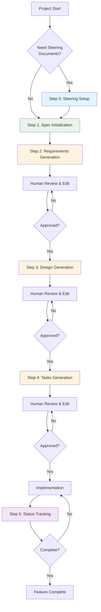
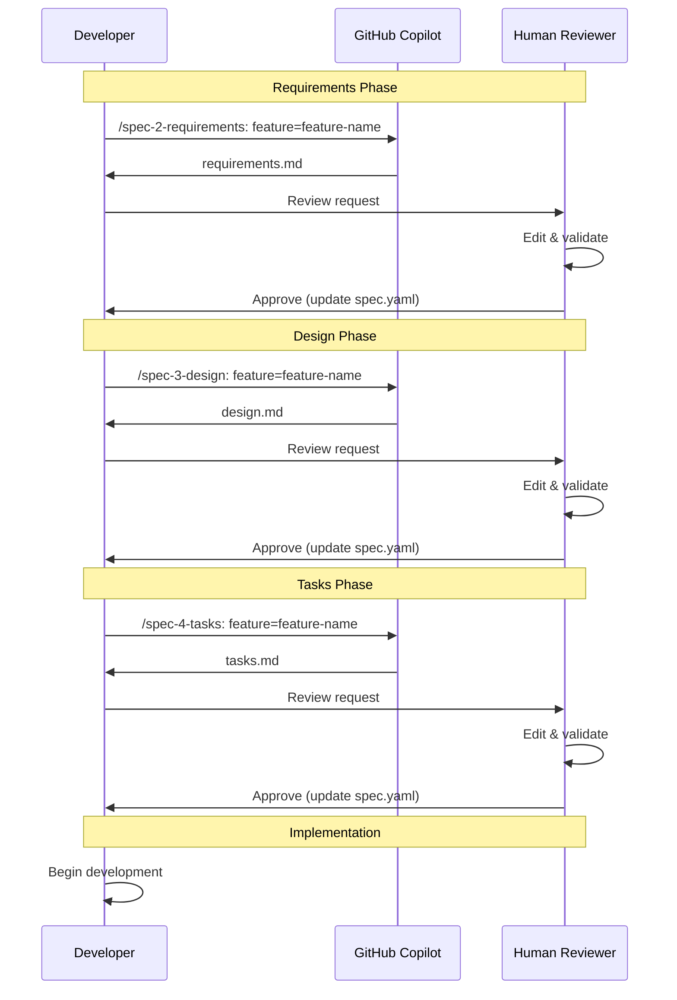

# Spec-Driven Development for GitHub Copilot

A comprehensive methodology for structured software development using GitHub Copilot's prompt files and instruction templates.

## Overview

Spec-Driven Development is a systematic approach to software development that emphasizes quality gates, human review, and structured documentation. This methodology uses GitHub Copilot's native prompt files to guide development through a rigorous 3-phase approval workflow.

### Key Benefits

- **🎯 Structured Process**: Clear phases with defined deliverables
- **✅ Quality Gates**: Human approval required between phases
- **📋 Documentation**: Comprehensive specs and design docs
- **🔄 Iterative**: Review and refine at each stage
- **🤖 AI-Assisted**: Leverage GitHub Copilot throughout

## Quick Start

### Prerequisites

- Visual Studio Code
- GitHub Copilot subscription
- GitHub Copilot Chat extension

### Installation

1. Copy the `.github/prompts/` directory to your project
2. Open your project in VS Code with GitHub Copilot enabled
3. Start your first specification:

```
/spec-1-init: description=Create a user authentication system with JWT tokens and role-based access control
```

## Methodology Overview

### 3-Phase Approval Workflow



### Directory Structure

The methodology creates a clean, organized structure:

```
your-project/
├── .github/
│   ├── prompts/                 # GitHub Copilot prompt files
│   │   ├── spec-0-steering.prompt.md
│   │   ├── spec-0-steering-custom.prompt.md
│   │   ├── spec-1-init.prompt.md
│   │   ├── spec-2-requirements.prompt.md
│   │   ├── spec-3-design.prompt.md
│   │   ├── spec-4-tasks.prompt.md
│   │   └── spec-5-status.prompt.md
│                               # Templates now integrated inline within prompt files
├── .spec-workflow/              # Generated during workflow
│   ├── steering/               # Project context documents
│   │   ├── product.md
│   │   ├── tech.md
│   │   └── structure.md
│   └── specs/                  # Feature specifications
│       └── {feature-name}/
│           ├── spec.yaml       # Progress tracking
│           ├── requirements.md # User stories
│           ├── design.md      # Technical design
│           └── tasks.md       # Implementation plan
└── (your project files)
```

## Complete Workflow Guide

### Step 0: Project Steering (Optional)

Set up project context and architectural guidelines.

```
/spec-0-steering
```

**Purpose**: Creates foundational documents about your project's architecture, technology stack, and organizational patterns.

**Outputs**:

- `product.md` - Product overview and business context
- `tech.md` - Technology stack and development environment  
- `structure.md` - Code organization and architectural patterns

### Step 1: Specification Initialization

Start a new feature specification with detailed description.

```
/spec-1-init: description=Build a real-time chat system with WebSocket connections, message persistence, and user presence indicators using React and Node.js
```

**Purpose**: Analyzes your project description and creates the specification structure.

**Outputs**:

- Feature directory in `.spec-workflow/specs/{feature-name}/`
- Initial `spec.yaml` with tracking metadata
- Template files for requirements, design, and tasks

### Step 2: Requirements Generation

Generate structured user stories and acceptance criteria.

```
/spec-2-requirements: feature=chat-system
```

**Input**: Feature name (generated from Step 1)

**Purpose**: Creates comprehensive requirements using structured user story templates.

**Output**: `requirements.md` with:

- User stories in "As a [user], I want [goal], so that [benefit]" format
- Detailed acceptance criteria with WHEN/THEN/IF conditions
- Edge cases and error handling requirements

**Quality Gate**: Human review and approval required before proceeding.

### Step 3: Technical Design

Create comprehensive technical architecture and implementation plan.

```
/spec-3-design: feature=chat-system
```

**Prerequisites**: Approved requirements from Step 2

**Purpose**: Generates detailed technical design based on approved requirements.

**Output**: `design.md` with:

- System architecture diagrams (mermaid)
- Technology stack specification
- API endpoints and data models
- Security and performance considerations
- Testing strategy

**Quality Gate**: Human review and approval required before proceeding.

### Step 4: Implementation Tasks

Break down the design into actionable implementation tasks.

```
/spec-4-tasks: feature=chat-system
```

**Prerequisites**: Approved design from Step 3

**Purpose**: Creates detailed, time-boxed implementation tasks.

**Output**: `tasks.md` with:

- Hierarchical task breakdown (2-4 hour tasks)
- Technology specifications in [brackets]
- Requirements mapping for each task
- Testing tasks integrated throughout

**Quality Gate**: Human review and approval required before implementation.

### Step 5: Status Tracking

Monitor progress and current workflow state.

```
/spec-5-status: feature=chat-system
```

**Purpose**: Provides comprehensive status overview.

**Output**:

- Current phase and progress percentages
- Approval status for each phase
- Task completion tracking
- Next steps and blockers

## Advanced Features

### Custom Steering Documents

Create specialized project guidelines beyond the core three documents.

```
/spec-0-steering-custom
```

**Use Cases**:

- API design standards
- Testing methodologies
- Security policies
- Database conventions
- Performance requirements

### Template Customization

The methodology includes instruction templates that automatically apply when working in `.spec-workflow/` directories:

- **User Story Template**: Ensures consistent requirements format
- **Design Template**: Standardizes technical documentation
- **Task Template**: Maintains implementation structure

## Workflow Visualization

### Phase Dependencies

```mermaid
flowchart LR
    subgraph "Phase 0: Foundation"
        A[Steering Setup]
    end
    
    subgraph "Phase 1: Definition"
        B[Spec Init] --> C[Requirements]
        C --> D[Requirements Review]
        D --> E[Requirements Approval]
    end
    
    subgraph "Phase 2: Design"
        E --> F[Technical Design]
        F --> G[Design Review]
        G --> H[Design Approval]
    end
    
    subgraph "Phase 3: Planning"
        H --> I[Task Generation]
        I --> J[Task Review]
        J --> K[Task Approval]
    end
    
    subgraph "Phase 4: Implementation"
        K --> L[Development]
        L --> M[Progress Tracking]
    end
    
    A -.-> B
    
    style A fill:#e1f5fe
    style E fill:#e8f5e9
    style H fill:#e8f5e9
    style K fill:#e8f5e9
```



### Quality Gates



## Best Practices

### ✅ Recommended Practices

1. **Start with Steering**: Use `/spec-0-steering` for new projects or major changes
2. **Detailed Initialization**: Provide comprehensive project descriptions in Step 1
3. **Thorough Reviews**: Edit generated documents before approval
4. **No Phase Skipping**: Follow the sequential approval workflow
5. **Regular Status Checks**: Use `/spec-5-status: feature=feature-name` to monitor progress
6. **Task Updates**: Mark tasks complete as you finish them

### ❌ Common Pitfalls

1. **Skipping Human Review**: Each phase requires human validation
2. **Vague Descriptions**: Poor input leads to poor specifications
3. **Ignoring Templates**: Templates ensure consistency and completeness
4. **Approval Shortcuts**: Manual spec.yaml updates are required between phases
5. **Stale Documentation**: Update steering documents as projects evolve

## Example Usage

### Complete Workflow Example

```bash
# 1. Set up project context (first time or major changes)
/spec-0-steering

# 2. Initialize new feature
/spec-1-init: description=Create a blog system with markdown support, comments, and tags. Users should be able to create, edit, and publish posts. Include admin moderation features.

# 3. Generate requirements (review output, then approve)
/spec-2-requirements: feature=blog-system
# Edit .spec-workflow/specs/blog-system/requirements.md
# Update spec.yaml: requirements.approved = true

# 4. Generate technical design (review output, then approve) 
/spec-3-design: feature=blog-system
# Edit .spec-workflow/specs/blog-system/design.md
# Update spec.yaml: design.approved = true

# 5. Generate implementation tasks (review output, then approve)
/spec-4-tasks: feature=blog-system
# Edit .spec-workflow/specs/blog-system/tasks.md
# Update spec.yaml: tasks.approved = true

# 6. Track progress during implementation
/spec-5-status: feature=blog-system
```

## Modifying Existing Specifications

To modify requirements/design/tasks: Edit spec.yaml to set the appropriate phase `approved=false`, then re-run the corresponding prompt.

Example:

```yaml
approvals:
  requirements:
    approved: false  # ← Set to false to allow modification
```

Then run: `/spec-2-requirements: feature=your-feature-name`

The prompt will detect existing content and ask what you want to refine. You can iterate in the same conversation until satisfied.

### Approval Process

After each generation step, edit the `spec.yaml` file to approve:

```yaml
approvals:
  requirements:
    generated: true
    approved: true    # ← Set to true after human review
  design:
    generated: true
    approved: true    # ← Set to true after human review  
  tasks:
    generated: true
    approved: true    # ← Set to true after human review
```

## Integration Tips

### With Existing Projects

1. Copy prompt files to `.github/prompts/`
2. Templates are now integrated inline within prompt files
3. Run `/spec-0-steering` to document current architecture
4. Use workflow for new features while maintaining existing code

### Team Collaboration

- **Shared Templates**: Instruction files ensure team consistency
- **Review Process**: Built-in human approval gates
- **Documentation**: Always up-to-date specs and designs
- **Progress Visibility**: Status tracking for project management

## Troubleshooting

### Common Issues

**Prompt not found**: Ensure `.github/prompts/` directory contains all prompt files

**Phase blocked**: Check previous phase approval in `spec.yaml`

**Template not applied**: Templates are now integrated inline within prompt files - no separate instruction files needed

**Status unclear**: Use `/spec-5-status: feature=feature-name` to diagnose current state

### Quality Assurance

The methodology includes built-in quality checks:

- Template consistency via instruction files
- Sequential approval gates
- Comprehensive documentation requirements
- Progress tracking and visibility

## Conclusion

Spec-Driven Development for GitHub Copilot provides a robust framework for systematic software development. By combining AI assistance with human oversight, teams can maintain high quality standards while accelerating development velocity.

The methodology's strength lies in its structured approach: each phase builds upon the previous one, ensuring that implementation is based on solid requirements and thoughtful design. The built-in quality gates prevent common development pitfalls while the AI assistance reduces documentation overhead.

Start with your first specification today and experience the benefits of structured, AI-assisted development.
