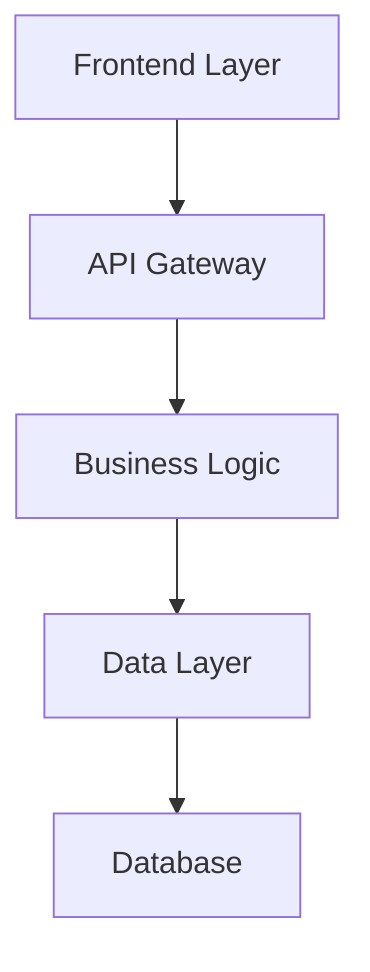
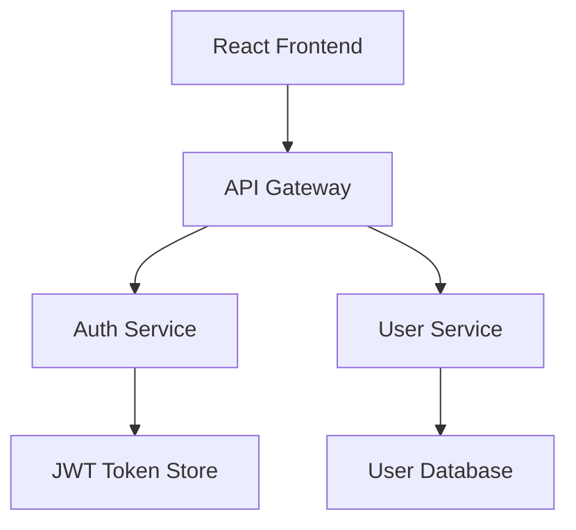

# Technical Design Generation

Create comprehensive technical design for feature: **${input:feature:Enter feature name}**

## Approval Gate: Requirements Check

**CRITICAL**: Design can only be generated after requirements are approved.

### Approval Status Verification

First, check the spec metadata to verify requirements approval:

- Spec metadata: Reference `.spec-workflow/specs/${input:feature}/spec.yaml`

**STOP EXECUTION** if spec.yaml shows:

```yaml
approvals:
  requirements:
    approved: false
```

### Required Actions for Requirements Approval

If requirements are not approved:

1. **Review requirements.md** - Read through the generated requirements thoroughly
2. **Edit if needed** - Make any necessary changes directly in the requirements.md file
3. **Manual approval required** - Update spec.yaml manually to set `requirements.approved: true`
4. **Reasoning**: Human review ensures requirements accuracy before design phase

**Example approval in spec.yaml**:

```yaml
approvals:
  requirements:
    generated: true
    approved: true # ← Set this to true after human review
phase: "requirements-approved"
```

**Only proceed to design generation after requirements are explicitly approved by human review.**

## Context Analysis

### Steering Context

Reference steering documents if available:

- Current architecture: #.spec-workflow/steering/structure.md
- Technology stack: #.spec-workflow/steering/tech.md
- Product constraints: #.spec-workflow/steering/product.md

### Requirements Context (APPROVED)

- Feature requirements: Reference `.spec-workflow/specs/${input:feature}/requirements.md`
- Current design: Reference `.spec-workflow/specs/${input:feature}/design.md`
- Spec metadata: Reference `.spec-workflow/specs/${input:feature}/spec.yaml`

## Technical Design Process

**Prerequisites Verified**: Requirements are approved and ready for design phase.

Follow this comprehensive technical design template structure:

---
## 🏗️ TECHNICAL DESIGN TEMPLATE REFERENCE
*Use this template structure when generating design - this is template content, not prompt instructions*

### Technical Design Template

Use this structured template when generating technical designs for specifications to ensure comprehensive coverage and consistency.

### Design Document Structure

Follow this structure for all technical design documents:

#### 1. Overview

- **Purpose**: Brief technical overview of the implementation approach
- **Scope**: What this design covers and what it doesn't
- **Assumptions**: Key technical assumptions and constraints

#### 2. Architecture

Include a high-level architecture diagram using mermaid:



#### 3. Technology Stack

Specify the complete technology stack:

- **Frontend**: Framework + Language (React/Vue/Next.js + TypeScript)
- **Backend**: Framework + Language (FastAPI/Express/Django + Python/Node.js)
- **Database**: Database technology (PostgreSQL/MySQL/MongoDB)
- **Authentication**: Auth approach (JWT/OAuth/Auth0)
- **Testing**: Testing frameworks (Jest/pytest + Testing Library/Playwright)
- **Deployment**: Deployment platform (Docker/Vercel/AWS)

#### 4. Components and Interfaces

Detail component design with clear interfaces:

- **Component breakdown**: Major system components
- **Interface definitions**: APIs between components
- **Data contracts**: Expected data formats and schemas

#### 5. API Endpoints

Document all API endpoints:

```
GET /api/[resource]           # List resources
POST /api/[resource]          # Create resource
GET /api/[resource]/:id       # Get specific resource
PUT /api/[resource]/:id       # Update resource
DELETE /api/[resource]/:id    # Delete resource
```

#### 6. Data Flow

Describe how data flows through the system:

- **Request flow**: From user action to response
- **Data transformations**: How data changes between layers
- **State management**: How application state is maintained

#### 7. Data Models

Define data structures and database schemas:

```typescript
interface [ModelName] {
  id: string;
  createdAt: Date;
  updatedAt: Date;
  // Add domain-specific fields
}
```

#### 8. Error Handling

Comprehensive error handling strategy:

- **Error types**: Different categories of errors
- **Error responses**: Standard error response formats
- **Recovery strategies**: How the system handles failures
- **Logging**: What gets logged and where

#### 9. Security Considerations

Address security requirements:

- **Authentication**: How users are authenticated
- **Authorization**: How access control is enforced
- **Data validation**: Input validation and sanitization
- **Security headers**: Required security configurations

#### 10. Performance & Scalability

Plan for performance and scale:

- **Caching strategy**: What gets cached and where
- **Database optimization**: Indexing and query optimization
- **Scaling approach**: Horizontal vs vertical scaling
- **Performance metrics**: Key performance indicators

#### 11. Testing Strategy

Comprehensive testing approach:

- **Unit tests**: Component-level testing
- **Integration tests**: API and service integration
- **E2E tests**: User workflow testing
- **Test data**: Test data management strategy

### Design Quality Guidelines

#### Architecture Principles

- **Modularity**: Clear separation of concerns
- **Scalability**: Design for growth
- **Maintainability**: Easy to modify and extend
- **Testability**: Components can be tested in isolation

#### Technical Standards

- **Consistency**: Follow established patterns
- **Documentation**: Clear interface documentation
- **Error Handling**: Comprehensive error scenarios
- **Security**: Security-first design approach

#### Integration Requirements

- **Existing Systems**: How to integrate with current architecture
- **Data Migration**: Strategy for data transitions
- **Backward Compatibility**: Maintaining existing functionality
- **Dependencies**: External service dependencies

### Template Example

````markdown
# Technical Design: User Management System

## Overview

This design covers a comprehensive user management system including registration, authentication, profile management, and role-based access control.

## Architecture



## Technology Stack

- **Frontend**: React 18 + TypeScript + Tailwind CSS
- **Backend**: Node.js + Express + TypeScript
- **Database**: PostgreSQL with Prisma ORM
- **Authentication**: JWT + bcrypt for password hashing
- **Testing**: Jest + React Testing Library + Playwright
- **Deployment**: Docker + AWS ECS

## Components and Interfaces

### Auth Service

```typescript
interface AuthService {
  register(userData: UserRegistration): Promise<AuthResult>;
  login(credentials: LoginCredentials): Promise<AuthResult>;
  refreshToken(token: string): Promise<string>;
}
```

### User Service

```typescript
interface UserService {
  getProfile(userId: string): Promise<UserProfile>;
  updateProfile(userId: string, updates: ProfileUpdates): Promise<UserProfile>;
  deleteUser(userId: string): Promise<void>;
}
```
````

### Best Practices

- Include specific technology choices with versions
- Provide concrete examples for interfaces and data models
- Address both functional and non-functional requirements
- Consider security and performance from the start
- Design for testability and maintainability
- Document assumptions and constraints clearly

---
*End of template reference section*

### 1. Design Document Structure

Create comprehensive design.md with the following structure:

````markdown
# Technical Design

## Overview

[Technical overview of the implementation approach]

## Architecture

[Architecture diagram using mermaid]


````

## Technology Stack

- **Frontend**: [React/Vue/Next.js] + [TypeScript]
- **Backend**: [FastAPI/Express/Django] + [Language]
- **Database**: [PostgreSQL/MySQL/MongoDB]
- **Authentication**: [JWT/OAuth/Auth0]
- **Testing**: [Jest/pytest] + [Testing Library/Playwright]
- **Deployment**: [Docker/Vercel/AWS]

## Components and Interfaces

[Detailed component design with clear interfaces]

### API Endpoints

```
GET /api/[resource]
POST /api/[resource]
PUT /api/[resource]/:id
DELETE /api/[resource]/:id
```

### Data Flow

[Description of how data flows through the system]

## Data Models

[Data structures and database schemas]

```typescript
interface [ModelName] {
  id: string;
  // Add relevant fields
}
```

## Error Handling

[Comprehensive error handling strategy]

## Security Considerations

[Authentication, authorization, data validation]

## Performance & Scalability

[Caching, optimization, scaling strategy]

## Testing Strategy

[Unit, integration, and E2E testing approach]

````

### 2. Design Quality Guidelines
Ensure the design meets these standards:
- **Architecture Alignment**: Follow existing architectural patterns
- **Technology Consistency**: Use established technology stack
- **Interface Design**: Define clear component interfaces
- **Data Modeling**: Design appropriate data structures
- **Error Handling**: Plan comprehensive error scenarios
- **Testing Strategy**: Include unit, integration, and E2E testing

### 3. Integration Considerations
Based on steering and requirements:
- How components integrate with existing architecture
- Database schema changes required
- API endpoint design
- Performance considerations
- Security requirements

### 4. Mermaid Diagrams
Include relevant diagrams:
- System architecture
- Component interactions
- Data flow diagrams
- Sequence diagrams for key workflows

### 5. Update Metadata
After generating design, update spec.yaml with:
```yaml
phase: "design-generated"
progress:
  requirements: 100
  design: 100
  tasks: 0
approvals:
  requirements:
    generated: true
    approved: true
  design:
    generated: true
    approved: false
updated_at: "{current_timestamp}"
````

### 6. Document Generation Focus

Generate the design document content ONLY. Do not include review or approval instructions in the actual document file.

## Quality Validation

Ensure the generated design:

- Follows the design template structure
- Includes comprehensive technical details
- Provides clear architectural diagrams
- Addresses all requirements from the approved requirements.md
- Considers integration with existing system components
- Includes appropriate security and performance considerations

## Cross-References

This prompt works within the spec-driven development workflow:

- **Previous step**: #spec-2-requirements.prompt.md (requirements generation)
- **Next step**: #spec-4-tasks.prompt.md (implementation tasks - requires design approval)
- **Status check**: #spec-5-status.prompt.md (view current progress)

## Implementation Instructions

### Execution Steps:

1. **Verify requirements approval** - Check spec.yaml for requirements approval status
2. **Analyze approved requirements** from requirements.md
3. **Apply steering context** for architectural and technical constraints
4. **Generate comprehensive design** following template structure
5. **Include technical diagrams** using mermaid syntax
6. **Update tracking metadata** upon completion
7. **Provide next steps** for human review and approval process

### Output Guidelines:

- Generate design that provides clear foundation for implementation tasks
- Use specific technical details and concrete examples
- Include comprehensive architecture and data modeling
- Address security, performance, and testing considerations
- Maintain consistency with established project patterns

## Human Review Process

After generation, the design must be reviewed and approved before proceeding to tasks:

1. **Human reviews** the generated design.md
2. **Manual edits** can be made directly to the file if needed
3. **Approval** is granted by manually updating spec.yaml:
   ```yaml
   approvals:
     design:
       generated: true
       approved: true
   phase: "design-approved"
   ```
4. **Only after approval** can #spec-4-tasks.prompt.md be used

This ensures quality technical design that serves as a solid foundation for implementation task planning.
