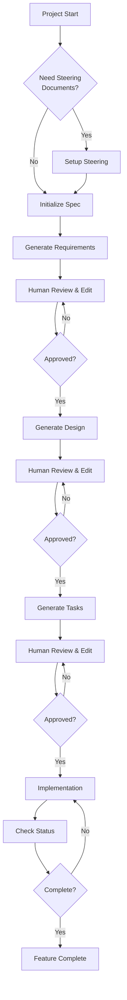

# Spec-Driven Development for GitHub Copilot

A systematic approach to software development using GitHub Copilot's prompt files and 3-phase approval workflow.

## Overview

Spec-Driven Development emphasizes quality gates, human review, and structured documentation. This methodology uses GitHub Copilot's agent mode to guide development through a rigorous workflow while maintaining elegant simplicity.

### Key Benefits

- **🎯 Structured Process**: Clear phases with defined deliverables
- **✅ Quality Gates**: Human approval required between phases  
- **📋 Documentation**: Comprehensive specs and design docs
- **🔄 Iterative**: Review and refine at each stage
- **🤖 AI-Assisted**: Leverage GitHub Copilot's agent mode

## Quick Start

### Prerequisites

- Visual Studio Code
- GitHub Copilot subscription
- GitHub Copilot Chat extension

### Installation

1. Copy the `.github/prompts/` directory to your project
2. Open your project in VS Code with GitHub Copilot enabled
3. Start your first specification:

```text
/spec-1-init: description=Create a user authentication system with JWT tokens and role-based access control
```

## 3-Phase Approval Workflow



## Directory Structure

```text
your-project/
├── .github/
│   └── prompts/                 # GitHub Copilot prompt files
│       ├── spec-0-steering.prompt.md
│       ├── spec-0-steering-custom.prompt.md
│       ├── spec-1-init.prompt.md
│       ├── spec-2-requirements.prompt.md
│       ├── spec-3-design.prompt.md
│       ├── spec-4-tasks.prompt.md
│       └── spec-5-status.prompt.md
├── .spec-workflow/              # Generated during workflow
│   ├── steering/               # Project context documents
│   │   ├── product.md
│   │   ├── tech.md
│   │   └── structure.md
│   └── specs/                  # Feature specifications
│       └── {feature-name}/
│           ├── spec.yaml       # Progress tracking
│           ├── requirements.md # User stories
│           ├── design.md      # Technical design
│           └── tasks.md       # Implementation plan
└── (your project files)
```

## Complete Workflow

### Step 0: Project Steering (Optional)

Set up project context and architectural guidelines:

```text
/spec-0-steering
```

Creates foundational documents about your project's architecture, technology stack, and organizational patterns.

### Step 1: Specification Initialization

Start a new feature specification:

```text
/spec-1-init: description=Build a real-time chat system with WebSocket connections, message persistence, and user presence indicators using React and Node.js
```

Analyzes your project description and creates the specification structure.

### Step 2: Requirements Generation

Generate structured user stories and acceptance criteria:

```text
/spec-2-requirements: feature=chat-system
```

Creates comprehensive requirements using structured user story templates.

**Quality Gate**: Human review and approval required before proceeding.

### Step 3: Technical Design

Create comprehensive technical architecture:

```text
/spec-3-design: feature=chat-system
```

**Prerequisites**: Approved requirements from Step 2

Generates detailed technical design based on approved requirements.

**Quality Gate**: Human review and approval required before proceeding.

### Step 4: Implementation Tasks

Break down the design into actionable implementation tasks:

```text
/spec-4-tasks: feature=chat-system
```

**Prerequisites**: Approved design from Step 3

Creates detailed, time-boxed implementation tasks.

**Quality Gate**: Human review and approval required before implementation.

### Step 5: Status Tracking

Monitor progress and current workflow state:

```text
/spec-5-status: feature=chat-system
```

Provides comprehensive status overview with progress tracking.

## Usage Examples

### Complete Workflow Example

```bash
# 1. Set up project context (optional)
/spec-0-steering

# 2. Initialize new feature
/spec-1-init: description=Create a blog system with markdown support, comments, and tags. Users should be able to create, edit, and publish posts. Include admin moderation features.

# 3. Generate requirements (review output, then approve)
/spec-2-requirements: feature=blog-system
# Edit .spec-workflow/specs/blog-system/requirements.md
# Update spec.yaml: requirements.approved = true

# 4. Generate technical design (review output, then approve) 
/spec-3-design: feature=blog-system
# Edit .spec-workflow/specs/blog-system/design.md
# Update spec.yaml: design.approved = true

# 5. Generate implementation tasks (review output, then approve)
/spec-4-tasks: feature=blog-system
# Edit .spec-workflow/specs/blog-system/tasks.md
# Update spec.yaml: tasks.approved = true

# 6. Track progress during implementation
/spec-5-status: feature=blog-system
```

## Approval Process

After each generation step, manually approve by editing the `spec.yaml` file:

```yaml
approvals:
  requirements:
    generated: true
    approved: true    # ← Set to true after human review
  design:
    generated: true
    approved: true    # ← Set to true after human review  
  tasks:
    generated: true
    approved: true    # ← Set to true after human review
```

## Best Practices

### ✅ Recommended Practices

1. **Start with steering**: Use `/spec-0-steering` for new projects or major changes
2. **Detailed initialization**: Provide comprehensive project descriptions in Step 1
3. **Thorough reviews**: Edit generated documents before approval
4. **No phase skipping**: Follow the sequential approval workflow
5. **Regular status checks**: Use `/spec-5-status: feature=feature-name` to monitor progress
6. **Task updates**: Mark tasks complete as you finish them

### ❌ Common Pitfalls

1. **Skipping human review**: Each phase requires human validation
2. **Vague descriptions**: Poor input leads to poor specifications
3. **Approval shortcuts**: Manual spec.yaml updates are required between phases
4. **Stale documentation**: Update steering documents as projects evolve

## Modifying Existing Specifications

To modify requirements/design/tasks: Edit spec.yaml to set the appropriate phase `approved=false`, then re-run the corresponding prompt.

Example:

```yaml
approvals:
  requirements:
    approved: false  # ← Set to false to allow modification
```

Then run: `/spec-2-requirements: feature=your-feature-name`

The prompt will detect existing content and offer refinement options for iteration.

## Custom Steering Documents

Create specialized project guidelines beyond the core three documents:

```text
/spec-0-steering-custom
```

**Use Cases**:

- API design standards
- Testing methodologies  
- Security policies
- Database conventions
- Performance requirements

## Integration Tips

### With Existing Projects

1. Copy prompt files to `.github/prompts/`
2. Run `/spec-0-steering` to document current architecture
3. Use workflow for new features while maintaining existing code

### Team Collaboration

- **Consistent workflow**: Prompt files ensure team consistency
- **Review process**: Built-in human approval gates
- **Documentation**: Always up-to-date specs and designs
- **Progress visibility**: Status tracking for project management

## Troubleshooting

### Common Issues

**Prompt not found**: Ensure `.github/prompts/` directory contains all prompt files

**Phase blocked**: Check previous phase approval in `spec.yaml`

**Status unclear**: Use `/spec-5-status: feature=feature-name` to diagnose current state

## Summary

Spec-Driven Development for GitHub Copilot provides a robust framework for systematic software development. By combining AI assistance with human oversight, teams can maintain high quality standards while accelerating development velocity.

The methodology's strength lies in its structured approach: each phase builds upon the previous one, ensuring that implementation is based on solid requirements and thoughtful design. The built-in quality gates prevent common development pitfalls while the AI assistance reduces documentation overhead.

Start with your first specification today and experience the benefits of structured, AI-assisted development.
