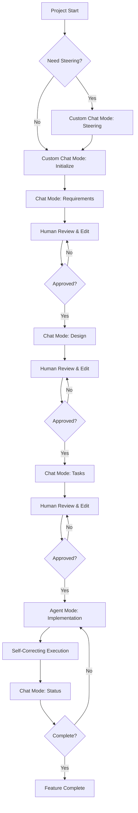

# Enhanced Spec-Driven Development for GitHub Copilot v3

A sophisticated, research-driven approach to software development using GitHub Copilot's advanced features with autonomous execution, validation loops, and platform-native optimization.

## Overview

This enhanced version leverages GitHub Copilot's latest capabilities including custom chat modes, instructions files, agent mode, and GPT-4o optimization to provide a robust spec-driven development workflow that exceeds the original Kiro system capabilities.

### Key Enhancements

- **🤖 Agent Mode Optimization**: Autonomous multi-task execution with premium model efficiency
- **📋 Custom Chat Modes**: Specialized modes for each development phase
- **🔄 Self-Correcting Validation**: Automatic issue resolution with validation loops  
- **📚 Automatic Context Injection**: Instructions files for consistent standards
- **🔍 Optional Research Integration**: AI-powered research when beneficial
- **⚡ Interaction Efficiency**: Context optimization for premium model usage

## Quick Start

### Prerequisites

- Visual Studio Code 1.99+
- GitHub Copilot Pro subscription (for GPT-4o and unlimited usage)
- GitHub Copilot Chat extension

### Installation

1. Copy the `.github-v3/` directory to your project root as `.github/`
2. Enable chat agent mode in VS Code settings:

   ```json
   "chat.agent.enabled": true
   ```

3. Start your first specification:

   ```
   /spec-1-init description=Create a user authentication system with JWT tokens and role-based access control
   ```

## Enhanced 4-Phase Workflow



## Chat Modes Usage

### Requirements Generation

```
Switch to: spec-requirements chat mode
Input: feature name
```

- EARS format requirements generation
- Codebase analysis integration  
- Optional research for complex features
- Automatic context injection via instructions

### Technical Design  

```
Switch to: spec-design chat mode
Input: feature name (requires approved requirements)
```

- Research-driven design process
- Architecture analysis and diagramming
- Source citation when research conducted
- Integration with existing system patterns

### Implementation Planning

```
Switch to: spec-tasks chat mode  
Input: feature name + execution mode preference
```

- Hierarchical task structure (max 2 levels)
- Coding-focused task generation
- Requirement traceability
- Time estimation and dependency ordering

### Autonomous Implementation

```
Switch to: spec-implementation chat mode
Input: feature name + single/multiple task mode
```

- **Agent mode execution** with GPT-4o optimization
- **Multi-task autonomous execution** with 90k context monitoring
- **Self-correcting validation loops** with automatic issue resolution
- **Interaction efficiency** for premium model usage

### Progress Tracking

```
Switch to: spec-status chat mode
Input: feature name
```

- Comprehensive progress analysis
- Quality metrics and validation status
- Blocker identification and recommendations
- Visual progress indicators

## Prompt Files (Alternative Usage)

If you prefer traditional prompt files over chat modes:

```bash
# Project setup
/spec-0-steering

# Feature initialization  
/spec-1-init description=detailed feature description

# Requirements with optional research
/spec-2-requirements feature=feature-name

# Design with research integration
/spec-3-design feature=feature-name

# Task planning with execution optimization
/spec-4-tasks feature=feature-name executionMode=multiple

# Status tracking and analysis
/spec-5-status feature=feature-name
```

## Directory Structure

```
your-project/
├── .github/
│   ├── chatmodes/                    # Custom chat modes
│   │   ├── spec-requirements.chatmode.md
│   │   ├── spec-design.chatmode.md
│   │   ├── spec-implementation.chatmode.md
│   │   └── spec-status.chatmode.md
│   ├── instructions/                 # Automatic context injection
│   │   └── spec-driven-standards.instructions.md
│   └── prompts/                     # Alternative prompt files
│       ├── spec-0-steering.prompt.md
│       ├── spec-1-init.prompt.md
│       ├── spec-2-requirements.prompt.md
│       ├── spec-3-design.prompt.md
│       ├── spec-4-tasks.prompt.md
│       └── spec-5-status.prompt.md
├── .spec-workflow/                  # Generated during workflow
│   ├── steering/                    # Project context
│   │   ├── product.md
│   │   ├── tech.md
│   │   └── structure.md
│   └── specs/                       # Feature specifications
│       └── {feature-name}/
│           ├── spec.yaml           # Progress tracking
│           ├── requirements.md     # EARS format requirements
│           ├── design.md          # Research-driven design
│           └── tasks.md           # Implementation plan
└── (your project files)
```

## Key Features

### EARS Requirements Methodology

Automatic enforcement of Easy Approach to Requirements Syntax:

```markdown
WHEN user clicks "Login" AND credentials are valid THEN system redirects to dashboard
GIVEN user is authenticated WHEN user accesses protected resource THEN system grants access
```

### Research-Driven Design

Optional research integration for complex features:

- Industry best practice analysis
- Technical approach evaluation  
- Source citation and documentation
- Evidence-based design decisions

### Agent Mode Implementation

Autonomous multi-task execution with:

- Context monitoring (90k token optimization)
- Self-correcting validation loops
- Automatic issue resolution
- Premium interaction efficiency

### Automatic Quality Standards

Instructions files provide automatic context injection:

- EARS format enforcement
- Research citation standards
- Task completion validation
- Code quality requirements

## Interaction Efficiency

### Premium Model Optimization

- **Context batching**: Group compatible tasks under 90k tokens
- **Interaction savings**: Multiple tasks per interaction
- **Token monitoring**: Automatic context usage tracking
- **Model selection**: GPT-4o for unlimited implementation usage

### Execution Modes

- **Single task mode**: Focus on one task with detailed guidance
- **Multiple task mode**: Batch execution for efficiency
- **Agent mode**: Autonomous execution with validation

## Advanced Features

### Self-Correcting Validation

Implementation tasks include automatic validation:

1. Execute task automatically
2. Validate completion quality
3. If issues found: fix automatically and re-validate
4. Continue only after successful validation

### Research Integration

When beneficial for complex features:

- Use fetch tool for external research
- Integrate findings into design decisions
- Provide source citations and rationale
- Evidence-based technical choices

### Quality Gates

Built-in quality validation:

- EARS format compliance checking
- Requirement coverage validation
- Design completeness verification
- Implementation quality assessment

## Migration from Previous Versions

### From v2 (.github-v2/)

1. Copy chat modes and instructions to `.github/`
2. Update existing prompts with enhanced features
3. Enable agent mode in VS Code settings
4. Start using custom chat modes for workflow

### From Original Kiro

1. Install GitHub Copilot enhanced system
2. Convert existing specifications to YAML format
3. Adopt EARS requirements methodology
4. Leverage new research and validation features

## Best Practices

### ✅ Recommended Workflow

1. **Start with steering** for new projects or major features
2. **Use chat modes** for guided, context-aware development
3. **Enable agent mode** for autonomous implementation
4. **Review and approve** each phase before proceeding
5. **Monitor progress** with status tracking
6. **Leverage research** for complex or unfamiliar features

### ⚡ Performance Optimization

1. **Use multiple task mode** for compatible tasks
2. **Monitor context usage** to stay under 90k tokens
3. **Batch related tasks** for interaction efficiency
4. **Let agent mode iterate** to resolve issues automatically

### 🔍 Quality Assurance

1. **Follow EARS format** for all requirements
2. **Include research citations** when research conducted
3. **Validate task completion** before proceeding
4. **Use automatic context injection** for consistency

## Troubleshooting

### Common Issues

**Chat mode not found**: Ensure `.github/chatmodes/` files are correctly placed

**Instructions not applying**: Check `applyTo` glob patterns in instructions files

**Agent mode not working**: Verify `chat.agent.enabled: true` in VS Code settings

**Context limit exceeded**: Use single task mode or reduce task batch size

### Performance Tips

- Use agent mode for complex multi-file tasks
- Batch simple tasks together for efficiency
- Monitor token usage in implementation mode
- Let validation loops resolve issues automatically

## Summary

Enhanced Spec-Driven Development for GitHub Copilot v3 provides a sophisticated, research-driven approach to software development that leverages cutting-edge AI capabilities while maintaining the structured quality gates that ensure robust, well-documented software development.

The system exceeds the original Kiro capabilities through modern AI integration, autonomous execution, and platform-native optimization while preserving the methodological rigor that makes spec-driven development effective.
