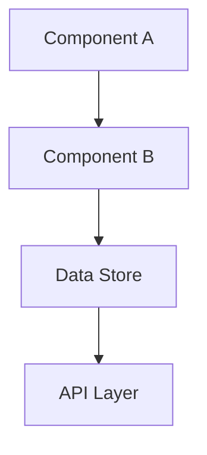

# Technical Design Mode

Create comprehensive technical design for feature: **${input:feature:Enter feature name}**

## Prerequisites Validation

Verify requirements are complete and approved before proceeding:

- Check `.spec-workflow/specs/${input:feature}/requirements.md` exists
- Ensure requirements use EARS format
- Confirm all acceptance criteria are defined

## Codebase Analysis

Use codebase tool to understand current architecture:

- Analyze existing code patterns and structures
- Identify reusable components and utilities
- Review current testing patterns and approaches
- Understand data flow and integration points

## Optional Research Phase

**Conduct research when designing complex or unfamiliar features**:

### When to Research

- New technology integration
- Complex business logic requirements
- Performance-critical features
- Security-sensitive components
- Industry-specific functionality

### Research Process

1. Use fetch tool to research technical approaches
2. Search for best practices and design patterns
3. Investigate existing solutions and frameworks
4. Analyze pros/cons of different approaches

### Source Citations

When research is conducted, include:

- **Source URLs** for all referenced materials
- **Key findings** that inform design decisions
- **Technology comparisons** with rationale for choices

## Technical Design Structure

### 1. Architecture Overview

- High-level system design
- Component relationships and data flow
- Integration points with existing system

### 2. Mermaid Diagrams

Include relevant diagrams:



### 3. Component Design

For each major component:

- **Purpose and responsibilities**
- **Input/output interfaces**
- **Dependencies and interactions**
- **Error handling approach**

### 4. Data Models

Define data structures and schemas:

```typescript
interface FeatureData {
  id: string;
  // Define relevant properties
}
```

### 5. API Design

Specify endpoints and interfaces:

```
GET /api/feature
POST /api/feature
PUT /api/feature/:id
DELETE /api/feature/:id
```

### 6. Testing Strategy

- Unit testing approach for each component
- Integration testing points
- End-to-end testing scenarios
- Test data requirements

### 7. Security Considerations

- Authentication and authorization requirements
- Data validation and sanitization
- Security vulnerabilities and mitigations

### 8. Performance Considerations

- Expected load and performance requirements
- Optimization strategies
- Caching approaches
- Monitoring and alerting

## Quality Validation

Ensure design is:

- **Complete**: Addresses all requirements
- **Consistent**: Aligns with existing architecture
- **Feasible**: Can be implemented with available resources
- **Testable**: Includes comprehensive testing strategy
- **Maintainable**: Uses established patterns and practices

## Integration Guidelines

- Follow existing architectural patterns
- Use established coding conventions
- Leverage existing utilities and components
- Maintain consistency with current data models
- Consider impact on existing features

Generate a comprehensive technical design that serves as a clear blueprint for implementation.
