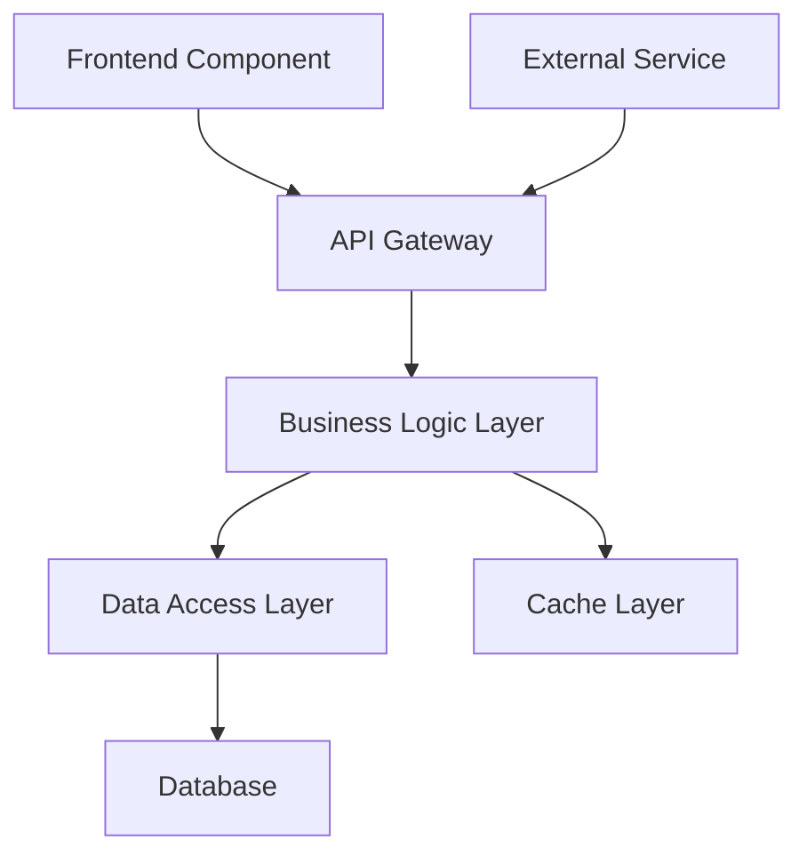

# Technical Design Generation

Create comprehensive technical design for feature: **${input:feature:Enter feature name}**

## Prerequisites Validation

**CRITICAL**: Design can only be generated after requirements are approved.

### Approval Status Check

Verify in `.spec-workflow/specs/${input:feature}/spec.yaml`:

```yaml
approvals:
  requirements:
    approved: true # Must be true to proceed
```

**If requirements not approved**: Complete requirements review and approval first.

## Context Analysis

### Requirements Analysis

Read and analyze `.spec-workflow/specs/${input:feature}/requirements.md`:

- Understand all functional requirements
- Identify non-functional requirements
- Note integration requirements
- Review acceptance criteria for design implications

### Codebase Architecture Analysis

Use codebase tool to understand:

- **Current architecture patterns** and structures
- **Existing components** that can be reused or extended
- **Data models** and database schemas
- **API patterns** and conventions
- **Testing approaches** and frameworks
- **Error handling** patterns

### Steering Context

Reference steering documents for:

- **Architecture guidelines**: `.spec-workflow/steering/structure.md`
- **Technology constraints**: `.spec-workflow/steering/tech.md`
- **Product constraints**: `.spec-workflow/steering/product.md`

## Optional Research Integration

**Conduct research when designing complex or unfamiliar features**:

### When Research is Beneficial

- New technology integration or complex technical approaches
- Performance-critical or security-sensitive components
- Integration with external systems or APIs
- Features requiring specialized knowledge or industry standards

### Research Process

1. **Use fetch tool** to research technical approaches and patterns
2. **Search for architectural patterns** and best practices
3. **Investigate frameworks, libraries, or tools** for implementation
4. **Analyze performance, security, or scalability considerations**

### Research Documentation

When research is conducted, document findings:

```markdown
## Research Findings

### Technical Approaches Analyzed

- **[Approach Name](Source URL)**: Description and evaluation
- **[Framework/Library](Source URL)**: Capabilities and trade-offs
- **[Pattern/Architecture](Source URL)**: Benefits and implementation considerations

### Selected Approach Rationale

- **Chosen solution**: [Selected approach] based on [specific criteria]
- **Trade-off analysis**: Why this approach over alternatives
- **Integration considerations**: How it fits with existing architecture
```

## Technical Design Structure

### 1. Architecture Overview

- **High-level system design** showing major components
- **Component relationships** and data flow
- **Integration points** with existing system
- **Technology stack decisions** with rationale

### 2. System Architecture Diagram

Use mermaid syntax for visual representation:



### 3. Component Design

For each major component:

#### Component: [Component Name]

- **Purpose**: What this component does
- **Responsibilities**: Specific functions and capabilities
- **Interfaces**: Input/output specifications
- **Dependencies**: Other components or services required
- **Data Model**: Structures and schemas used

### 4. API Design

Specify endpoints and interfaces:

```typescript
// API Endpoints
GET    /api/feature              // Description
POST   /api/feature              // Description
PUT    /api/feature/:id          // Description
DELETE /api/feature/:id          // Description

// Data Models
interface FeatureData {
  id: string;
  name: string;
  // Additional properties based on requirements
}

interface FeatureRequest {
  // Request payload structure
}

interface FeatureResponse {
  // Response payload structure
}
```

### 5. Data Model Design

```typescript
// Database Schema
interface FeatureEntity {
  id: string;
  createdAt: Date;
  updatedAt: Date;
  // Feature-specific fields based on requirements
}

// Business Logic Models
interface FeatureDomain {
  // Domain model properties and methods
}
```

### 6. Error Handling Strategy

- **Error types** and categorization
- **Error response formats** and status codes
- **Validation error handling** approach
- **Exception propagation** and logging strategy

### 7. Security Considerations

- **Authentication** requirements and implementation
- **Authorization** rules and access control
- **Data validation** and sanitization approach
- **Security vulnerabilities** and mitigation strategies

### 8. Performance and Scalability

- **Performance requirements** from specifications
- **Optimization strategies** for critical paths
- **Caching approach** and cache invalidation
- **Database query optimization** considerations
- **Monitoring and alerting** requirements

### 9. Testing Strategy

- **Unit testing approach** for each component
- **Integration testing** scenarios and setup
- **End-to-end testing** critical user flows
- **Test data management** and setup requirements
- **Performance testing** considerations

## Design Quality Validation

Ensure design addresses:

- [ ] All functional requirements from requirements.md
- [ ] All non-functional requirements (performance, security, etc.)
- [ ] Integration with existing system architecture
- [ ] Error handling for all specified conditions
- [ ] Data model changes and migration considerations
- [ ] API design follows existing conventions
- [ ] Security requirements are addressed
- [ ] Testing strategy covers all components

## Implementation Considerations

### Development Approach

- **Incremental implementation** strategy
- **Dependency order** for development tasks
- **Risk mitigation** for complex components
- **Rollback strategy** for deployment

### Existing Code Integration

- **Components to reuse** or extend
- **Patterns to follow** from existing codebase
- **Conventions to maintain** for consistency
- **Impact assessment** on existing features

## Metadata Updates

Update spec.yaml upon completion:

```yaml
phase: "design-generated"
progress:
  requirements: 100
  design: 100
  tasks: 0
approvals:
  requirements:
    generated: true
    approved: true
  design:
    generated: true
    approved: false
updated_at: "{current_timestamp}"
```

## Next Steps

After design generation:

1. **Human Review**: Thoroughly review technical design
2. **Architecture Validation**: Ensure alignment with existing system
3. **Edit as Needed**: Make necessary adjustments or improvements
4. **Approve Design**: Update spec.yaml to set `design.approved: true`
5. **Proceed to Tasks**: Only after design is approved

Generate a comprehensive technical design that serves as a clear blueprint for implementation, addressing all requirements while integrating seamlessly with existing system architecture.
