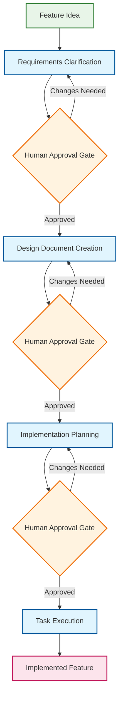

# Spec-Driven Development Workflow for GitHub Copilot: Blueprint & Architecture

*A comprehensive framework for systematic, quality-controlled software development using GitHub Copilot customizations*

## Executive Summary

This document provides the architectural blueprint for a sophisticated Spec-Driven Development workflow implemented through GitHub Copilot's customization system. The workflow transforms feature ideas into implemented functionality through four structured stages with explicit quality gates, scope control, and context preservation.

**Core Achievement**: A systematic development methodology that combines the power of Kiro IDE's spec-driven approach with GitHub Copilot's AI capabilities, enhanced through GPT-4.1 prompting principles and USDD → EARS → SDD hybrid methodology for reliable, consistent execution from vague requests to implemented features.

## System Architecture Overview

### Four-Stage Workflow Design



### File Hierarchy & Responsibilities

```text
.github-v5-gpt-4.1/
├── instructions/           # Foundational standards shared across stages
│   ├── spec-requirements.instructions.md
│   ├── spec-design.instructions.md
│   ├── spec-implementation-plan.instructions.md
│   └── spec-workflow-general.instructions.md
├── chatmodes/             # System-level behavior frameworks
│   ├── spec-0-steering*.chatmode.md
│   ├── spec-2-requirements*.chatmode.md
│   ├── spec-3-design*.chatmode.md
│   ├── spec-4-implementation*.chatmode.md
│   └── spec-5-task-execution.chatmode.md
└── prompts/               # Complete task-specific prompts
    ├── spec-0-steering*.prompt.md
    ├── spec-2-requirements*.prompt.md
    ├── spec-3-design*.prompt.md
    ├── spec-4-implementation*.prompt.md
    └── spec-5-task-execution.prompt.md
```

## Philosophy & Design Principles

### 1. GPT-4.1 Prompting Philosophy Integration

**Why**: Traditional prompting approaches fail with advanced AI models that require explicit specification rather than intuitive guidance.

**How**: Applied the 8 foundational GPT-4.1 principles throughout:

#### Explicit Over Implicit

- **Before**: Vague completion criteria like "generate comprehensive requirements"
- **After**: Specific success criteria: "All functional requirements use proper EARS format where condition/response patterns apply"

#### Structured Autonomy (The Three Pillars)

- **Persistence**: Clear termination conditions for each stage
- **Tool Utilization**: Explicit tool usage patterns (`search` → `codebase` semantic search → analysis)
- **Planning & Reflection**: Systematic reasoning steps with reflection requirements

#### Defensive Design Patterns

- **Scope Control**: Explicit prevention of feature creep at every stage
- **Error Handling**: Comprehensive escape clauses for common failure modes
- **Quality Gates**: Measurable validation criteria before stage progression

### 2. Scenario-Based Technology Approach

**Why**: Blanket "language-agnostic" approaches don't work across all workflow stages. Technology awareness should match the stage purpose.

**How**: Implemented stage-appropriate technology awareness:

#### Requirements Stage: Language-Agnostic

- **Rationale**: Business requirements are independent of implementation technology
- **Focus**: WHAT users need, not HOW to implement it
- **Examples**: "User must be able to authenticate" vs "User must authenticate via JWT"

#### Design Stage: Scenario-Based Technology Decisions

- **Greenfield Projects**: Analyze requirements → choose appropriate tech stack → design for chosen technology
- **Brownfield Projects**: Analyze existing codebase → design for existing technology stack
- **Hybrid Projects**: Justify new technology + design integration patterns

#### Implementation Planning: Technology-Specific

- **Rationale**: By this stage, technology stack is known and tasks must be specific
- **Focus**: Create concrete coding tasks like "Create SQLAlchemy User model" not "Create user model"

#### Task Execution: Technology-Specific

- **Rationale**: Writing actual code in specific languages and frameworks
- **Focus**: Execute technology-specific implementation tasks

### 3. Realistic Quality Standards

**Why**: Arbitrary percentages and subjective language create unrealistic expectations and inconsistent behavior.

**How**: Replaced rigid metrics with practical, achievable standards:

#### Before (Problematic)

- "100% of functional requirements must use EARS format"
- "90%+ compliance for task sizing"
- "Generate comprehensive documentation"

#### After (Realistic)

- "Use EARS format for functional requirements where condition/response patterns apply"
- "Maintain task sizing consistently within 2-4 hour range"
- "Generate appropriate documentation"

### 4. Scope Control Architecture

**Why**: AI models tend to expand scope beyond requirements, leading to feature creep and project bloat.

**How**: Implemented multi-layer scope control:

#### Explicit Scope Statements

- Every stage includes explicit scope control requirements
- Clear boundaries between "enhancement of existing requirements" vs "new features"

#### Defensive Patterns

- Error handling for "scope expansion temptation"
- Documentation requirements for additional ideas (but exclusion from current scope)

#### Examples and Counter-Examples

- ✅ Correct: "Implement user login endpoint as specified in REQ-2.1"
- ❌ Scope Creep: "Implement user login endpoint with OAuth integration and rate limiting"

### 5. USDD → EARS → SDD Hybrid Methodology

**Why**: Personal productivity workflows require transformation of initial ideas and fuzzy ideas into clear, actionable plans while maintaining systematic quality control.

**How**: Implemented adaptive hybrid approach combining User Story Driven Development, EARS format requirements, and Specification-Driven Development:

#### Development Methodologies Research Foundation

Based on comprehensive analysis of development methodologies:

**Methodology Definitions:**
- **USDD (User Story Driven Development)**: Excels at capturing user empathy and clarifying fuzzy ideas through "As a [persona], I want [intent], so that [value]" format
- **EARS (Easy Approach to Requirements Syntax)**: Provides formal, testable requirements using "WHEN [condition] THEN [response]" structure  
- **SDD (Specification-Driven Development)**: Enables direct executable specifications (already implemented in existing workflow)

#### Hybrid Integration Strategy

**Stage 1 (Initialization)**: Prepare templates for hybrid methodology
**Stage 2 (Requirements)**: Implement USDD → EARS progression
**Stages 3+ (Design/Implementation/Execution)**: Preserve existing REQ-X.X traceability system

#### Conditional Application Principles

- **User Stories**: Applied only when ideas are fuzzy or unclear (adaptive, not mandatory)
- **EARS Requirements**: Maintain as primary formal requirements format
- **Traceability Preservation**: REQ-X.X system remains intact throughout workflow stages 3+

#### Personal Productivity Optimization

**Idea-to-Implementation Pipeline**:

1. Initial idea or fuzzy idea
2. User story clarification (when needed)
3. EARS formal requirements
4. Existing design → implementation → execution workflow

**Benefits for Individual Use**:

- Transform fuzzy ideas into structured implementation plans
- Generate comprehensive Jira ticket content from initial ideas
- Support individual brainstorming and idea clarification
- Maintain systematic quality while enhancing thought organization

#### Quality Standards Integration

- **Realistic Application**: Conditional user story usage rather than rigid metrics
- **Scope Control Maintenance**: Prevent feature creep during clarification process
- **Existing System Preservation**: No disruption to proven REQ-X.X traceability
- **Evidence-Based Enhancement**: Built on development methodologies comparative analysis

## Implementation Architecture

### Tool Usage Standardization

**Problem Solved**: Inconsistent and incorrect tool usage across workflow stages.

**Solution**: Standardized detection-first methodology:

```markdown
1. Use `search` tool to locate files and understand project structure
2. Use `codebase` semantic search tool to find patterns and examples
3. Use systematic file reading for detailed analysis
4. Use `editFiles` for content creation and updates
```

**Why This Order**: Search provides spatial awareness, semantic search provides pattern understanding, systematic reading provides detailed context.

### Context Safety Protocols

**Problem Solved**: AI models losing context during long workflow executions, leading to inconsistent behavior.

**Solution**: Implemented context preservation mechanisms:

#### Context Refresh Requirements

- Always re-read specification documents before task execution
- Mark progress immediately after each completed task
- Re-read tasks.md between individual task executions

#### State Persistence

- All progress tracked in markdown files with checkbox format
- spec.yaml metadata tracks approval status and workflow state
- Steering documents maintain project context across sessions

### Quality Assurance Framework

**Problem Solved**: Inconsistent quality and missing validation across workflow stages.

**Solution**: Multi-level quality validation:

#### Instructions Level

- Document format standards and content requirements
- Template structures and required sections
- Quality criteria for deliverable completeness

#### Chat Mode Level  

- Agent behavior patterns and defensive strategies
- Tool usage requirements and context management
- Planning and reflection requirements

#### Prompt Level

- Specific success criteria and validation checklists
- Error handling and recovery procedures
- Output format requirements and quality gates

## Workflow Stage Details

### Stage 0: Steering System (Project Context)

**Purpose**: Establish and maintain persistent project knowledge

**Key Innovation**: Context persistence across development sessions through structured markdown documents

**Technology Awareness**: Project-specific (analyzes actual codebase)

**Quality Control**:

- Preservation of user customizations
- Accuracy validation against actual project state
- Integration verification with development workflow

### Stage 1: Requirements Clarification

**Purpose**: Transform feature ideas into structured, testable requirements using USDD → EARS hybrid methodology

**Key Innovation**: Conditional user story clarification followed by EARS format requirements with business impact rationale

**Technology Awareness**: Language-agnostic (business requirements)

**Hybrid Methodology Integration**:

- User value analysis section prepared in templates for fuzzy idea clarification
- Conditional user story application when ideas lack clarity
- EARS format requirements as primary formal specification
- Idea-to-implementation pipeline for personal productivity optimization

**Quality Control**:

- EARS format validation where applicable
- Testable acceptance criteria for all requirements
- Business impact rationale for priorities
- Scope control during clarification process

### Stage 2: Design Document Creation

**Purpose**: Bridge requirements with implementable architecture

**Key Innovation**: Scenario-based technology decisions with research integration

**Technology Awareness**: Scenario-based (greenfield/brownfield/hybrid)

**Quality Control**:

- All requirements addressed with clear traceability
- Technology decisions documented with rationale
- Integration patterns defined with clear interfaces

### Stage 3: Implementation Planning

**Purpose**: Break design into specific, actionable coding tasks

**Key Innovation**: Coding-only focus with requirement traceability and dependency management

**Technology Awareness**: Technology-specific (implements for known stack)

**Quality Control**:

- 2-4 hour task sizing for effective execution
- Complete requirement coverage with traceability
- Dependency sequencing for optimal execution order

### Stage 4: Task Execution

**Purpose**: Execute implementation tasks with context safety and quality validation

**Key Innovation**: All-tasks execution with context preservation and scope control

**Technology Awareness**: Technology-specific (writing actual code)

**Quality Control**:

- Context safety through task.md re-reading  
- Immediate progress marking for session resumption
- Quality validation per task before progression

## Success Metrics & Validation

### Quantitative Measures

1. **Requirement Coverage**: All approved requirements mapped to design and implementation
2. **Task Completion**: All tasks completed with acceptance criteria met
3. **Scope Adherence**: No unauthorized features added beyond approved requirements
4. **Quality Gate Compliance**: All validation checklists completed successfully

### Qualitative Measures

1. **Consistency**: Coherent deliverables across all workflow stages
2. **Maintainability**: Documentation and code quality suitable for long-term maintenance
3. **Traceability**: Clear links from feature ideas through implemented functionality
4. **Context Preservation**: Ability to resume work across different sessions

## Benefits & Advantages

### For Development Teams

1. **Systematic Documentation**: Comprehensive artifact generation ensures nothing is overlooked
2. **Quality Gate Enforcement**: Mandatory human review prevents rushed or incomplete work
3. **Context Preservation**: Knowledge retention across development sessions and team members
4. **Scope Control**: Built-in protection against feature creep and scope expansion

### For Personal Productivity

1. **Idea Development**: Systematic conversion of fuzzy ideas into actionable implementation plans
2. **Idea Clarification**: User story format improves clarity and builds understanding of initial ideas
3. **Documentation Generation**: Structured progression suitable for Jira ticket creation and project handoffs
4. **Individual Workflow Optimization**: Supports personal brainstorming and requirement clarification processes

### For AI-Assisted Development

1. **Reliable Behavior**: GPT-4.1 principles ensure consistent, predictable AI performance
2. **Error Recovery**: Comprehensive defensive patterns handle common failure modes
3. **Context Management**: Structured approach prevents context loss and maintains coherence
4. **Tool Integration**: Optimized tool usage patterns for maximum effectiveness

### For Project Management

1. **Progress Visibility**: Clear task-level progress tracking and completion status
2. **Risk Mitigation**: Early identification of scope, technical, and resource risks
3. **Knowledge Transfer**: Comprehensive documentation enables effective team handoffs
4. **Quality Assurance**: Built-in validation ensures deliverable quality

## Integration & Extensibility

### GitHub Copilot Integration

The workflow leverages GitHub Copilot's three customization mechanisms:

1. **Instructions Files**: Establish foundational standards and quality criteria
2. **Custom Chat Modes**: Define agent behaviors and workflow frameworks
3. **Prompt Files**: Provide complete task-specific execution instructions

### MCP Tool Integration

The workflow integrates with external tools through Model Context Protocol:

1. **Context7**: Up-to-date library documentation and best practices
2. **Sequential Thinking**: Complex analysis and decision-making support
3. **IDE Integration**: Direct integration with development environment

### Extensibility Points

1. **Custom Steering Documents**: Project-specific context and standards
2. **Domain-Specific Instructions**: Specialized requirements for specific development domains
3. **Tool Integration**: Additional MCP servers for specialized development tools
4. **Workflow Customization**: Adaptation for different development methodologies

## Future Evolution

### Continuous Improvement Framework

1. **Evidence-Based Refinement**: Regular analysis of workflow effectiveness and bottlenecks
2. **Pattern Learning**: Identification of successful patterns for broader application
3. **Tool Evolution**: Integration of new tools and capabilities as they become available
4. **Methodology Advancement**: Incorporation of evolving best practices and standards

### Scalability Considerations

1. **Team Collaboration**: Extensions for multi-developer workflow coordination
2. **Project Complexity**: Adaptations for large-scale, multi-component systems
3. **Technology Evolution**: Framework updates for emerging technologies and platforms
4. **Integration Breadth**: Connections with broader development and deployment toolchains

## Conclusion

The Spec-Driven Development workflow for GitHub Copilot represents a significant advancement in AI-assisted software development. By combining systematic methodology with advanced AI prompting techniques and USDD → EARS → SDD hybrid methodology, it provides a reliable, scalable approach to software development that maintains quality while leveraging AI capabilities.

The workflow's success stems from its recognition that different development stages require different approaches to technology awareness, quality control, and scope management. The hybrid methodology enhancement addresses the critical gap between initial ideas and formal requirements, enabling personal productivity optimization while maintaining systematic quality control. This nuanced understanding, combined with GPT-4.1 prompting principles and comprehensive defensive design, creates a robust framework suitable for professional software development.

**Key Achievement**: Transformation of AI assistance from helpful but unpredictable to systematic and reliable, enabling consistent high-quality software development through structured methodology, explicit quality control, and adaptive requirement clarification that bridges the gap from initial ideas to implemented features.

---

*This blueprint represents the culmination of systematic refinement and testing, incorporating lessons learned from practical application and continuous improvement of the workflow design and implementation.*
