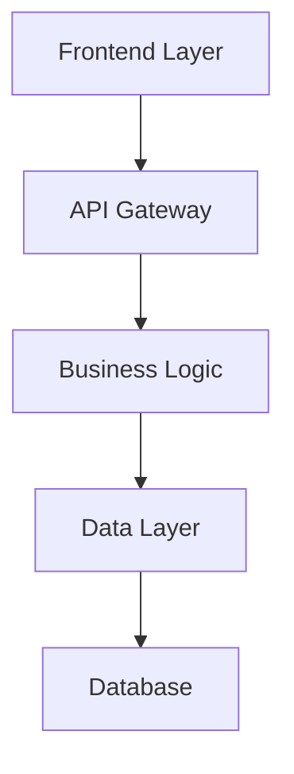
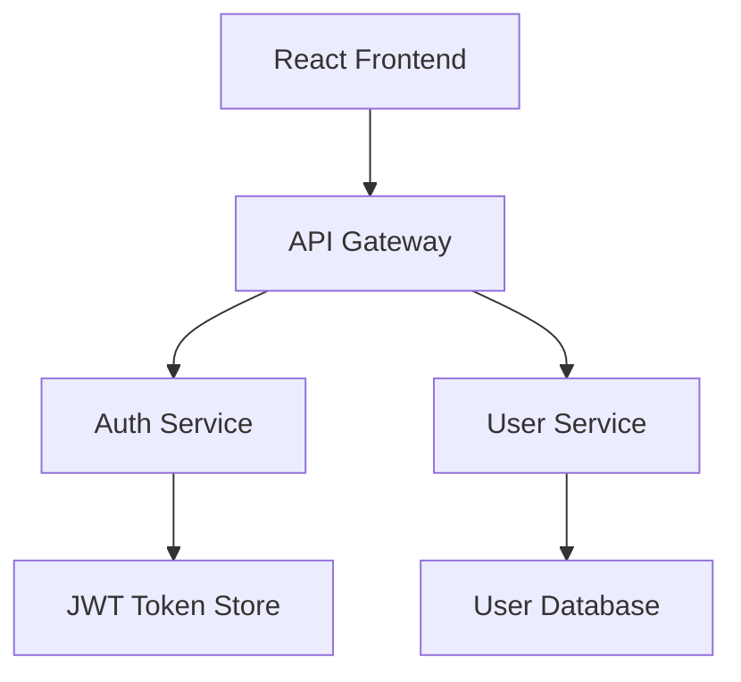

# Technical Design Template

Use this structured template when generating technical designs for specifications to ensure comprehensive coverage and consistency.

## Design Document Structure

Follow this structure for all technical design documents:

### 1. Overview

- **Purpose**: Brief technical overview of the implementation approach
- **Scope**: What this design covers and what it doesn't
- **Assumptions**: Key technical assumptions and constraints

### 2. Architecture

Include a high-level architecture diagram using mermaid:



### 3. Technology Stack

Specify the complete technology stack:

- **Frontend**: Framework + Language (React/Vue/Next.js + TypeScript)
- **Backend**: Framework + Language (FastAPI/Express/Django + Python/Node.js)
- **Database**: Database technology (PostgreSQL/MySQL/MongoDB)
- **Authentication**: Auth approach (JWT/OAuth/Auth0)
- **Testing**: Testing frameworks (Jest/pytest + Testing Library/Playwright)
- **Deployment**: Deployment platform (Docker/Vercel/AWS)

### 4. Components and Interfaces

Detail component design with clear interfaces:

- **Component breakdown**: Major system components
- **Interface definitions**: APIs between components
- **Data contracts**: Expected data formats and schemas

### 5. API Endpoints

Document all API endpoints:

```
GET /api/[resource]           # List resources
POST /api/[resource]          # Create resource
GET /api/[resource]/:id       # Get specific resource
PUT /api/[resource]/:id       # Update resource
DELETE /api/[resource]/:id    # Delete resource
```

### 6. Data Flow

Describe how data flows through the system:

- **Request flow**: From user action to response
- **Data transformations**: How data changes between layers
- **State management**: How application state is maintained

### 7. Data Models

Define data structures and database schemas:

```typescript
interface [ModelName] {
  id: string;
  createdAt: Date;
  updatedAt: Date;
  // Add domain-specific fields
}
```

### 8. Error Handling

Comprehensive error handling strategy:

- **Error types**: Different categories of errors
- **Error responses**: Standard error response formats
- **Recovery strategies**: How the system handles failures
- **Logging**: What gets logged and where

### 9. Security Considerations

Address security requirements:

- **Authentication**: How users are authenticated
- **Authorization**: How access control is enforced
- **Data validation**: Input validation and sanitization
- **Security headers**: Required security configurations

### 10. Performance & Scalability

Plan for performance and scale:

- **Caching strategy**: What gets cached and where
- **Database optimization**: Indexing and query optimization
- **Scaling approach**: Horizontal vs vertical scaling
- **Performance metrics**: Key performance indicators

### 11. Testing Strategy

Comprehensive testing approach:

- **Unit tests**: Component-level testing
- **Integration tests**: API and service integration
- **E2E tests**: User workflow testing
- **Test data**: Test data management strategy

## Design Quality Guidelines

### Architecture Principles

- **Modularity**: Clear separation of concerns
- **Scalability**: Design for growth
- **Maintainability**: Easy to modify and extend
- **Testability**: Components can be tested in isolation

### Technical Standards

- **Consistency**: Follow established patterns
- **Documentation**: Clear interface documentation
- **Error Handling**: Comprehensive error scenarios
- **Security**: Security-first design approach

### Integration Requirements

- **Existing Systems**: How to integrate with current architecture
- **Data Migration**: Strategy for data transitions
- **Backward Compatibility**: Maintaining existing functionality
- **Dependencies**: External service dependencies

## Template Example

````markdown
# Technical Design: User Management System

## Overview

This design covers a comprehensive user management system including registration, authentication, profile management, and role-based access control.

## Architecture


````

## Technology Stack

- **Frontend**: React 18 + TypeScript + Tailwind CSS
- **Backend**: Node.js + Express + TypeScript
- **Database**: PostgreSQL with Prisma ORM
- **Authentication**: JWT + bcrypt for password hashing
- **Testing**: Jest + React Testing Library + Playwright
- **Deployment**: Docker + AWS ECS

## Components and Interfaces

### Auth Service

```typescript
interface AuthService {
  register(userData: UserRegistration): Promise<AuthResult>;
  login(credentials: LoginCredentials): Promise<AuthResult>;
  refreshToken(token: string): Promise<string>;
}
```

### User Service

```typescript
interface UserService {
  getProfile(userId: string): Promise<UserProfile>;
  updateProfile(userId: string, updates: ProfileUpdates): Promise<UserProfile>;
  deleteUser(userId: string): Promise<void>;
}
```

```

## Integration with Spec Workflow

This template should be referenced in:
- Design generation phase (#spec-3-design.prompt.md)
- Quality assurance reviews
- Implementation planning

## Best Practices

- Include specific technology choices with versions
- Provide concrete examples for interfaces and data models
- Address both functional and non-functional requirements
- Consider security and performance from the start
- Design for testability and maintainability
- Document assumptions and constraints clearly
```
