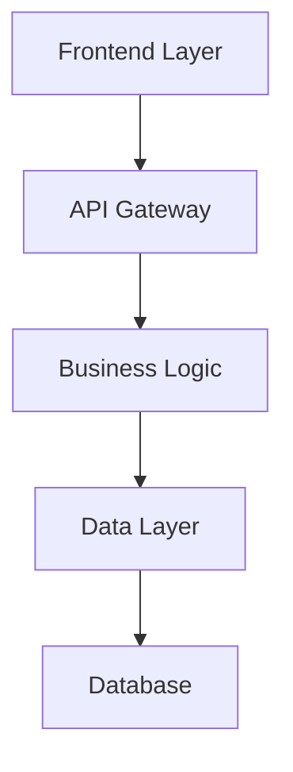

# Technical Design Generation

Create comprehensive technical design for feature: **${input:feature:Enter feature name}**

## Approval Gate: Requirements Check

**CRITICAL**: Design can only be generated after requirements are approved.

### Approval Status Verification

First, check the spec metadata to verify requirements approval:

- Spec metadata: Reference `.spec-workflow/specs/${input:feature}/spec.yaml`

**STOP EXECUTION** if spec.yaml shows:

```yaml
approvals:
  requirements:
    approved: false
```

### Required Actions for Requirements Approval

If requirements are not approved:

1. **Review requirements.md** - Read through the generated requirements thoroughly
2. **Edit if needed** - Make any necessary changes directly in the requirements.md file
3. **Manual approval required** - Update spec.yaml manually to set `requirements.approved: true`
4. **Reasoning**: Human review ensures requirements accuracy before design phase

**Example approval in spec.yaml**:

```yaml
approvals:
  requirements:
    generated: true
    approved: true # ← Set this to true after human review
phase: "requirements-approved"
```

**Only proceed to design generation after requirements are explicitly approved by human review.**

## Context Analysis

### Steering Context

Reference steering documents if available:

- Current architecture: #.spec-workflow/steering/structure.md
- Technology stack: #.spec-workflow/steering/tech.md
- Product constraints: #.spec-workflow/steering/product.md

### Requirements Context (APPROVED)

- Feature requirements: Reference `.spec-workflow/specs/${input:feature}/requirements.md`
- Current design: Reference `.spec-workflow/specs/${input:feature}/design.md`
- Spec metadata: Reference `.spec-workflow/specs/${input:feature}/spec.yaml`

## Technical Design Process

**Prerequisites Verified**: Requirements are approved and ready for design phase.

Follow the design template structure from #spec-design-template.instructions.md.

### 1. Design Document Structure

Create comprehensive design.md with the following structure:

````markdown
# Technical Design

## Overview

[Technical overview of the implementation approach]

## Architecture

[Architecture diagram using mermaid]


````

## Technology Stack

- **Frontend**: [React/Vue/Next.js] + [TypeScript]
- **Backend**: [FastAPI/Express/Django] + [Language]
- **Database**: [PostgreSQL/MySQL/MongoDB]
- **Authentication**: [JWT/OAuth/Auth0]
- **Testing**: [Jest/pytest] + [Testing Library/Playwright]
- **Deployment**: [Docker/Vercel/AWS]

## Components and Interfaces

[Detailed component design with clear interfaces]

### API Endpoints

```
GET /api/[resource]
POST /api/[resource]
PUT /api/[resource]/:id
DELETE /api/[resource]/:id
```

### Data Flow

[Description of how data flows through the system]

## Data Models

[Data structures and database schemas]

```typescript
interface [ModelName] {
  id: string;
  // Add relevant fields
}
```

## Error Handling

[Comprehensive error handling strategy]

## Security Considerations

[Authentication, authorization, data validation]

## Performance & Scalability

[Caching, optimization, scaling strategy]

## Testing Strategy

[Unit, integration, and E2E testing approach]

````

### 2. Design Quality Guidelines
Ensure the design meets these standards:
- **Architecture Alignment**: Follow existing architectural patterns
- **Technology Consistency**: Use established technology stack
- **Interface Design**: Define clear component interfaces
- **Data Modeling**: Design appropriate data structures
- **Error Handling**: Plan comprehensive error scenarios
- **Testing Strategy**: Include unit, integration, and E2E testing

### 3. Integration Considerations
Based on steering and requirements:
- How components integrate with existing architecture
- Database schema changes required
- API endpoint design
- Performance considerations
- Security requirements

### 4. Mermaid Diagrams
Include relevant diagrams:
- System architecture
- Component interactions
- Data flow diagrams
- Sequence diagrams for key workflows

### 5. Update Metadata
After generating design, update spec.yaml with:
```yaml
phase: "design-generated"
progress:
  requirements: 100
  design: 100
  tasks: 0
approvals:
  requirements:
    generated: true
    approved: true
  design:
    generated: true
    approved: false
updated_at: "{current_timestamp}"
````

### 6. Document Generation Focus

Generate the design document content ONLY. Do not include review or approval instructions in the actual document file.

## Quality Validation

Ensure the generated design:

- Follows the design template structure
- Includes comprehensive technical details
- Provides clear architectural diagrams
- Addresses all requirements from the approved requirements.md
- Considers integration with existing system components
- Includes appropriate security and performance considerations

## Cross-References

This prompt works within the spec-driven development workflow:

- **Previous step**: #spec-2-requirements.prompt.md (requirements generation)
- **Next step**: #spec-4-tasks.prompt.md (implementation tasks - requires design approval)
- **Status check**: #spec-5-status.prompt.md (view current progress)

## Implementation Instructions

### Execution Steps:

1. **Verify requirements approval** - Check spec.yaml for requirements approval status
2. **Analyze approved requirements** from requirements.md
3. **Apply steering context** for architectural and technical constraints
4. **Generate comprehensive design** following template structure
5. **Include technical diagrams** using mermaid syntax
6. **Update tracking metadata** upon completion
7. **Provide next steps** for human review and approval process

### Output Guidelines:

- Generate design that provides clear foundation for implementation tasks
- Use specific technical details and concrete examples
- Include comprehensive architecture and data modeling
- Address security, performance, and testing considerations
- Maintain consistency with established project patterns

## Human Review Process

After generation, the design must be reviewed and approved before proceeding to tasks:

1. **Human reviews** the generated design.md
2. **Manual edits** can be made directly to the file if needed
3. **Approval** is granted by manually updating spec.yaml:
   ```yaml
   approvals:
     design:
       generated: true
       approved: true
   phase: "design-approved"
   ```
4. **Only after approval** can #spec-4-tasks.prompt.md be used

This ensures quality technical design that serves as a solid foundation for implementation task planning.
