# Spec-Driven Development Evolution Analysis - July 27, 2025

## Revolutionary Discovery

This analysis uncovered the **complete evolutionary history** of spec-driven development systems, revealing that many features attributed to Claude Code v2 were actually **ORIGINAL to the Amazon Kiro system**! 

**🚨 Key Revelation**: EARS methodology, research integration, and sophisticated steering were pioneered by Amazon's Kiro system. Claude Code v1 was a simplification, and v2 represents a renaissance of original Kiro principles enhanced with AI automation.

## The True Evolution Path

```mermaid
graph LR
    A[Original Kiro<br/>Amazon 2023?<br/>🏛️ Enterprise Foundation] --> B[Claude Code v1<br/>🎯 Simplification]
    B --> C[Claude Code v2<br/>🚀 Renaissance + AI]
    
    A -.->|Direct Influence| C
    
    subgraph "Feature Origins"
        D[EARS Methodology<br/>✨ Original Kiro]
        E[Research Integration<br/>✨ Original Kiro]
        F[Sophisticated Steering<br/>✨ Original Kiro]
        G[VS Code Integration<br/>✨ Original Kiro]
        H[MCP Protocol<br/>✨ Original Kiro]
    end
    
    A --> D
    A --> E
    A --> F
    A --> G
    A --> H
```

## Documents in This Analysis

### 🏛️ [complete-evolution-analysis.md](./complete-evolution-analysis.md) ⭐ **ESSENTIAL READ**
**The Complete Story - Revolutionary Analysis**
- Original Amazon Kiro system deep dive and documentation analysis
- True evolutionary path: Kiro → v1 (simplification) → v2 (renaissance + AI)
- EARS methodology origins revealed (predates v2 by years!)
- Research integration heritage analysis (also original to Kiro!)
- Enterprise integration evolution and feature comparison
- **This changes everything we thought we knew about v2's innovations**

### 🎯 [decision-framework.md](./decision-framework.md) ⭐ **PRACTICAL GUIDE**
**Three-System Decision Framework**
- Choose between Original Kiro, Claude Code v1, or v2
- Team assessment criteria and capability matching
- Use case recommendations and migration strategies
- Implementation guidance and success metrics
- **Your practical guide to choosing the right system**

### 📋 [claude-code-v1-vs-v2-analysis.md](./claude-code-v1-vs-v2-analysis.md)
**Original v1 vs v2 Analysis** (Pre-Discovery)
- Executive summary of v1/v2 differences
- Command-by-command detailed comparison
- Workflow methodology comparison
- Technical architecture differences
- Migration considerations and recommendations

### 📊 [workflow-diagrams.md](./workflow-diagrams.md)
**Visual Workflow Comparisons**
- High-level architecture diagrams for all three systems
- Detailed phase flow comparisons
- Approval workflow evolution visualizations
- Requirements methodology diagrams
- Implementation execution flows
- Tool integration ecosystem maps

### 📊 [command-comparison-table.md](./command-comparison-table.md)
**Detailed Command Matrix**
- Feature-by-feature command comparison
- Lines of code and complexity metrics
- Tool usage analysis across versions
- Performance and migration impact assessment
- Breaking changes and compatibility matrix

## Major Discovery Summary

### What We Thought vs. Reality

| Feature | Previous Understanding | **Revolutionary Truth** |
|---------|----------------------|------------------------|
| **EARS Methodology** | "New innovation in v2" | **✨ ORIGINAL to Amazon Kiro system** |
| **Research Integration** | "v2 enhancement" | **✨ ORIGINAL Kiro design stage feature** |
| **Sophisticated Steering** | "Basic in v1, enhanced in v2" | **✨ ORIGINAL Kiro had always/conditional/manual modes** |
| **VS Code Integration** | "Not available" | **✨ ORIGINAL Kiro had full enterprise integration** |
| **MCP Protocol** | "v2 research tools only" | **✨ ORIGINAL Kiro had comprehensive MCP ecosystem** |

### The Three Systems Compared

| System | Philosophy | Innovation Level | Target Audience |
|--------|------------|------------------|----------------|
| **Original Kiro** | Enterprise-grade integration | 🏛️ **Foundation** | Large teams, VS Code ecosystem |
| **Claude Code v1** | Simplified accessibility | 🎯 **Democratization** | Small teams, quick adoption |
| **Claude Code v2** | AI-enhanced automation | 🚀 **Renaissance + Innovation** | Quality-focused, AI-ready teams |

### True Innovations by System

#### Original Kiro (Amazon) - The Pioneer
- ✨ **EARS methodology** (WHEN/THEN/IF format)
- ✨ **Research integration** in design stage
- ✨ **4-stage workflow** with userInput tool
- ✨ **Sophisticated steering** with inclusion modes
- ✨ **VS Code extension** with custom file schemes
- ✨ **MCP protocol** integration
- ✨ **Hook system** automation

#### Claude Code v1 - The Democratizer  
- ✨ **Interactive Japanese prompts** (user-friendly)
- ✨ **Auto-approval functionality** (streamlined)
- ✨ **steering-custom command** (flexibility)
- ✨ **Simplified adoption** (accessibility)

#### Claude Code v2 - The Renaissance + Innovator
- 🔄 **Restored EARS methodology** (back to Kiro roots)
- 🔄 **Restored research integration** (back to Kiro roots)
- ✨ **Multi-task execution engine** (revolutionary NEW)
- ✨ **AI validation loops** (revolutionary NEW)
- ✨ **Self-correcting implementation** (revolutionary NEW)
- ✨ **Enhanced codebase intelligence** (evolutionary NEW)

## Decision Quick Guide

### Choose Original Kiro If:
- **Enterprise VS Code environment** with full ecosystem needs
- **MCP protocol integration** required for external tools
- **Hook system automation** needed for workflow optimization
- **Comprehensive enterprise features** are priority

### Choose Claude Code v1 If:
- **Simple, interactive workflow** preferred
- **Quick team adoption** is priority
- **Flexible requirement formats** needed
- **Small to medium teams** (1-5 developers)

### Choose Claude Code v2 If:
- **AI-enhanced development** aligns with goals
- **Quality assurance automation** is valuable
- **EARS methodology** benefits outweigh learning curve
- **Research-informed decisions** are important

## Key Implications

### For Development Teams
1. **v2 is not just an evolution** - it's a return to sophisticated original principles
2. **EARS methodology has proven history** - not experimental, battle-tested since Kiro
3. **Multiple mature options exist** - choose based on team needs, not just "latest"

### For Strategic Planning
1. **Enterprise teams** may benefit from Original Kiro if VS Code ecosystem fits
2. **Growing teams** should consider v2 for structured methodology + AI benefits
3. **Small teams** can start with v1 and evolve as needs grow

### For Future Development
1. **v3 synthesis opportunity** - combine best of all three systems
2. **Enterprise integration gap** - v2 could benefit from Original Kiro's ecosystem
3. **Methodology proven** - EARS format validated across multiple implementations

## Analysis Impact

This analysis **fundamentally changes** how we understand spec-driven development evolution:

- **Historical Accuracy**: Proper attribution of innovations to original sources
- **Strategic Decisions**: Teams can choose based on complete option understanding  
- **Future Development**: Clear path for synthesis of proven approaches
- **Technology Heritage**: Recognition of Amazon Kiro's foundational contributions

## Analysis Metadata

- **Analysis Date**: July 27, 2025
- **Scope**: Complete evolution from Amazon Kiro through Claude Code v2
- **Major Discovery**: Original Kiro system documentation analysis
- **Methodology**: Professional technical analysis with historical context
- **Impact**: Fundamental revision of understanding spec-driven development evolution