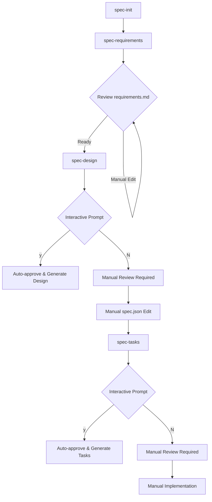
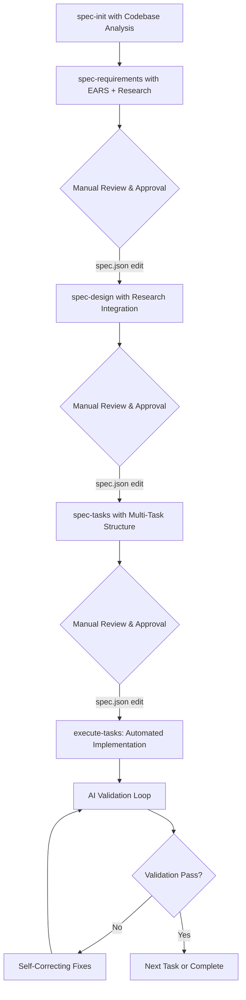

# Claude Code v1 vs v2: Comprehensive Analysis

## Executive Summary

This document provides a detailed comparison between the current Claude Code implementation (v1) found in `.claude/commands/kiro` and the enhanced version (v2) found in `.claude-v2/commands/kiro`. The analysis reveals significant architectural and methodological differences that represent a major evolution in spec-driven development capabilities.

**Key Finding**: Claude Code v2 represents a fundamental paradigm shift from interactive approval workflows to EARS-driven, research-enhanced, multi-task execution with AI validation loops.

## Document Structure Overview

| Component | v1 (.claude) | v2 (.claude-v2) | Status |
|-----------|--------------|-----------------|---------|
| README.md | ❌ Not present | ✅ Comprehensive guide | New |
| IMPLEMENTATION-GUIDE.md | ❌ Not present | ✅ Detailed setup guide | New |
| spec-design.md | ✅ Present | ✅ Enhanced | Major changes |
| spec-init.md | ✅ Present | ✅ Enhanced | Major changes |
| spec-requirements.md | ✅ Present | ✅ Enhanced | Major changes |
| spec-status.md | ✅ Present | ✅ Enhanced | Major changes |
| spec-tasks.md | ✅ Present | ✅ Enhanced | Major changes |
| steering.md | ✅ Present | ✅ Enhanced | Major changes |
| steering-custom.md | ✅ Present | ❌ Not present | Removed |
| execute-tasks.md | ❌ Not present | ✅ New command | New |

## Command-by-Command Analysis

### 1. spec-init.md - Specification Initialization

#### v1 (Current) Characteristics

- **Simple project description processing**
- **Basic feature name generation**
- **Standard template creation**
- **Minimal codebase integration**

```markdown
# Key Features:
- Uses project description to generate feature name
- Creates basic template files
- Simple spec.json metadata
- Optional steering context checking
```

#### v2 (Enhanced) Characteristics

- **Enhanced project description analysis**
- **Intelligent codebase integration**
- **Technology stack detection**
- **Pattern recognition and alignment**

```markdown
# Key Enhancements:
- Comprehensive codebase analysis
- Technology stack detection (React, Vue, Python, etc.)
- Pattern recognition for existing architectures
- Enhanced metadata with complexity assessment
- Codebase-informed context analysis
```

**Impact**: v2 provides much deeper project understanding and context-aware initialization.

### 2. spec-requirements.md - Requirements Generation

#### v1 (Current) Approach

- **Basic requirements format**
- **Simple user story structure**
- **No methodology enforcement**
- **Manual approval workflow**

```markdown
# Features:
- Focus on core functionality
- Basic requirement structure
- Sequential questions avoided
- Manual spec.json editing for approval
```

#### v2 (Enhanced) Approach

- **EARS methodology integration**
- **Optional research capabilities**
- **Structured validation**
- **Enhanced quality guidelines**

```markdown
# Major Enhancements:
- EARS (Easy Approach to Requirements Syntax) mandatory
- WHEN/THEN, GIVEN/WHEN/THEN, IF/THEN format enforcement
- Optional WebSearch/WebFetch for complex requirements
- Automatic EARS format validation
- Research findings integration
```

**Key Difference**: v2 enforces EARS methodology throughout, making requirements directly testable.

### 3. spec-design.md - Technical Design

#### v1 (Current) Features

- **Interactive approval prompts** (Japanese)
- **Basic technical design**
- **Auto-approval functionality**
- **Standard design structure**

```markdown
# Interactive Approval Example:
"requirements.mdをレビューしましたか？ [y/N]"
- If 'y': Auto-approves requirements and generates design
- If 'N': Stops for manual review
```

#### v2 (Enhanced) Features

- **Research-driven design**
- **EARS requirement integration**
- **Manual approval workflow**
- **Enhanced technical depth**

```markdown
# Research Integration:
- WebSearch for architectural patterns
- WebFetch for technical documentation
- Source citations and documentation
- Research-informed technology selection
```

**Major Change**: v2 removes interactive approval in favor of manual approval, but adds sophisticated research capabilities.

### 4. spec-tasks.md - Implementation Planning

#### v1 (Current) Approach

- **Basic task generation**
- **Interactive approval system**
- **Code-generation prompts**
- **Standard task structure**

```markdown
# Features:
- Hierarchical task numbering
- Code-generation focused
- Interactive approval for both requirements and design
- Basic EARS requirement mapping
```

#### v2 (Enhanced) Approach

- **Multi-task execution support**
- **Enhanced EARS traceability**
- **Advanced task structure**
- **Validation framework integration**

```markdown
# Major Enhancements:
- Multi-task execution preparation
- Enhanced EARS requirement traceability
- Task validation framework
- Parallel execution support
- Advanced dependency analysis
```

**Key Innovation**: v2 prepares tasks for automated multi-task execution with validation loops.

### 5. spec-status.md - Progress Monitoring

#### v1 (Current) Capabilities

- **Basic progress tracking**
- **Phase status reporting**
- **Simple completion metrics**
- **Standard recommendations**

#### v2 (Enhanced) Capabilities

- **EARS compliance monitoring**
- **Research integration tracking**
- **Multi-task execution readiness**
- **Quality metrics scoring**

```markdown
# Enhanced Status Features:
- EARS format validation and compliance scoring
- Research integration status
- Multi-task execution readiness assessment
- Quality metrics and recommendations
- Visual progress indicators
```

### 6. steering.md - Project Context Management

#### v1 (Current) Features

- **Smart file detection**
- **User customization preservation**
- **Basic codebase analysis**
- **Standard steering generation**

#### v2 (Enhanced) Features

- **Enhanced codebase intelligence**
- **Advanced pattern detection**
- **Technology evolution tracking**
- **Comprehensive analysis**

```markdown
# Advanced Features:
- Deeper technology stack analysis
- Enhanced pattern recognition
- Steering freshness assessment
- Change detection and evolution tracking
```

### 7. execute-tasks.md - NEW in v2

#### Revolutionary New Capability

- **Multi-task execution engine**
- **AI validation loops**
- **Self-correcting implementation**
- **Task tool integration**

```markdown
# Key Features:
- Automated task execution in sequence
- Task tool validation after each task
- Self-correcting error resolution
- Progress tracking and validation metrics
- Escalation for complex issues
```

**Impact**: This completely new command enables automated implementation with quality assurance.

## Workflow Comparison

### v1 Workflow (Interactive Approval)



### v2 Workflow (EARS + Research + Multi-Task)



## Methodology Comparison

### Requirements Methodology

| Aspect | v1 Approach | v2 Approach |
|--------|-------------|-------------|
| **Format** | Generic user stories | EARS methodology mandatory |
| **Structure** | Flexible format | WHEN/THEN, IF/THEN, GIVEN/WHEN/THEN |
| **Validation** | Basic completeness | EARS compliance checking |
| **Testability** | Implied | Direct test case mapping |
| **Research** | None | Optional WebSearch/WebFetch |

### Approval Workflow

| Phase | v1 Process | v2 Process |
|-------|------------|------------|
| **Requirements** | Interactive prompt → Auto-approval | Manual review → Manual spec.json edit |
| **Design** | Interactive prompt → Auto-approval | Manual review → Manual spec.json edit |
| **Tasks** | Interactive prompt → Auto-approval | Manual review → Manual spec.json edit |
| **Implementation** | Manual coding | Automated multi-task execution |

### Quality Assurance

| Aspect | v1 Approach | v2 Approach |
|--------|-------------|-------------|
| **Validation** | Human review only | AI validation loops |
| **Error Handling** | Manual debugging | Self-correcting fixes |
| **Progress Tracking** | Basic status | Comprehensive metrics |
| **Quality Metrics** | Minimal | EARS compliance, research integration |

## Technical Architecture Differences

### Metadata Structure (spec.json)

#### v1 Structure

```json
{
  "feature_name": "string",
  "created_at": "timestamp",
  "phase": "string",
  "approvals": {
    "requirements": {"generated": boolean, "approved": boolean},
    "design": {"generated": boolean, "approved": boolean},
    "tasks": {"generated": boolean, "approved": boolean}
  }
}
```

#### v2 Structure

```json
{
  "feature_name": "string",
  "methodology": "EARS",
  "codebase_context": {...},
  "complexity_assessment": {...},
  "progress": {"requirements": %, "design": %, "tasks": %},
  "workflow_features": {
    "ears_methodology": true,
    "research_integration": true,
    "multi_task_execution": true
  },
  "research": {...},
  "task_summary": {...},
  "ready_for_implementation": boolean,
  "multi_task_execution": boolean
}
```

### Tool Integration

| Tool | v1 Usage | v2 Usage |
|------|----------|----------|
| **WebSearch** | Not used | Requirements & Design research |
| **WebFetch** | Not used | Technical documentation |
| **Task** | Not used | AI validation loops |
| **Bash** | Basic commands | Enhanced codebase analysis |

## User Experience Comparison

### Learning Curve

| Aspect | v1 | v2 |
|--------|----|----|
| **Initial Setup** | Simple | More complex |
| **Daily Usage** | Interactive prompts | Manual approval workflow |
| **Methodology** | Flexible | EARS methodology required |
| **Debugging** | Manual | AI-assisted |

### Automation Level

| Phase | v1 Automation | v2 Automation |
|-------|---------------|---------------|
| **Requirements** | Template generation | EARS format + Research |
| **Design** | Basic generation | Research-informed generation |
| **Tasks** | Task list creation | Multi-task structure + Validation |
| **Implementation** | Manual coding | Automated execution + AI validation |

## Advantages and Disadvantages

### v1 Advantages

- ✅ **Simple workflow** - Easy to understand and use
- ✅ **Interactive approval** - User-friendly approval process
- ✅ **Low learning curve** - Minimal methodology requirements
- ✅ **Flexible format** - No strict requirement formatting
- ✅ **Steering customization** - Includes steering-custom command

### v1 Disadvantages

- ❌ **No research integration** - Lacks external information gathering
- ❌ **Manual implementation** - No automated coding assistance
- ❌ **Basic validation** - Limited quality assurance
- ❌ **No methodology enforcement** - Requirements may lack structure
- ❌ **Limited progress tracking** - Basic status monitoring

### v2 Advantages

- ✅ **EARS methodology** - Structured, testable requirements
- ✅ **Research integration** - Evidence-based design decisions
- ✅ **Multi-task execution** - Automated implementation with AI validation
- ✅ **Self-correcting loops** - AI-powered error resolution
- ✅ **Comprehensive tracking** - Detailed progress and quality metrics
- ✅ **Codebase intelligence** - Deep project analysis and integration

### v2 Disadvantages

- ❌ **Steeper learning curve** - EARS methodology and manual approval
- ❌ **More complex setup** - Enhanced configuration requirements
- ❌ **Manual approval workflow** - No interactive prompts
- ❌ **Methodology rigidity** - EARS format mandatory
- ❌ **No steering-custom** - Lost flexibility in steering customization

## Migration Considerations

### For Teams Currently Using v1

#### **Low-Risk Migration Path:**

1. **Backup existing .claude directory**
2. **Start with new features** using v2
3. **Gradually convert existing specs** to EARS format
4. **Train team on EARS methodology**

#### **High-Impact Migration Path:**

1. **Full replacement** of .claude directory
2. **Convert all existing requirements** to EARS format
3. **Update all spec.json metadata** to v2 structure
4. **Retrain entire team** on new workflow

### **Migration Challenges:**

- **EARS methodology training** required for all team members
- **Existing specifications** need format conversion
- **Workflow changes** from interactive to manual approval
- **Tool configuration** for research integration

## Recommendations

### **Choose v1 If:**

- Team prefers **simple, interactive workflows**
- Requirements **don't need strict structure**
- **Manual implementation** is acceptable
- **Learning curve** is a primary concern
- **Steering customization** is important

### **Choose v2 If:**

- Team values **structured, testable requirements**
- **Research-informed decisions** are important
- **Automated implementation** with AI validation is desired
- **Quality assurance** is a high priority
- **Advanced progress tracking** is needed

### **Hybrid Approach:**

Consider adopting **v2 selectively**:

- Use **v2 for complex features** requiring research and automation
- Keep **v1 for simple features** needing quick iteration
- **Gradually transition** as team gains EARS methodology experience

## Future Considerations

### **Potential v3 Evolution:**

Based on this analysis, a future v3 might combine the best of both:

- **Interactive approval workflow** from v1
- **EARS methodology and research integration** from v2
- **Optional automation levels** (manual vs. automated implementation)
- **Flexible methodology** (EARS for complex features, simple format for basic ones)

### **Technology Trends Alignment:**

v2 better aligns with current trends:

- **AI-assisted development**
- **Automated testing and validation**
- **Evidence-based technical decisions**
- **Comprehensive quality metrics**

## Conclusion

Claude Code v2 represents a significant evolution in spec-driven development, introducing sophisticated methodologies, research capabilities, and automated implementation with AI validation. While it requires a higher learning curve and more structured approach, it offers substantial benefits in terms of quality assurance, automation, and evidence-based development.

The choice between v1 and v2 should be based on team maturity, project complexity, and organizational priorities. Teams seeking maximum automation and quality should adopt v2, while those preferring simplicity and flexibility may continue with v1.

**Recommendation**: For teams ready to embrace structured methodologies and AI-assisted development, v2 provides a compelling upgrade path that significantly enhances the spec-driven development experience.
