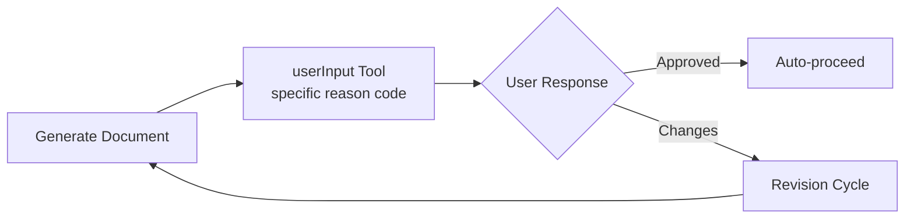
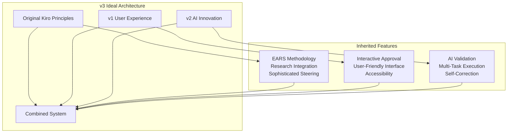

# Complete Evolution Analysis: Original Kiro → Claude Code v1 → v2

## Executive Summary

This analysis reveals the true evolutionary path of spec-driven development systems, showing how Claude Code v2 represents a **renaissance** of the original Amazon Kiro system principles enhanced with modern AI capabilities, rather than a simple evolution from v1.

**Revolutionary Discovery**: EARS methodology, research integration, and sophisticated steering systems were **ORIGINAL** to the Amazon Kiro system - not innovations in v2. Claude Code v1 was actually a simplification, and v2 is a return to sophisticated original principles with AI-powered automation enhancements.

## The Three-System Evolution

### Original Kiro (Amazon) - The Sophisticated Foundation

**Philosophy**: Highly structured, tool-integrated, enterprise-grade spec-driven development

#### Key Characteristics:
- **4-stage workflow** with explicit approval gates
- **userInput tool integration** with specific reason codes
- **EARS methodology** (original implementation)
- **Research integration** in design stage (original feature)
- **Comprehensive steering system** with inclusion modes
- **VS Code extension integration** with custom file schemes
- **MCP protocol** for external tool integration
- **Hook system** for workflow automation
- **Single-task execution** focus

#### Approval System:
```javascript
// Original Kiro approval mechanism
userInput({
  reason: "spec-requirements-review",
  question: "Do the requirements look good? If so, we can move on to the design."
})
```

### Claude Code v1 - The Simplification

**Philosophy**: Streamlined, interactive, user-friendly adaptation

#### Key Changes from Original Kiro:
- **❌ Removed**: userInput tool complexity
- **✅ Added**: Interactive Japanese prompts
- **✅ Added**: Auto-approval functionality  
- **⚡ Simplified**: Steering system complexity
- **❌ Lost**: VS Code/MCP/Hook integration
- **✅ Added**: steering-custom command

#### Approval System:
```markdown
# v1 interactive approval
"requirements.mdをレビューしましたか？ [y/N]"
→ If 'y': Auto-approve and proceed
→ If 'N': Stop for manual review
```

### Claude Code v2 - The Renaissance

**Philosophy**: Return to original sophistication + AI-powered automation

#### Key Changes:
- **🔄 Restored**: EARS methodology enforcement (back to Kiro roots)
- **🔄 Restored**: Research integration (back to Kiro roots)
- **🆕 Enhanced**: Multi-task execution with AI validation loops
- **🆕 Enhanced**: Self-correcting implementation
- **🔄 Changed**: Manual approval workflow (spec.json editing)
- **❌ Removed**: Interactive approval prompts
- **❌ Removed**: steering-custom command

## Detailed Evolution Comparison

### Requirements Methodology Evolution

| System | Approach | Format | Research | Quality Control |
|--------|----------|---------|----------|----------------|
| **Original Kiro** | EARS mandatory | WHEN/THEN/IF enforced | Design stage integration | userInput tool gates |
| **Claude Code v1** | Flexible format | Basic user stories preferred | None | Interactive approval |
| **Claude Code v2** | EARS mandatory | WHEN/THEN/IF enforced | Optional WebSearch/WebFetch | Manual spec.json approval |

**Key Insight**: v2 **returns** to original Kiro's EARS methodology, not inventing it!

### Approval Workflow Evolution

#### Original Kiro Workflow


#### Claude Code v1 Workflow  


#### Claude Code v2 Workflow


### Steering System Evolution

#### Original Kiro Steering (Most Sophisticated)
- **Always Included**: Universal context (product.md, tech.md, structure.md)
- **Conditional Loading**: File pattern matching with front-matter config
- **Manual Reference**: On-demand loading with #filename syntax
- **External References**: File inclusion with #[[file:path]] syntax
- **VS Code Integration**: Custom file schemes and providers

#### Claude Code v1 Steering (Simplified)
- **Basic steering management**: Simplified document handling
- **steering-custom command**: Manual custom steering creation
- **Preservation logic**: User customization protection
- **Standard inclusion**: Always/conditional modes

#### Claude Code v2 Steering (Enhanced Basic)
- **Intelligent management**: Advanced codebase analysis
- **Pattern detection**: Technology stack recognition
- **Change tracking**: Git-based evolution monitoring
- **No custom command**: Integrated functionality

### Integration Architecture Evolution

| Integration Layer | Original Kiro | Claude Code v1 | Claude Code v2 |
|------------------|---------------|----------------|----------------|
| **VS Code Extension** | ✅ Full integration | ❌ None | ❌ None |
| **Custom File Schemes** | ✅ kiro-spec, kiro-meta | ❌ None | ❌ None |
| **MCP Protocol** | ✅ External tools | ❌ None | ✅ Research tools |
| **Hook System** | ✅ Workflow automation | ❌ None | ❌ None |
| **Webview Components** | ✅ Spec Explorer, etc. | ❌ None | ❌ None |

## Revolutionary Insights

### 1. EARS Methodology Origins
**Revelation**: EARS was **original** to Amazon Kiro, not an innovation in v2!

- **Original Kiro**: Full EARS implementation with validation
- **v1**: Simplified to basic user stories (regression!)
- **v2**: Return to EARS with enhanced validation (renaissance!)

### 2. Research Integration Heritage
**Revelation**: Research integration was **original** to Amazon Kiro design stage!

```markdown
# Original Kiro Design Stage (2023?)
- MUST conduct research and build up context in conversation thread
- SHOULD NOT create separate research files
- MUST summarize key findings that inform feature design
- SHOULD cite sources and include relevant links
```

This is nearly identical to v2's research approach!

### 3. Tool Integration Evolution
**Original Kiro**: Enterprise-grade tool ecosystem
- userInput tool for approval gates
- MCP servers for external tools  
- VS Code extension for UI
- Hook system for automation

**v1**: Simplified to basic Claude Code commands
**v2**: Partial return with enhanced research tools but no VS Code/Hook integration

### 4. Implementation Automation Innovation
**Original Kiro**: Single-task focus with manual execution
**v1**: Manual implementation (no change)
**v2**: **Revolutionary** multi-task execution with AI validation loops (true innovation!)

## The True Innovation in v2

While v2 returns to many original Kiro principles, it introduces genuinely revolutionary capabilities:

### Multi-Task Execution Engine (Completely New)
```markdown
# v2 Innovation: execute-tasks command
1. Parse tasks.md for pending tasks
2. Execute multiple tasks automatically in sequence  
3. AI validation after each task using Task tool
4. Self-correcting error resolution
5. Real-time progress tracking
```

This level of automation was **never** in original Kiro or v1!

### AI Validation Loops (Completely New)
```markdown
# Task tool validation prompt
"Review completed task: [task description]
- Analyze code changes for correctness
- Verify requirement fulfillment  
- Check integration with existing code
- Provide pass/fail with specific feedback"
```

### Self-Correcting Implementation (Completely New)
- Automatic error detection and resolution
- Iterative improvement cycles
- Quality assurance validation
- Escalation for complex issues

## Architectural Philosophy Comparison

### Original Kiro Philosophy
- **Enterprise Integration**: Full VS Code ecosystem integration
- **Tool Orchestration**: MCP protocol for external tool coordination
- **Workflow Automation**: Hook system for event-driven automation
- **Human Oversight**: userInput tool for explicit approval control
- **Quality Gates**: Structured approval mechanisms

### Claude Code v1 Philosophy  
- **Accessibility**: Simple, interactive user experience
- **User-Friendly**: Japanese prompts for familiar interaction
- **Streamlined**: Reduced complexity for broader adoption
- **Manual Control**: Human-driven workflow progression

### Claude Code v2 Philosophy
- **AI-Enhanced**: Leverage AI for implementation and validation
- **Quality Focused**: Comprehensive validation and self-correction
- **Methodology Driven**: Return to structured EARS approach
- **Automation Forward**: Multi-task execution with minimal human intervention

## Migration Implications

### From Original Kiro to v1 (Simplification)
- **Lost**: Enterprise integration capabilities
- **Lost**: Sophisticated steering system
- **Lost**: EARS methodology enforcement  
- **Gained**: User-friendly interaction model
- **Gained**: Simplified setup and operation

### From v1 to v2 (Renaissance + Innovation)
- **Restored**: EARS methodology (original Kiro principle)
- **Restored**: Research integration (original Kiro principle)
- **Enhanced**: Codebase intelligence beyond original
- **Innovated**: AI-powered automation (revolutionary new capability)
- **Lost**: Interactive approval simplicity

### From Original Kiro to v2 (Direct Evolution)
If original Kiro users adopted v2 directly:
- **Maintained**: Core EARS and research principles
- **Enhanced**: With AI automation capabilities
- **Lost**: VS Code/MCP/Hook ecosystem integration
- **Changed**: From userInput tool to manual approval workflow

## Future Evolution Possibilities

### Ideal v3 Synthesis
Combining the best of all three systems:



### v3 Feature Synthesis
- **✅ EARS + Research** (Original Kiro heritage)
- **✅ Interactive Approval** (v1 user experience)  
- **✅ AI Validation** (v2 innovation)
- **✅ VS Code Integration** (Original Kiro ecosystem)
- **✅ Flexible Automation** (Configurable execution modes)

## Conclusion

This analysis reveals that Claude Code v2 is not merely an evolution from v1, but rather a **renaissance** of the sophisticated original Amazon Kiro system enhanced with revolutionary AI-powered automation capabilities.

### Key Revelations:
1. **EARS methodology** was original to Amazon Kiro (2023?), not new in v2
2. **Research integration** was original to Amazon Kiro design stage
3. **Sophisticated steering** with inclusion modes was original to Kiro
4. **v1 was a simplification** that made spec-driven development more accessible
5. **v2 represents a return** to original sophistication plus AI innovation

### The True Innovation:
While v2 restores many original Kiro principles, its **revolutionary contribution** is the multi-task execution engine with AI validation loops and self-correcting implementation - capabilities that go far beyond the original system.

### Strategic Recommendations:
- **For Original Kiro Users**: v2 offers familiar methodology with powerful automation
- **For v1 Users**: v2 requires methodology learning but provides substantial automation benefits  
- **For New Users**: v2 represents the most advanced spec-driven development system available

The evolution shows how sophisticated enterprise concepts can be democratized (v1) and then enhanced with cutting-edge AI capabilities (v2) while preserving the original architectural wisdom.