# Spec-Driven Development System Decision Framework

## Overview

This framework helps teams choose between Original Kiro, Claude Code v1, and Claude Code v2 based on their specific needs, capabilities, and organizational context. Each system represents a different philosophy and maturity level of spec-driven development.

## System Philosophy Summary

| System | Core Philosophy | Target User |
|--------|----------------|-------------|
| **Original Kiro** | Enterprise-grade integration with comprehensive tooling | Large teams with VS Code ecosystem |
| **Claude Code v1** | Simplified, accessible spec-driven development | Teams wanting easy adoption |
| **Claude Code v2** | AI-enhanced automation with sophisticated methodology | Teams ready for structured processes and AI assistance |

## Decision Matrix

### Team Assessment Criteria

#### 1. Methodology Readiness

**High Readiness** → Original Kiro or Claude Code v2
- Team comfortable with structured requirements (EARS format)
- Experience with formal development processes  
- Willingness to learn methodology constraints
- Focus on quality and traceability

**Medium Readiness** → Claude Code v1
- Team prefers flexible approaches
- Values simplicity over structure
- Quick iteration priority
- Informal development processes

#### 2. Integration Requirements

**Enterprise Integration Needs** → Original Kiro
- ✅ VS Code extension required
- ✅ MCP protocol for external tools
- ✅ Hook system for automation
- ✅ Custom file schemes
- ✅ Webview components

**Basic Integration Needs** → Claude Code v1 or v2
- ✅ Command-line interface sufficient
- ✅ Markdown file management adequate
- ✅ Manual workflow progression acceptable

#### 3. Automation Appetite

**High Automation Desire** → Claude Code v2
- ✅ AI-powered implementation valuable
- ✅ Self-correcting validation beneficial
- ✅ Multi-task execution needed
- ✅ Quality assurance automation important

**Manual Control Preference** → Original Kiro or Claude Code v1
- ✅ Human oversight at each step
- ✅ Explicit control over progression
- ✅ Manual implementation comfortable

#### 4. Learning Curve Tolerance

**Low Tolerance** → Claude Code v1
- Interactive prompts guide usage
- Auto-approval streamlines workflow
- Flexible requirement formats
- Minimal methodology learning

**High Tolerance** → Original Kiro or Claude Code v2
- EARS methodology learning required
- Tool integration complexity acceptable
- Structured approval processes manageable

## Use Case Matching

### Choose Original Kiro If:

#### ✅ Primary Indicators
- **Enterprise VS Code Environment**: Team heavily uses VS Code ecosystem
- **External Tool Integration**: Need MCP protocol for specialized tools
- **Workflow Automation**: Require hook system for custom automation
- **Comprehensive Integration**: Need file schemes and webview components
- **Structured Methodology**: Team ready for rigorous EARS implementation

#### 🎯 Ideal Use Cases
- Large enterprise development teams
- Projects requiring extensive tool integration
- Teams with established VS Code workflows
- Organizations needing comprehensive audit trails
- Projects with complex external dependencies

#### ⚠️ Considerations
- Requires VS Code extension setup
- More complex initial configuration
- Learning curve for MCP and hook systems
- Enterprise-focused feature set

### Choose Claude Code v1 If:

#### ✅ Primary Indicators
- **Simplicity Priority**: Team values ease of use over advanced features
- **Quick Adoption**: Need immediate productivity without methodology training
- **Flexible Requirements**: Prefer informal requirement formats
- **Interactive Workflow**: Team benefits from guided prompts
- **Small to Medium Teams**: 1-5 developers who need streamlined processes

#### 🎯 Ideal Use Cases
- Rapid prototyping projects
- Small team development
- Teams new to spec-driven development
- Projects with flexible requirements
- Organizations prioritizing quick wins

#### ⚠️ Considerations
- Less structured than other options
- Manual implementation required
- Limited automation capabilities
- May not scale to larger teams

### Choose Claude Code v2 If:

#### ✅ Primary Indicators
- **AI-Enhanced Development**: Team excited about AI-powered automation
- **Quality Focus**: High emphasis on validation and self-correction
- **Structured Methodology**: Ready to adopt EARS requirement format
- **Research Integration**: Value evidence-based technical decisions
- **Automation Benefits**: Want multi-task execution with validation

#### 🎯 Ideal Use Cases
- Teams building complex features requiring research
- Organizations focusing on quality and validation
- Projects benefiting from automated implementation
- Teams ready for methodology adoption
- Development requiring comprehensive requirement traceability

#### ⚠️ Considerations
- EARS methodology learning required
- Manual approval workflow (no interactive prompts)
- Higher complexity than v1
- Requires comfort with AI-assisted development

## Migration Strategies

### Migration Complexity Assessment

| From | To | Complexity | Timeline | Key Challenges |
|------|----|-----------|---------|----|
| **Original Kiro → v1** | Low | 1-2 weeks | Tool integration loss, methodology relaxation |
| **Original Kiro → v2** | Medium | 2-4 weeks | Approval workflow change, integration loss |
| **v1 → Original Kiro** | High | 4-8 weeks | Enterprise integration setup, methodology training |
| **v1 → v2** | Medium | 2-4 weeks | EARS methodology learning, workflow changes |
| **v2 → Original Kiro** | Medium | 3-6 weeks | Enterprise integration setup, tool learning |
| **v2 → v1** | Low | 1-2 weeks | Methodology relaxation, feature simplification |

### Recommended Migration Paths

#### Phase 1: Assessment and Planning
1. **Team Capability Assessment**
   - Evaluate methodology readiness
   - Assess integration requirements
   - Determine automation appetite
   - Measure learning curve tolerance

2. **Current State Analysis**
   - Inventory existing specifications
   - Evaluate current workflow effectiveness
   - Identify pain points and improvement areas
   - Assess team satisfaction with current approach

3. **Target State Definition**
   - Select target system based on assessment
   - Define success criteria
   - Plan training and onboarding approach
   - Estimate migration timeline

#### Phase 2: Pilot Implementation
1. **Pilot Project Selection**
   - Choose non-critical feature for testing
   - Ensure representative complexity
   - Include team members from different experience levels
   - Plan for feedback collection

2. **System Setup**
   - Install and configure target system
   - Create initial specifications
   - Test approval workflows
   - Validate tool integration (if applicable)

3. **Team Training**
   - Methodology training (EARS for Original Kiro/v2)
   - Tool training (VS Code integration for Original Kiro)
   - Workflow training (approval processes)
   - Best practices documentation

#### Phase 3: Gradual Rollout
1. **Incremental Adoption**
   - Start with new features in target system
   - Gradually convert existing specifications
   - Maintain parallel systems during transition
   - Monitor team adoption and satisfaction

2. **Process Optimization**
   - Refine workflows based on team feedback
   - Optimize tool configurations
   - Develop team-specific best practices
   - Create internal documentation and guidelines

3. **Full Transition**
   - Complete conversion of all specifications
   - Deprecate old system
   - Establish ongoing training processes
   - Implement continuous improvement practices

## Implementation Guidance

### Getting Started with Each System

#### Original Kiro Implementation
```bash
# Prerequisites
1. VS Code with Kiro extension
2. MCP server configuration
3. Hook system setup
4. Team EARS methodology training

# Initial Setup
1. Configure .kiro/steering/ documents
2. Set up MCP servers in .kiro/settings/mcp.json
3. Configure hooks for workflow automation
4. Train team on userInput tool workflow
```

#### Claude Code v1 Implementation
```bash
# Prerequisites
1. Claude Code CLI
2. Basic understanding of spec-driven development

# Initial Setup
1. Create .claude/commands/kiro/ structure
2. Initialize first specification with /spec-init
3. Train team on interactive approval workflow
4. Establish steering document practices
```

#### Claude Code v2 Implementation
```bash
# Prerequisites
1. Claude Code CLI
2. EARS methodology training
3. Understanding of manual approval workflow

# Initial Setup
1. Create .claude-v2/commands/kiro/ structure  
2. Train team on EARS requirement format
3. Establish manual approval workflow
4. Configure research integration tools
```

### Team Training Programs

#### EARS Methodology Training (Required for Original Kiro and v2)
```markdown
# EARS Training Curriculum

## Session 1: Introduction to EARS
- Requirements vs. user stories
- WHEN/THEN structure
- IF/THEN exception handling
- GIVEN/WHEN/THEN context scenarios

## Session 2: Writing Quality EARS Requirements
- Specific condition definition
- Measurable outcome specification
- Edge case identification
- Validation criteria creation

## Session 3: EARS to Implementation
- Requirement to test case mapping
- Design decision traceability
- Implementation validation
- Quality assurance practices

## Hands-On Workshop
- Convert existing user stories to EARS
- Practice requirement validation
- Group review and feedback
- Best practice development
```

#### Tool Integration Training (Required for Original Kiro)
```markdown
# Original Kiro Integration Training

## VS Code Extension Usage
- Custom file scheme navigation
- Webview component utilization
- Command palette integration
- Workflow management

## MCP Protocol Integration
- Server configuration
- Tool discovery and usage
- Auto-approval configuration
- Troubleshooting integration issues

## Hook System Configuration
- Event monitoring setup
- Pattern matching configuration
- Action execution scripting
- Workflow automation design
```

## Success Metrics and Evaluation

### Key Performance Indicators

#### Process Efficiency Metrics
- **Specification Creation Time**: Time from feature idea to approved spec
- **Implementation Speed**: Time from approved spec to working feature
- **Revision Cycles**: Number of approval iterations required
- **Context Switching**: Time spent switching between tools and documents

#### Quality Metrics
- **Requirement Completeness**: Percentage of requirements with proper acceptance criteria
- **Traceability Score**: Percentage of implementation tasks traceable to requirements
- **Defect Rate**: Bugs found in production vs. spec compliance
- **Test Coverage**: Automated test coverage of EARS requirements

#### Team Satisfaction Metrics
- **Adoption Rate**: Percentage of team actively using the system
- **Learning Curve**: Time to productivity for new team members
- **Workflow Satisfaction**: Team satisfaction with approval and progression workflows
- **Tool Integration Satisfaction**: Satisfaction with tool ecosystem (where applicable)

### Evaluation Timeline

#### 30-Day Assessment
- Tool adoption and basic usage
- Initial team feedback
- Major blockers identification
- Process refinement needs

#### 90-Day Assessment  
- Workflow efficiency measurement
- Quality improvements validation
- Team satisfaction survey
- ROI preliminary assessment

#### 180-Day Assessment
- Full productivity measurement
- Process optimization opportunities
- Long-term sustainability evaluation
- Strategic refinement planning

## Decision Flowchart

```mermaid
graph TD
    Start([Team Needs Assessment]) --> Q1{Enterprise VS Code Environment?}
    Q1 -->|Yes| Q2{Need MCP/Hook Integration?}
    Q1 -->|No| Q3{Comfort with EARS Methodology?}
    
    Q2 -->|Yes| OriginalKiro[Original Kiro<br/>✅ Enterprise Integration<br/>✅ EARS Methodology<br/>✅ Tool Ecosystem]
    Q2 -->|No| Q3
    
    Q3 -->|Yes| Q4{Want AI-Enhanced Automation?}
    Q3 -->|No| V1[Claude Code v1<br/>✅ Simple & Interactive<br/>✅ Flexible Requirements<br/>✅ Quick Adoption]
    
    Q4 -->|Yes| V2[Claude Code v2<br/>✅ AI Automation<br/>✅ EARS Methodology<br/>✅ Research Integration]
    Q4 -->|No| Q5{Team Size & Complexity?}
    
    Q5 -->|Small/Simple| V1
    Q5 -->|Large/Complex| OriginalKiro
    
    %% Styling
    classDef system fill:#e1f5fe,stroke:#01579b,stroke-width:2px
    classDef decision fill:#fff3e0,stroke:#ef6c00,stroke-width:2px
    
    class OriginalKiro,V1,V2 system
    class Q1,Q2,Q3,Q4,Q5 decision
```



## Conclusion and Recommendations

### Strategic Recommendations by Organization Type

#### **Startups and Small Teams (2-5 developers)**
**Recommended**: Claude Code v1
- Fastest time to value
- Lowest learning curve
- Sufficient for early-stage development
- Easy scaling to other systems later

#### **Growing Companies (5-15 developers)**
**Recommended**: Claude Code v2
- Balances structure with innovation
- AI assistance scales team productivity
- EARS methodology prepares for growth
- Research integration supports complex decisions

#### **Enterprise Organizations (15+ developers)**
**Recommended**: Original Kiro
- Enterprise integration capabilities
- Comprehensive tool ecosystem
- Structured methodology enforcement
- Workflow automation at scale

### Future-Proofing Considerations

#### Technology Evolution Alignment
- **Original Kiro**: Mature, stable, enterprise-focused
- **Claude Code v1**: Simple foundation, may need enhancement
- **Claude Code v2**: AI-forward, aligns with development trends

#### Organizational Growth Planning
- **Start Simple**: Begin with v1 for immediate productivity
- **Scale Structured**: Move to v2 as team and complexity grow
- **Enterprise Integration**: Adopt Original Kiro for comprehensive integration needs

The choice between these systems should align with your team's current capabilities, growth trajectory, and integration requirements. Each system excels in different contexts, and the "best" choice depends on matching system strengths to organizational needs.