# Claude Code v1 vs v2 Workflow Diagrams

## Overview

This document provides detailed mermaid diagrams illustrating the key workflow differences between Claude Code v1 and v2 implementations.

## 1. High-Level Architecture Comparison

### v1 Architecture (Interactive Approval)

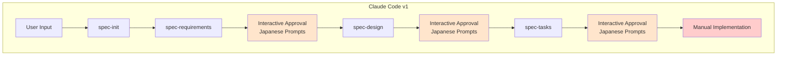

### v2 Architecture (EARS + Research + Multi-Task)

```mermaid
graph TB
    subgraph "Claude Code v2"
        A[User Input] --> B[Enhanced spec-init<br/>Codebase Analysis]
        B --> C[EARS spec-requirements<br/>+ Optional Research]
        C --> D[Manual Review<br/>spec.json Edit]
        D --> E[Research-Informed<br/>spec-design]
        E --> F[Manual Review<br/>spec.json Edit]
        F --> G[Multi-Task<br/>spec-tasks]
        G --> H[Manual Review<br/>spec.json Edit]
        H --> I[execute-tasks<br/>AI Validation Loops]
        I --> J[Self-Correcting<br/>Implementation]
    end
    
    style B fill:#E5F3FF
    style C fill:#E5F3FF
    style E fill:#E5F3FF
    style G fill:#E5F3FF
    style I fill:#CCE5FF
    style J fill:#CCE5FF
```

## 2. Detailed Phase Flow Comparison

### v1 Phase Flow

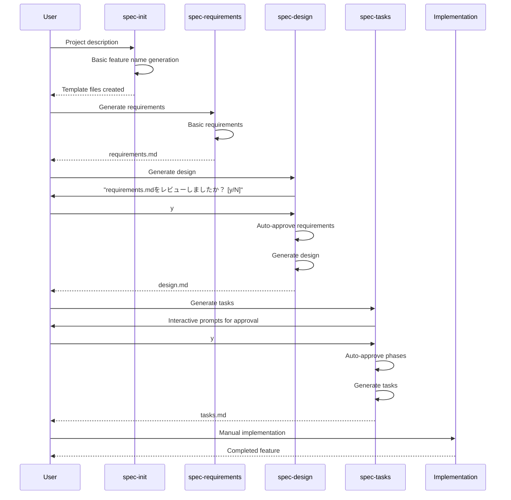

### v2 Phase Flow

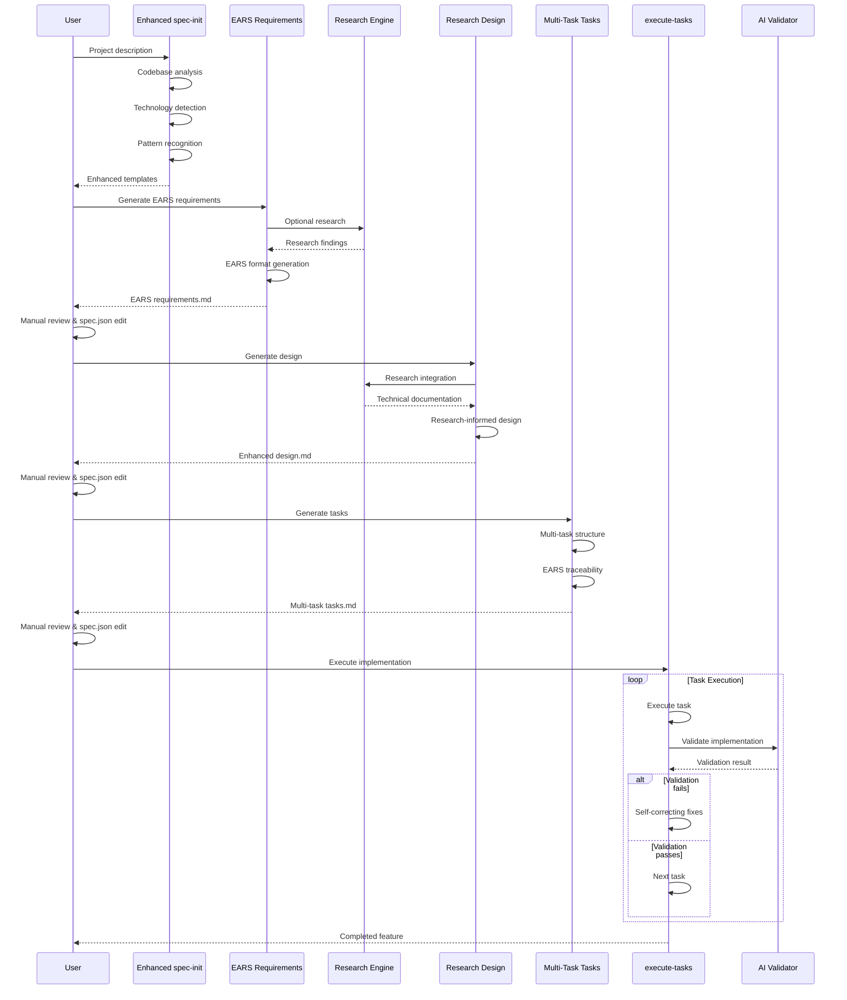

## 3. Approval Workflow Comparison

### v1 Interactive Approval

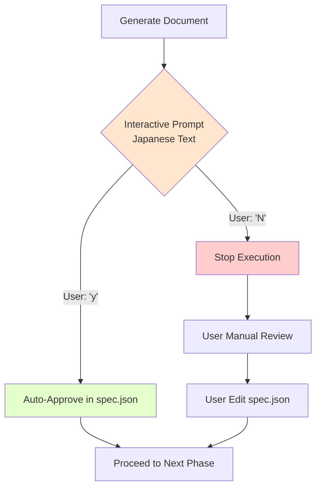

### v2 Manual Approval

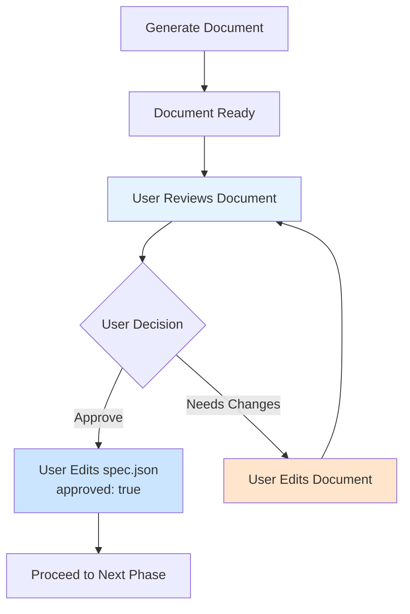

## 4. Requirements Methodology Comparison

### v1 Requirements Format

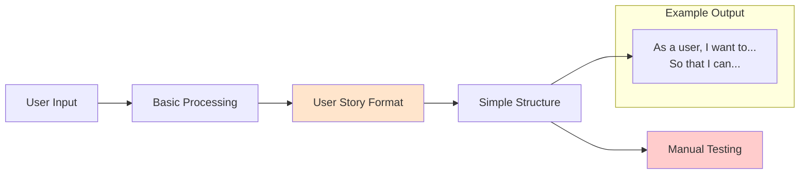

### v2 EARS Requirements Format

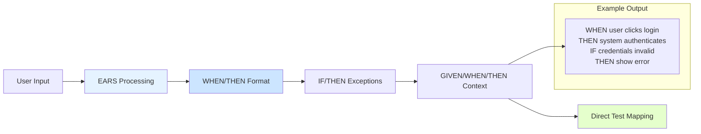

## 5. Implementation Execution Comparison

### v1 Manual Implementation

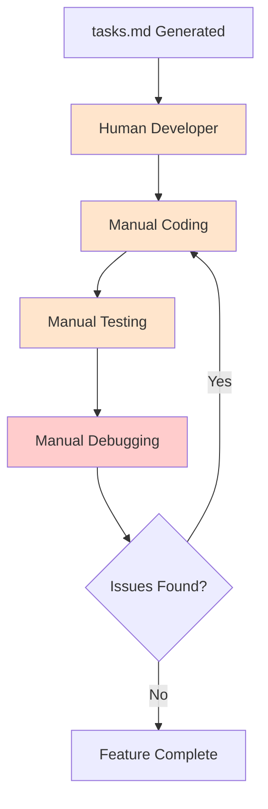

### v2 Automated Multi-Task Execution

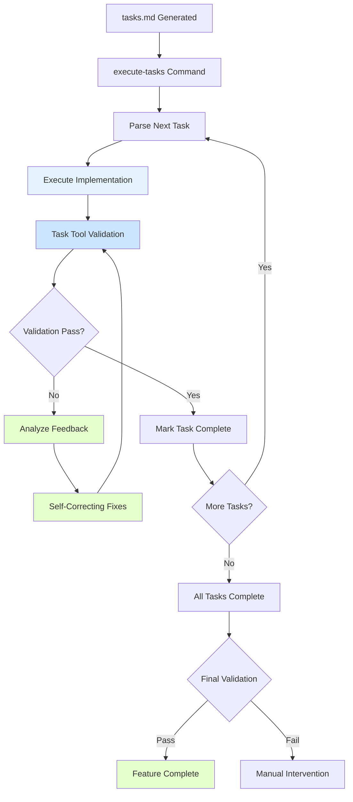

## 6. Research Integration Flow (v2 Only)

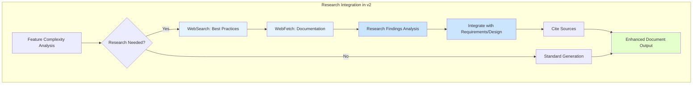

## 7. Quality Assurance Comparison

### v1 Quality Assurance

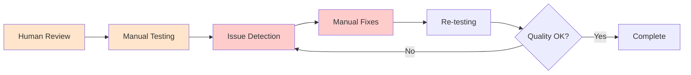

### v2 Quality Assurance

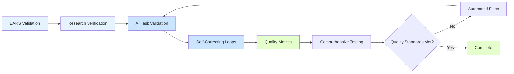

## 8. Data Flow Architecture

### v1 Data Flow

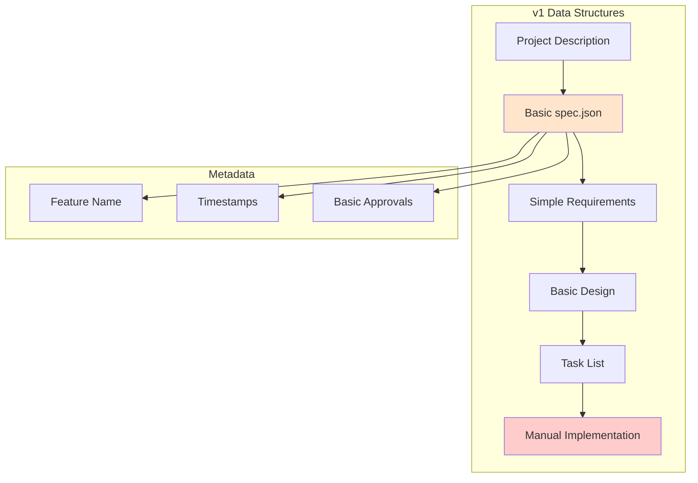

### v2 Data Flow

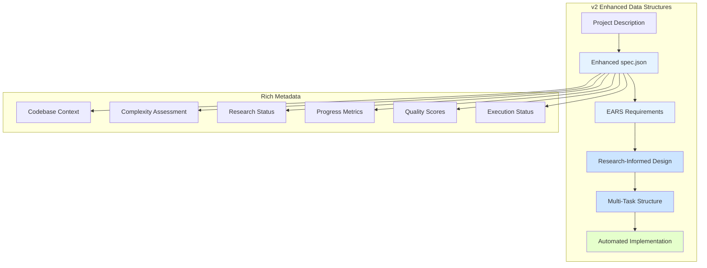

## 9. Tool Integration Ecosystem

### v1 Tool Usage

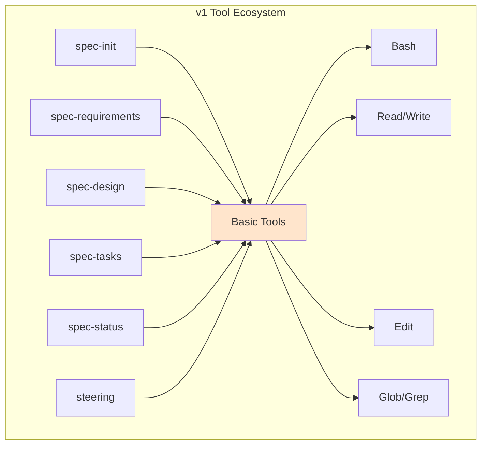

### v2 Tool Usage

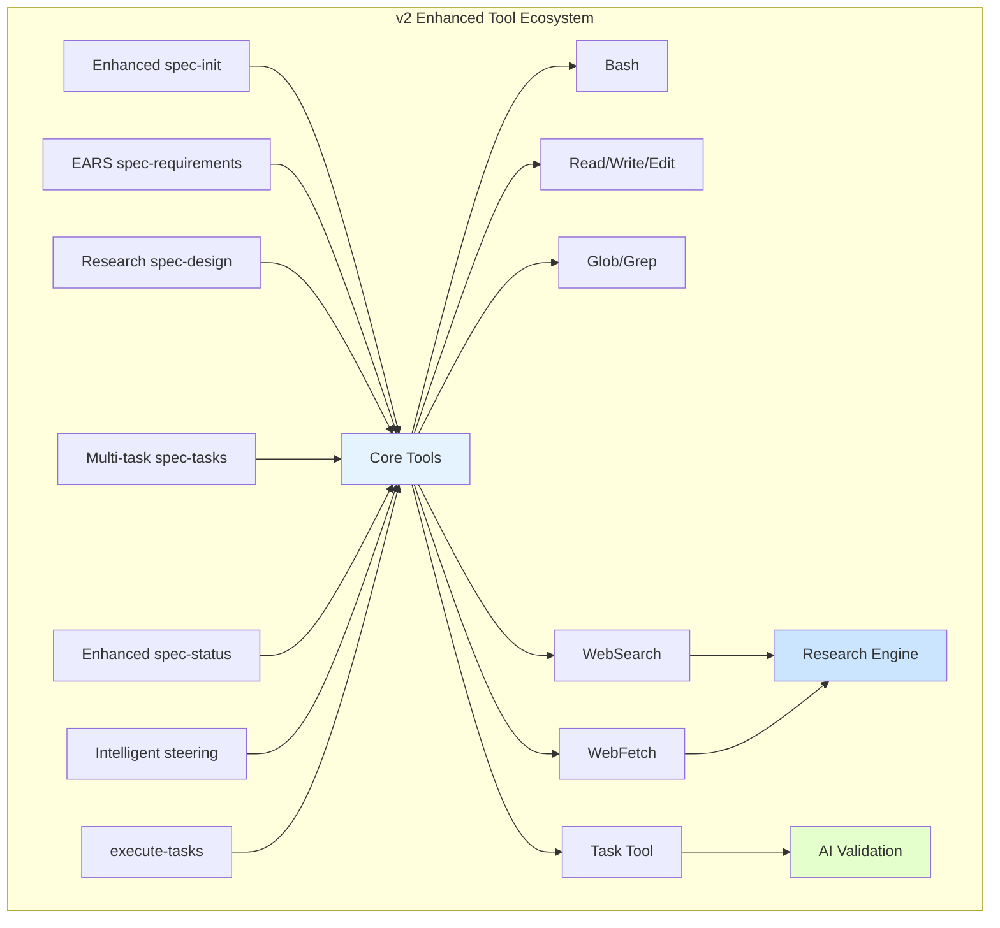

## 10. Error Handling and Recovery

### v1 Error Handling

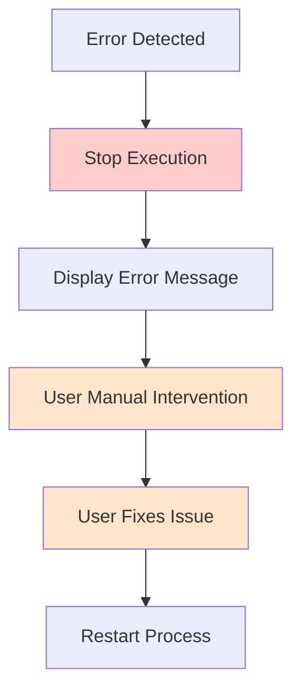

### v2 Error Handling and Self-Correction

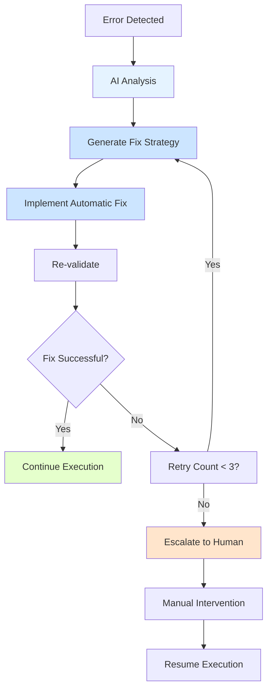

## Summary

These diagrams illustrate the fundamental architectural differences between Claude Code v1 and v2:

- **v1**: Interactive, simple, human-guided workflow
- **v2**: EARS-driven, research-enhanced, AI-automated workflow with validation loops

The evolution represents a shift from manual, interactive development to structured, automated, quality-assured implementation with comprehensive validation and self-correction capabilities.
