# COMPREHENSIVE Transformation Analysis: `.claude/commands/` → `.github-base/`

## Executive Summary

This analysis documents the **complete systematic transformation** of the Kiro-style Spec-Driven Development methodology from Claude Code's slash command system (`.claude/commands/`) to GitHub Copilot's prompt file system (`.github-base/`).

**CRITICAL FINDING: This represents a fundamental strategic pivot, not a technical migration.** The transformation completely redefines target audience, capabilities, workflow philosophy, and integration approach while preserving the core 3-phase approval methodology.

**SCOPE**: Complete analysis of all 7 command/prompt pairs, template systems, documentation evolution, internationalization changes, automation capabilities, and strategic implications.

---

## 🚨 MASSIVE FEATURE CREEP ANALYSIS

### CRITICAL DISCOVERY: The GitHub Copilot Version Added Massive Functionality

**SHOCKING FINDING**: The `.github-base/` prompts contain **enormous amounts of added functionality** that never existed in the original `.claude/commands/` files. This is NOT a simple transformation - it's a **massive feature expansion** with significant design bloat.

### 📊 Feature Creep Summary Statistics

| Category | Original | New | Feature Creep |
|----------|----------|-----|---------------|
| **Interactive Features** | 0 | 20+ refinement options | **∞% increase** |
| **Conversational Language** | 0 lines | 100+ lines | **NEW CATEGORY** |
| **Cross-References** | 0 | 21 cross-references | **NEW CATEGORY** |
| **Embedded Templates** | ~95 lines | 586+ lines | **517% increase** |
| **Quality Guidelines** | 0 sections | 15+ sections | **NEW CATEGORY** |
| **Implementation Instructions** | 0 sections | 7 sections | **NEW CATEGORY** |
| **Best Practices** | 0 embedded | 7 embedded sections | **NEW CATEGORY** |

---

## 🔍 SYSTEMATIC FEATURE CREEP BY FILE

### 1. SPEC-REQUIREMENTS: MASSIVE EXPANSION

#### Original `spec-requirements.md` (137 lines) - MINIMAL DESIGN

```markdown
## Task: Generate Detailed Requirements
Create comprehensive requirements document in the language specified in spec.json:

### 1. Requirements Structure
[25-line simple template]

### 4. Update Metadata
[Basic JSON update]
```

#### New `spec-2-requirements.prompt.md` (268 lines) - FEATURE EXPLOSION

**🚨 ADDED FEATURES NOT IN ORIGINAL:**

1. **📋 USER STORY TEMPLATE REFERENCE (86 lines)** - MASSIVE template section
2. **Quality Guidelines for User Stories** - Comprehensive guidance
3. **User Story Components** - Detailed breakdowns  
4. **Acceptance Criteria Standards** - Quality standards
5. **Requirements Coverage** - Coverage requirements
6. **Template Example** - Detailed examples with full stories
7. **Best Practices** - Best practice guidelines
8. **Refinement Options (10 lines)** - Interactive refinement menu:

   ```markdown
   What would you like me to refine or change about these requirements?
   - **Adjust scope**: Add or remove requirement areas?
   - **Modify detail level**: More detailed acceptance criteria or simpler stories?
   - **Change user focus**: Different user types or personas?
   - **Refine acceptance criteria**: More specific conditions or edge cases?
   - **Update integration points**: Better alignment with existing systems?
   ```

9. **Conversational Language** - "I can iterate on this in our conversation until you're satisfied"
10. **Cross-References** - Navigation between prompts
11. **Implementation Instructions** - Step-by-step execution guides
12. **Output Guidelines** - Format specifications
13. **Quality Validation** - Built-in validation requirements
14. **Human Review Process** - Detailed review procedures

**FEATURE CREEP IMPACT**: +95% file size, +517% template complexity

### 2. SPEC-DESIGN: TEMPLATE EXPLOSION

#### Original `spec-design.md` (229 lines) - FOCUSED DESIGN

```markdown
**CRITICAL**: Design can only be generated after requirements are approved.
**STOP HERE** if spec.json shows: [approval check]

### 1. Design Document Structure
[30-line embedded template]

Generate design that provides clear blueprint for implementation phase.
```

#### New `spec-3-design.prompt.md` (476 lines) - MEGA-TEMPLATE MONSTER

**🚨 ADDED FEATURES NOT IN ORIGINAL:**

1. **🏗️ TECHNICAL DESIGN TEMPLATE REFERENCE (200+ lines)** - MASSIVE template section
2. **Design Quality Guidelines** - Architecture principles, technical standards
3. **Integration Requirements** - System integration guidance
4. **Template Example (80+ lines)** - Complete example with mermaid diagrams
5. **Best Practices** - Design best practice guidelines
6. **Refinement Options (8 choices)** - Interactive design refinement:

   ```markdown
   What would you like me to refine or change about this technical design?
   - **Adjust architecture**: Modify system components or data flow?
   - **Update technology choices**: Different frameworks or tools?
   - **Refine API design**: Additional endpoints or modified interfaces?
   - **Enhance security considerations**: Additional security measures?
   ```

7. **Cross-References** - Links to other workflow steps
8. **Implementation Instructions** - Detailed execution steps
9. **Output Guidelines** - Format and content specifications
10. **Quality Validation** - Built-in quality checking
11. **Human Review Process** - Comprehensive review procedures

**FEATURE CREEP IMPACT**: +108% file size, +567% template complexity

### 3. SPEC-TASKS: TASK TEMPLATE EXPLOSION

#### Original `spec-tasks.md` (277 lines) - HIERARCHICAL TASKS

```markdown
**CRITICAL**: Tasks can only be generated after both requirements and design are approved.

### 1. Tasks Document Structure
[40-line task template with Japanese progress tracking]

Generate tasks that provide clear roadmap for implementation.
```

#### New `spec-4-tasks.prompt.md` (589 lines) - TASK GUIDANCE MONSTER

**🚨 ADDED FEATURES NOT IN ORIGINAL:**

1. **✏️ IMPLEMENTATION TASK TEMPLATE REFERENCE (300+ lines)** - MASSIVE task template
2. **Task Quality Guidelines** - Comprehensive task characteristics
3. **Standard Phase Structure** - Detailed phase breakdowns
4. **Task Content Requirements** - Specification requirements
5. **Dependencies and Ordering** - Flow management guidance
6. **Template Example (150+ lines)** - Complete example with all phases
7. **Task Formatting Rules** - Detailed formatting standards
8. **Refinement Options (7 choices)** - Interactive task refinement:

   ```markdown
   What would you like me to refine or change about this implementation plan?
   - **Adjust phase breakdown**: Modify task grouping or sequencing?
   - **Change task granularity**: Larger or smaller task chunks?
   - **Update technology specifications**: Different tools or frameworks?
   - **Modify time estimates**: Adjust 2-4 hour task sizing?
   ```

9. **Cross-References** - Workflow navigation
10. **Implementation Instructions** - Step-by-step execution
11. **Output Guidelines** - Task format specifications
12. **Quality Validation** - Task quality requirements
13. **Human Review Process** - Review and approval procedures

**FEATURE CREEP IMPACT**: +113% file size, +650% template complexity

### 4. SPEC-INIT: INPUT SYSTEM EXPANSION

#### Original `spec-init.md` (156 lines) - DIRECT INITIALIZATION

```markdown
Initialize a new specification based on the provided project description:
**Project Description**: $ARGUMENTS

### 4. Initialize spec.json Metadata
[Simple JSON structure]
```

#### New `spec-1-init.prompt.md` (186 lines) - INTERACTIVE EXPANSION

**🚨 ADDED FEATURES NOT IN ORIGINAL:**

1. **Interactive Input System** - `${input:description:Enter detailed project description}`
2. **Cross-Reference Navigation** - Links to other prompts
3. **Quality Guidelines** - Detailed specification standards
4. **Implementation Instructions** - Step-by-step execution guide
5. **Output Format** - Structured output requirements
6. **Integration with Existing Workflow** - Workflow guidance

**FEATURE CREEP IMPACT**: +19% file size, +200% guidance complexity

### 5. SPEC-STATUS: ANALYSIS EXPANSION

#### Original `spec-status.md` (96 lines) - AUTOMATED STATUS

```markdown
### Spec Files
- Spec directory: !`ls -la .kiro/specs/$ARGUMENTS/`
- Active specs: !`find .kiro/specs/ -name "spec.json" -exec grep -l "implementation_ready.*true" {} \;`

Generate status report that provides clear visibility into spec progress.
```

#### New `spec-5-status.prompt.md` (188 lines) - MANUAL ANALYSIS SYSTEM

**🚨 ADDED FEATURES NOT IN ORIGINAL:**

1. **Comprehensive Analysis Guidelines** - Detailed analysis procedures
2. **Quality Metrics** - Built-in quality assessment
3. **Cross-Reference Navigation** - Links to workflow steps
4. **Error Handling** - Comprehensive error scenarios
5. **Implementation Instructions** - Step-by-step analysis guide
6. **Output Format** - Structured status reporting

**FEATURE CREEP IMPACT**: +96% file size, +300% analysis complexity

### 6. STEERING COMMANDS: GUIDANCE EXPANSION

#### Both steering commands added similar feature creep

**🚨 ADDED FEATURES NOT IN ORIGINAL:**

1. **Inclusion Mode Selection** - Detailed inclusion mode guidance
2. **Document Structure Guidelines** - Template structure guidance
3. **Quality and Security Guidelines** - Best practice requirements
4. **Implementation Instructions** - Step-by-step creation guide
5. **Integration with Existing Workflow** - Workflow integration guidance

---

## 🎯 FEATURE CREEP CATEGORIES ANALYSIS

### 1. INTERACTIVE REFINEMENT SYSTEMS (NEW CATEGORY)

**Original**: Zero interactive features
**New**: 20+ refinement options across all prompts

Every major prompt now includes:

```markdown
## Refinement Options
What would you like me to refine or change about [this output]?
- Option 1
- Option 2  
- Option 3
[...6-8 more options]
```

### 2. CONVERSATIONAL LANGUAGE (NEW CATEGORY)

**Original**: Direct command language
**New**: Conversational interaction language

Added phrases like:

- "I can iterate on this in our conversation until you're satisfied"
- "What would you like me to refine?"
- "Or provide other specific guidance for refinement?"

### 3. CROSS-REFERENCE NAVIGATION (NEW CATEGORY)

**Original**: Zero cross-references between commands
**New**: 21 cross-references across all prompts

Added navigation like:

- "Previous step: #spec-2-requirements.prompt.md"
- "Next step: #spec-3-design.prompt.md"
- "Status check: #spec-5-status.prompt.md"

### 4. MEGA-TEMPLATE EMBEDDINGS (MASSIVE EXPANSION)

**Original**: ~95 lines of simple embedded templates
**New**: 586+ lines of comprehensive template references

Template expansion:

- Requirements: 25 lines → 86 lines (+244%)
- Design: 30 lines → 200+ lines (+567%)
- Tasks: 40 lines → 300+ lines (+650%)

### 5. QUALITY GUIDELINES (NEW CATEGORY)

**Original**: Zero quality guidance sections
**New**: 15+ quality guideline sections

Added sections like:

- "Quality Guidelines for User Stories"
- "Design Quality Guidelines"
- "Task Quality Guidelines"
- "Content Quality Standards"

### 6. IMPLEMENTATION INSTRUCTIONS (NEW CATEGORY)

**Original**: Zero implementation instruction sections
**New**: 7 comprehensive instruction sections

Added sections like:

- "Implementation Instructions"
- "Execution Steps"
- "Analysis Guidelines"
- "Step-by-step execution guide"

### 7. BEST PRACTICES EMBEDDING (NEW CATEGORY)

**Original**: Zero embedded best practices
**New**: 7 embedded best practice sections

Added sections in every major prompt with comprehensive best practice guidance.

---

## 🚨 CRITICAL ASSESSMENT: FEATURE CREEP IMPACT

### What This Reveals About The Transformation

1. **NOT a Simple Translation**: This is massive feature expansion disguised as transformation
2. **Design Bloat**: 84% overall size increase with questionable value additions
3. **Complexity Explosion**: Simple commands became complex interactive systems
4. **Scope Creep**: Far beyond original spec-driven development methodology
5. **Broken Implementation**: Added features use wrong syntax and don't work

### Feature Creep Severity Analysis

| Feature Category | Severity | Impact | Justification |
|------------------|----------|--------|---------------|
| **Interactive Refinement** | HIGH | Fundamental change | Changes command model entirely |
| **Cross-References** | HIGH | Technical failure | Wrong syntax, doesn't work |
| **Mega-Templates** | EXTREME | Massive bloat | 517% template expansion |
| **Conversational Language** | MEDIUM | Philosophy change | Changes interaction model |
| **Quality Guidelines** | MEDIUM | Scope expansion | Beyond original scope |
| **Implementation Instructions** | LOW | Documentation | Could be useful |

### The Feature Creep Problem

**VERDICT**: The GitHub Copilot transformation suffers from **severe feature creep** that:

- Adds massive complexity without clear justification
- Changes the fundamental interaction model
- Implements features incorrectly (wrong syntax)
- Bloats file sizes by 84% on average
- Violates the original's elegant simplicity

**RECOMMENDATION**: The feature creep should be **significantly reduced** to maintain the elegant simplicity of the original design while adapting to the GitHub Copilot platform.

---

## 🔍 COMPLETE FILE-BY-FILE ANALYSIS

### 1. STEERING COMMAND TRANSFORMATION

#### Original: `steering.md` (171 lines) - Automation-First Approach

```markdown
### Current steering documents status
- Product overview: !`[ -f ".kiro/steering/product.md" ] && echo "✅ EXISTS - Will be updated preserving custom content" || echo "📝 Not found - Will be created"`
- Technology stack: !`[ -f ".kiro/steering/tech.md" ] && echo "✅ EXISTS - Will be updated preserving custom content" || echo "📝 Not found - Will be created"`

### Current Project State
- Project files: !`find . -path ./node_modules -prune -o -path ./.git -prune -o -path ./dist -prune -o -type f \( -name "*.py" -o -name "*.js" -o -name "*.ts" \) -print 2>/dev/null || echo "No source files found"`
- Configuration files: !`find . -maxdepth 3 \( -name "package.json" -o -name "requirements.txt" \) 2>/dev/null || echo "No config files found"`

### Recent Changes (if updating)
- Last steering update: !`git log -1 --oneline -- .kiro/steering/ 2>/dev/null || echo "No previous steering commits"`
- Commits since last steering update: !`LAST_COMMIT=$(git log -1 --format=%H -- .kiro/steering/ 2>/dev/null); if [ -n "$LAST_COMMIT" ]; then git log --oneline ${LAST_COMMIT}..HEAD --max-count=20 2>/dev/null || echo "Not a git repository"; else echo "No previous steering update found"; fi`
```

#### New: `spec-0-steering.prompt.md` (187 lines) - Descriptive Guidance

```markdown
### Existing Steering Documents
Check for:
- Core steering files in `.spec-workflow/steering/`
- Count of existing custom steering files
- Current coverage areas

### Project Specialization Analysis
Look for specialized areas that indicate need for custom steering:
- Specialized directories (test, spec, api, auth, security)
- Configuration patterns (_.config._, _rc._)
- Domain-specific code patterns
```

**KEY DIFFERENCES:**

- **Automation Loss**: 15+ executable commands reduced to 0
- **File Detection**: Real-time `!find` and `!ls` commands → Manual "Look for" instructions
- **Git Integration**: Live git history analysis → "Review git history if available"
- **Dynamic Validation**: Shell conditionals → Descriptive checking

### 2. STEERING-CUSTOM COMMAND TRANSFORMATION

#### Original: `steering-custom.md` (154 lines) - Expert-Focused

```markdown
### Existing Steering Documents
- Core steering files: !`ls -la .kiro/steering/*.md 2>/dev/null || echo "No steering directory found"`
- Custom steering count: !`if [ -d ".kiro/steering" ]; then count=0; for f in .kiro/steering/*.md; do if [ -f "$f" ] && [ "$f" != ".kiro/steering/product.md" ] && [ "$f" != ".kiro/steering/tech.md" ] && [ "$f" != ".kiro/steering/structure.md" ]; then count=$((count + 1)); fi; done; echo "$count"; else echo "0"; fi`

### Project Analysis
- Specialized areas: !`find . -path ./node_modules -prune -o -path ./.git -prune -o -type d \( -name "test*" -o -name "spec*" -o -name "api" -o -name "auth" -o -name "security" \) -print 2>/dev/null || echo "No specialized directories found"`
```

#### New: `spec-0-steering-custom.prompt.md` (201 lines) - Comprehensive Guidance

```markdown
### Existing Steering Documents
Check for:
- Core steering files in `.spec-workflow/steering/`
- Count of existing custom steering files
- Current coverage areas

### Project Specialization Analysis
Look for specialized areas that indicate need for custom steering:
- Specialized directories (test, spec, api, auth, security)
- Configuration patterns (_.config._, _rc._)
```

**KEY DIFFERENCES:**

- **Executable Commands**: Complex shell scripting → Simple descriptive text
- **Dynamic Counting**: Live file counting → Manual assessment
- **File Structure**: Direct file system access → Guided inspection

### 3. SPEC-INIT COMMAND TRANSFORMATION

#### Original: `spec-init.md` (156 lines) - Japanese-First, Automation

```markdown
### Check Steering Documents
- Structure context: @.kiro/steering/structure.md
- Technical constraints: @.kiro/steering/tech.md  
- Product context: @.kiro/steering/product.md

### Verify Steering Exists
- Steering files: !`ls -la .kiro/steering/`

### 4. Initialize spec.json Metadata
Create initial metadata with approval tracking and project description:
```json
{
  "feature_name": "{generated-feature-name}",
  "project_description": "$ARGUMENTS",
  "language": "japanese",
  "phase": "initialized"
}
```

```

#### New: `spec-1-init.prompt.md` (186 lines) - Interactive, English-Focus
```markdown
### Check Steering Documents
Reference steering documents if available:
- Structure context: #.spec-workflow/steering/structure.md
- Technical constraints: #.spec-workflow/steering/tech.md
- Product context: #.spec-workflow/steering/product.md

### Verify Steering Status
Check if `.spec-workflow/steering/` directory exists and contains steering files.

### 4. Initialize spec.yaml Metadata
```yaml
feature_name: "{generated-feature-name}"
project_description: "${input:description}"
phase: "initialized"
# No language specification
```

```

**KEY DIFFERENCES:**
- **Language Support**: `"language": "japanese"` → No language specification
- **Parameter Handling**: `$ARGUMENTS` → `${input:description:Enter detailed project description}`
- **File References**: `@filename` → `#filename`
- **Commands**: `!ls -la .kiro/steering/` → Descriptive checking
- **Format**: JSON metadata → YAML metadata

### 4. SPEC-REQUIREMENTS TRANSFORMATION

#### Original: `spec-requirements.md` (137 lines) - Minimal, Language-Aware
```markdown
## Task: Generate Detailed Requirements
Create comprehensive requirements document in the language specified in spec.json:

### 1. Requirements Structure
Generate requirements.md in the language specified in spec.json (check `@.kiro/specs/$ARGUMENTS/spec.json` for "language" field):

```markdown
### Requirement 1
**User Story:** As a [user type], I want to [do something], so that I can [achieve some goal]
#### Acceptance Criteria
1. WHEN [specific condition] THEN [specific expected outcome]
```

### Context Validation

- Current spec directory: !`ls -la .kiro/specs/$ARGUMENTS/`
- Current requirements: @.kiro/specs/$ARGUMENTS/requirements.md

```

#### New: `spec-2-requirements.prompt.md` (268 lines) - Comprehensive Template System
```markdown
## 📋 USER STORY TEMPLATE REFERENCE
_Use this template structure when generating requirements - this is template content, not prompt instructions_

### User Story Template for Requirements
Use this structured template when generating requirements for specifications to ensure consistency and completeness.

### User Story Structure
Each requirement should follow this format:

#### Requirement N
**User Story:** As a [user type], I want to [do something], so that I can [achieve some goal]

##### Acceptance Criteria
1. WHEN [specific condition] THEN [specific expected outcome]
2. WHEN [specific condition] THEN [specific expected outcome]
3. IF [exception condition] THEN [expected error handling]

### Quality Guidelines for User Stories
[86-line comprehensive template with detailed examples and best practices]

### Verification
- Current spec directory: Check `.spec-workflow/specs/${input:feature}/`
- Current requirements: Reference `.spec-workflow/specs/${input:feature}/requirements.md`
```

**KEY DIFFERENCES:**

- **File Size**: 137 lines → 268 lines (+95% expansion)
- **Template System**: 25-line embedded template → 86-line comprehensive template reference
- **Language Awareness**: Language checking removed completely
- **Interactive Features**: Added refinement options section
- **Commands**: `!ls -la` → Descriptive checking
- **Parameter Format**: `$ARGUMENTS` → `${input:feature:Enter feature name}`

### 5. SPEC-DESIGN TRANSFORMATION

#### Original: `spec-design.md` (229 lines) - Hard Enforcement

```markdown
**CRITICAL**: Design can only be generated after requirements are approved.

**STOP HERE** if spec.json shows:
```json
"approvals": {
  "requirements": {
    "approved": false
  }
}
```

**Only proceed to design generation after requirements are explicitly approved by human review.**

Generate comprehensive design document in the language specified in spec.json:

```

#### New: `spec-3-design.prompt.md` (476 lines) - Soft Guidance + Massive Template
```markdown
**CRITICAL**: Design can only be generated after requirements are approved.

**STOP EXECUTION** if spec.yaml shows:
```yaml
approvals:
  requirements:
    approved: false
```

## 🏗️ TECHNICAL DESIGN TEMPLATE REFERENCE

_Use this template structure when generating design - this is template content, not prompt instructions_

[200+ lines of comprehensive template documentation with examples, best practices, and detailed guidance]

## Refinement Options

What would you like me to refine or change about this technical design?

- **Adjust architecture**: Modify system components or data flow?
- **Update technology choices**: Different frameworks or tools?
[6+ additional refinement options]

```

**KEY DIFFERENCES:**
- **Enforcement Language**: "STOP HERE" → "STOP EXECUTION" (slightly softer)
- **Template Explosion**: Minimal embedded template → 200+ line comprehensive template reference
- **Interactive Features**: Added refinement options (completely new)
- **File Size**: 229 lines → 476 lines (+108% expansion)
- **Language Awareness**: Removed language checking

### 6. SPEC-TASKS TRANSFORMATION

#### Original: `spec-tasks.md` (277 lines) - Dual Approval Gate
```markdown
**CRITICAL**: Tasks can only be generated after both requirements and design are approved.

**STOP HERE** if spec.json shows:
```json
"approvals": {
  "requirements": {
    "approved": false  // Must be true
  },
  "design": {
    "approved": false  // Must be true
  }
}
```

Create tasks.md in the language specified in spec.json (check `@.kiro/specs/$ARGUMENTS/spec.json` for "language" field):

[Hierarchical task template with Japanese progress tracking]

```

#### New: `spec-4-tasks.prompt.md` (589 lines) - Massive Template + Interactive
```markdown
**CRITICAL**: Tasks can only be generated after both requirements and design are approved.

**STOP EXECUTION** if spec.yaml shows:
```yaml
approvals:
  requirements:
    approved: false # Must be true
  design:
    approved: false # Must be true
```

## ✏️ IMPLEMENTATION TASK TEMPLATE REFERENCE

_Use this template structure when generating tasks - this is template content, not prompt instructions_

[300+ lines of comprehensive task template with detailed examples, formatting rules, and best practices]

## Refinement Options

What would you like me to refine or change about this implementation plan?
[7+ specific refinement options]

```

**KEY DIFFERENCES:**
- **File Size**: 277 lines → 589 lines (+113% expansion)
- **Template System**: Embedded template → 300+ line comprehensive template reference
- **Language Support**: Japanese progress tracking → Language-agnostic
- **Interactive Features**: Added comprehensive refinement options
- **Enforcement**: Same strict dual approval but softer language

### 7. SPEC-STATUS TRANSFORMATION

#### Original: `spec-status.md` (96 lines) - Automated Analysis
```markdown
### Spec Files
- Spec directory: !`ls -la .kiro/specs/$ARGUMENTS/`
- Spec metadata: @.kiro/specs/$ARGUMENTS/spec.json

### All Specs Overview
- Available specs: !`ls -la .kiro/specs/`
- Active specs: !`find .kiro/specs/ -name "spec.json" -exec grep -l "implementation_ready.*true" {} \;`

Create comprehensive status report for the specification in the language specified in spec.json
```

#### New: `spec-5-status.prompt.md` (188 lines) - Manual Analysis

```markdown
### Spec Files Analysis
First, verify the specification exists and analyze its current state:
- Spec directory: Check `.spec-workflow/specs/${input:feature}/`
- Spec metadata: Reference `.spec-workflow/specs/${input:feature}/spec.yaml`

### All Specs Overview
- Available specs: Check `.spec-workflow/specs/` directory
- Active specs: Look for specifications with `ready_for_implementation: true`

Create comprehensive status report for the specification:
```

**KEY DIFFERENCES:**

- **File Size**: 96 lines → 188 lines (+96% expansion)
- **Automation**: Live directory scanning → Manual checking
- **Commands**: `!find` and `!grep` → Descriptive analysis
- **Language**: Removed language-specific reporting
- **Analysis Depth**: Added comprehensive analysis guidelines

---

## 🎭 TEMPLATE SYSTEM REVOLUTION

### Original: External Template System + Simple Embedded

The original system used **dual template approach**:

#### 1. External Instruction Files (`.github/instructions/`)

- `spec-user-story-template.instructions.md` (91 lines)
- `spec-design-template.instructions.md` (213 lines)  
- `spec-task-template.instructions.md` (304 lines)
- **Total**: 608 lines of external template documentation

#### 2. Simple Embedded Templates in Commands

- Requirements: ~25 lines embedded template
- Design: ~30 lines embedded template
- Tasks: ~40 lines embedded template

### New: Inline Mega-Templates

The new system **eliminated external templates** and embedded massive templates directly in prompts:

#### Inline Template Sizes

- Requirements: 86-line "USER STORY TEMPLATE REFERENCE"
- Design: 200+ line "TECHNICAL DESIGN TEMPLATE REFERENCE"  
- Tasks: 300+ line "IMPLEMENTATION TASK TEMPLATE REFERENCE"
- **Total**: 586+ lines of inline template documentation

### Template Philosophy Shift

- **Original**: Modular templates with external references
- **New**: Self-contained prompts with embedded comprehensive guidance

---

## 🌍 INTERNATIONALIZATION & LANGUAGE TRANSFORMATION

### Original: Japanese-First Multi-Language System

#### README.md Analysis (349 lines)

```markdown
> 🌐 **Language**  
> 📖 **[English Version](README_en.md)** | 📖 **日本語版 README** (このページ) | 📖 **[繁體中文說明](README_zh-TW.md)**

Claude CodeのSlash CommandsとCLAUDE.mdを使用して、Kiro IDEに組み込まれているSpec-Driven Developmentを実践するためのプロジェクト。

### セットアップ
### 自分のプロジェクトに導入する
Claude Code Spec-Driven Developmentを自分のプロジェクトに導入するには、以下の2つのファイル/ディレクトリをコピーするだけ

### 使い方
### 1. 新規プロジェクトの場合
```bash
# オプション: プロジェクトステアリング生成（推奨だが必須ではない）
/kiro:steering

# ステップ1: 新機能の仕様作成開始（詳細な説明を含める）
/kiro:spec-init "ユーザーがPDFをアップロードして、その中の図表を抽出し、AIが内容を説明する機能を作りたい。技術スタックはNext.js、TypeScript、Tailwind CSSを使用。"
```

#### Language-Aware Commands

```markdown
Generate comprehensive requirements document in the language specified in spec.json:
Create tasks.md in the language specified in spec.json (check `@.kiro/specs/$ARGUMENTS/spec.json` for "language" field):
```

#### Japanese Workflow Examples

```mermaid
graph TD
    A["プロジェクト開始"] --> B{"ステアリング<br/>文書化？"}
    B -->|はい| C["/kiro:steering"]
    B -->|いいえ| D["/kiro:spec-init"]
```



### New: English-Only Professional System

#### .github-base/README.md Analysis (445 lines)

```markdown
# Spec-Driven Development for GitHub Copilot

A comprehensive methodology for structured software development using GitHub Copilot's prompt files and instruction templates.

## Overview
Spec-Driven Development is a systematic approach to software development that emphasizes quality gates, human review, and structured documentation.

### Quick Start
### Prerequisites
- Visual Studio Code
- GitHub Copilot subscription
- GitHub Copilot Chat extension

### Installation
1. Copy the `.github/prompts/` directory to your project
2. Open your project in VS Code with GitHub Copilot enabled
3. Start your first specification:

```

/spec-1-init: description=Create a user authentication system with JWT tokens and role-based access control

```
```

#### English-Only Commands

```markdown
Generate comprehensive requirements for feature: **${input:feature:Enter feature name}**
Create comprehensive technical design for feature: **${input:feature:Enter feature name}**
```

### Impact Analysis

- **Original**: Japanese primary with English/Chinese translations available
- **New**: English-only with no internationalization support
- **Language Detection**: Removed all language-aware generation
- **User Base**: Narrowed from international to English-speaking developers
- **Localization**: Eliminated multi-language workflow support

---

## 🔧 AUTOMATION CAPABILITIES COMPARISON

### Original: Comprehensive Automation Suite

#### File System Automation

```bash
# Real-time project analysis
!find . -path ./node_modules -prune -o -path ./.git -prune -o -path ./dist -prune -o -type f \( -name "*.py" -o -name "*.js" -o -name "*.ts" \) -print

# Dynamic file existence validation
![ -f ".kiro/steering/product.md" ] && echo "✅ EXISTS - Will be updated preserving custom content" || echo "📝 Not found - Will be created"

# Live directory inspection  
!ls -la .kiro/specs/$ARGUMENTS/
!ls -la .kiro/steering/
```

#### Git Integration Automation

```bash
# Git history analysis
!git log -1 --oneline -- .kiro/steering/

# Complex git change tracking
!LAST_COMMIT=$(git log -1 --format=%H -- .kiro/steering/ 2>/dev/null); if [ -n "$LAST_COMMIT" ]; then git log --oneline ${LAST_COMMIT}..HEAD --max-count=20 2>/dev/null || echo "Not a git repository"; else echo "No previous steering update found"; fi

# Working tree status
!git status --porcelain 2>/dev/null || echo "Not a git repository"
```

#### Dynamic Counting and Analysis

```bash
# Custom steering file counting
!if [ -d ".kiro/steering" ]; then count=0; for f in .kiro/steering/*.md; do if [ -f "$f" ] && [ "$f" != ".kiro/steering/product.md" ] && [ "$f" != ".kiro/steering/tech.md" ] && [ "$f" != ".kiro/steering/structure.md" ]; then count=$((count + 1)); fi; done; echo "$count"; else echo "0"; fi

# Active spec detection
!find .kiro/specs/ -name "spec.json" -exec grep -l "implementation_ready.*true" {} \;
```

### New: Descriptive Guidance Only

#### Manual File Analysis

```markdown
# Replaces real-time automation
- "Look for implementation files in common languages"
- "Check if .spec-workflow/steering/ directory exists"
- "Analyze the current project state"
- "Review git history if available"
- "Count of existing custom steering files"
```

#### No Executable Operations

- All automation replaced with descriptive instructions
- No dynamic validation or real-time analysis
- Relies entirely on user or agent manual checking
- Lost all shell scripting and command execution

### Automation Impact Analysis

- **Commands Lost**: 15+ complex executable commands across all files
- **Real-time Analysis**: File system scanning → Manual inspection
- **Git Integration**: Live history tracking → "Review if available"
- **Dynamic Validation**: Shell conditionals → User compliance
- **Project State**: Automated detection → Manual assessment

---

## 🎯 TARGET AUDIENCE & PHILOSOPHY EVOLUTION

### Original: Expert Developer Tool

#### Design Assumptions

- **Technical Competence**: Users expected to understand JSON, git, file systems
- **Automation Preference**: Minimize human intervention through automation
- **Efficiency Focus**: Terse commands, minimal explanation
- **System Integration**: Deep integration with development environment

#### Example Expert Approach (spec-requirements.md)

```markdown
## Task: Generate Detailed Requirements
Create comprehensive requirements document in the language specified in spec.json:

### 1. Requirements Structure
Generate requirements.md in the language specified in spec.json (check `@.kiro/specs/$ARGUMENTS/spec.json` for "language" field):

[25-line simple template]

### 4. Update Metadata
Update spec.json with:
```json
{
  "phase": "requirements-generated",
  "progress": {"requirements": 100, "design": 0, "tasks": 0},
  "approvals": {"requirements": {"generated": true, "approved": false}},
  "updated_at": "current_timestamp"
}
```

**Total Lines**: 137 (concise, focused)

```

### New: Beginner-Friendly Collaboration Platform

#### Design Assumptions  
- **Guidance Needed**: Users need comprehensive explanation and examples
- **Learning Focus**: Maximize educational value through detailed documentation
- **Collaboration**: Multi-turn conversations with refinement options
- **Accessibility**: Accommodate users with varying technical backgrounds

#### Example Beginner Approach (spec-2-requirements.prompt.md)
```markdown
## 📋 USER STORY TEMPLATE REFERENCE
_Use this template structure when generating requirements - this is template content, not prompt instructions_

### User Story Template for Requirements
Use this structured template when generating requirements for specifications to ensure consistency and completeness.

[86-line comprehensive template with detailed examples, quality guidelines, coverage requirements, and best practices]

## Refinement Options
What would you like me to refine or change about these requirements?
- **Adjust scope**: Add or remove requirement areas?
- **Modify detail level**: More detailed acceptance criteria or simpler stories?
- **Change user focus**: Different user types or personas?
- **Refine acceptance criteria**: More specific conditions or edge cases?
- **Update integration points**: Better alignment with existing systems?
- **Proceed to approval** if requirements look good?
- **Or provide other specific guidance** for refinement?

I can iterate on this in our conversation until you're satisfied.

**Total Lines**: 268 (comprehensive, guided)
```

### Philosophy Comparison

| Aspect | Original (Expert) | New (Beginner-Friendly) |
|--------|------------------|-------------------------|
| **Assumption** | Technical competence | Needs guidance |
| **Approach** | Automation-first | Explanation-heavy |
| **Error Handling** | User fixes issues | System guides through problems |
| **Learning** | Minimal explanation | Comprehensive education |
| **Efficiency** | Optimize for speed | Optimize for understanding |
| **Interaction** | One-shot execution | Multi-turn conversation |

---

## 🎮 INTERACTIVE FEATURES ANALYSIS

### Original: Zero Interactivity

- **Command Model**: Execute command → Get result
- **No Feedback Loops**: Single-shot execution
- **No Refinement**: User must run commands again for changes
- **No Guidance**: Users expected to know what they want

### New: Rich Interactive Experience

#### Comprehensive Refinement Systems

Each major prompt includes detailed refinement options:

#### Requirements Refinement (spec-2-requirements)

```markdown
## Refinement Options
What would you like me to refine or change about these requirements?
- **Adjust scope**: Add or remove requirement areas?
- **Modify detail level**: More detailed acceptance criteria or simpler stories?
- **Change user focus**: Different user types or personas?
- **Refine acceptance criteria**: More specific conditions or edge cases?
- **Update integration points**: Better alignment with existing systems?
- **Proceed to approval** if requirements look good?
- **Or provide other specific guidance** for refinement?

I can iterate on this in our conversation until you're satisfied.
```

#### Design Refinement (spec-3-design)

```markdown
## Refinement Options
What would you like me to refine or change about this technical design?
- **Adjust architecture**: Modify system components or data flow?
- **Update technology choices**: Different frameworks or tools?
- **Refine API design**: Additional endpoints or modified interfaces?
- **Enhance security considerations**: Additional security measures?
- **Modify performance approach**: Different caching or optimization strategies?
- **Update integration points**: Better alignment with existing systems?
- **Proceed to approval** if design looks good?
- **Or provide other specific guidance** for refinement?
```

#### Tasks Refinement (spec-4-tasks)

```markdown
## Refinement Options
What would you like me to refine or change about this implementation plan?
- **Adjust phase breakdown**: Modify task grouping or sequencing?
- **Change task granularity**: Larger or smaller task chunks?
- **Update technology specifications**: Different tools or frameworks in [brackets]?
- **Modify time estimates**: Adjust 2-4 hour task sizing?
- **Enhance testing approach**: More comprehensive test coverage?
- **Update deployment strategy**: Different deployment or monitoring approach?
- **Proceed to approval** if implementation plan looks good?
- **Or provide other specific guidance** for refinement?
```

#### Interactive Input System

```markdown
# Original parameter system
$ARGUMENTS

# New interactive input system  
${input:description:Enter detailed project description}
${input:feature:Enter feature name}
```

### Interactivity Impact

- **Conversation Flow**: Multi-turn discussions vs single commands
- **User Guidance**: 6-7 refinement options per major prompt
- **Iterative Improvement**: Built-in refinement loops
- **Error Recovery**: Guided problem-solving vs user troubleshooting

---

## 🚀 STRATEGIC IMPLICATIONS & TRANSFORMATION ASSESSMENT

### Market Positioning Shift

#### Original: Expert Developer Productivity Tool

- **Target**: Individual expert developers
- **Value Proposition**: Automate repetitive spec-driven development tasks
- **Competitive Advantage**: Deep system integration and automation
- **User Experience**: Minimal friction for experienced users

#### New: Team Collaboration Platform

- **Target**: Development teams and organizations
- **Value Proposition**: Guided spec-driven development with learning support
- **Competitive Advantage**: Comprehensive documentation and beginner accessibility
- **User Experience**: Educational and collaborative

### Integration Philosophy Transformation

#### Original: Deep System Integration

```markdown
# Direct file system access
@.kiro/specs/$ARGUMENTS/requirements.md
@.kiro/steering/structure.md

# Real-time command execution
!ls -la .kiro/specs/$ARGUMENTS/
!git log -1 --oneline -- .kiro/steering/

# CLAUDE.md integration
"Add the new spec to the active specifications list"

# Language-aware workflows
"Generate requirements.md in the language specified in spec.json"
```

#### New: Platform Surface Integration

```markdown
# Cross-reference system
#spec-2-requirements.prompt.md
#.spec-workflow/steering/structure.md

# Agent-mediated access
"Check .spec-workflow/specs/${input:feature}/"
"Reference .spec-workflow/specs/${input:feature}/requirements.md"

# GitHub Copilot optimization
mode: agent
tools: ['mermaid-diagram-preview', 'mermaid-diagram-validator', 'search', 'searchResults']

# Session-based workflow
"I can iterate on this in our conversation until you're satisfied"
```

### Capability Evolution Analysis

#### What Was Gained

1. **Comprehensive Documentation**: 95-113% increase in content per command
2. **Educational Value**: Detailed templates, examples, and best practices
3. **Interactive Refinement**: Multi-turn conversation capabilities
4. **Professional Presentation**: Visual diagrams, structured layouts
5. **Team Collaboration**: Built-in review and approval guidance
6. **Platform Integration**: GitHub Copilot specific optimizations
7. **Beginner Accessibility**: Hand-holding through complex processes

#### What Was Lost

1. **Automation Capabilities**: 15+ executable commands eliminated
2. **Multi-language Support**: Japanese-first workflow completely removed
3. **Real-time Analysis**: Live project state detection eliminated
4. **Deep Integration**: Direct file system and git integration lost
5. **Expert Efficiency**: Concise commands optimized for power users
6. **Hard Enforcement**: Strict workflow gates reduced to guidance
7. **Context Preservation**: Session-based vs persistent project state

#### Strategic Trade-offs

| Dimension | Original Strength | New Strength | Trade-off Assessment |
|-----------|------------------|--------------|---------------------|
| **Automation** | ✅ High | ❌ None | Major capability loss |
| **Learning** | ❌ Minimal | ✅ Comprehensive | Major capability gain |
| **Efficiency** | ✅ Expert-optimized | ❌ Verbose | Significant trade-off |
| **Accessibility** | ❌ Expert-only | ✅ Beginner-friendly | Major market expansion |
| **Integration** | ✅ Deep system | ❌ Surface-level | Architectural trade-off |
| **Collaboration** | ❌ Individual | ✅ Team-focused | Strategic pivot |

### Market Implications

#### Addressable Market Expansion

- **Original**: Expert developers familiar with CLI tools and automation
- **New**: Development teams, beginners, organizations adopting spec-driven development
- **Market Size**: Narrow expert market → Broad development community

#### Use Case Evolution

- **Original**: Individual productivity enhancement
- **New**: Team process standardization and knowledge transfer
- **Competitive Landscape**: Tool vs. platform positioning

#### Adoption Barriers

- **Original**: High technical barrier, automation dependency
- **New**: Lower technical barrier, requires platform adoption (GitHub Copilot)

---

## 📊 COMPREHENSIVE METRICS SUMMARY

### Quantitative Analysis

| Metric | Original | New | Change | Impact |
|--------|----------|-----|--------|--------|
| **File Count** | 7 commands | 7 prompts + README | Same count | Structural consistency |
| **Total Lines** | ~1,148 lines | ~2,117 lines | +84% | Massive expansion |
| **Executable Commands** | 15+ commands | 0 commands | -100% | Complete automation loss |
| **Template Lines** | ~95 lines | 586+ lines | +517% | Template explosion |
| **Interactive Features** | 0 | 20+ options | ∞% | New capability category |
| **Language Support** | 3 languages | 1 language | -67% | Internationalization loss |
| **Documentation Quality** | Basic | Professional | Major gain | Strategic improvement |

### File-by-File Size Comparison

| Command | Original Lines | New Lines | Growth | Major Changes |
|---------|---------------|-----------|--------|---------------|
| **steering** | 171 | 187 | +9% | Automation → Description |
| **steering-custom** | 154 | 201 | +31% | Added inclusion modes |
| **spec-init** | 156 | 186 | +19% | Interactive inputs |
| **spec-requirements** | 137 | 268 | +95% | Template explosion |
| **spec-design** | 229 | 476 | +108% | Mega-template + interactivity |
| **spec-tasks** | 277 | 589 | +113% | Comprehensive task guidance |
| **spec-status** | 96 | 188 | +96% | Enhanced analysis |
| **README** | 349 | 445 | +27% | Professional documentation |

### Strategic Assessment Score

| Dimension | Original Score | New Score | Analysis |
|-----------|---------------|-----------|----------|
| **Expert Usability** | 9/10 | 5/10 | Significant regression for experts |
| **Beginner Accessibility** | 3/10 | 9/10 | Major improvement for beginners |
| **Automation Capability** | 9/10 | 2/10 | Critical capability loss |
| **Documentation Quality** | 5/10 | 9/10 | Professional-grade improvement |
| **Team Collaboration** | 4/10 | 8/10 | Strong collaboration features |
| **Market Breadth** | 4/10 | 8/10 | Expanded addressable market |
| **Technical Integration** | 9/10 | 6/10 | Platform-specific constraints |

---

## 🎯 FINAL ASSESSMENT

### Transformation Success Criteria

#### Strategic Objectives Achieved ✅

1. **Market Expansion**: Successfully broadened from expert developers to development teams
2. **Platform Integration**: Full GitHub Copilot optimization achieved
3. **Documentation Quality**: Professional-grade documentation with visual workflows
4. **Beginner Accessibility**: Comprehensive guidance and hand-holding implemented
5. **Team Collaboration**: Built-in review processes and shared workflows

#### Strategic Objectives Compromised ❌

1. **Expert Efficiency**: Significant regression in automation and conciseness
2. **Multi-language Support**: Complete loss of internationalization capabilities
3. **System Integration**: Reduced from deep integration to surface-level interaction
4. **Workflow Enforcement**: Hard gates replaced with soft guidance
5. **Context Preservation**: Session-based vs persistent project state

### Overall Transformation Assessment

**REVISED VERDICT: Problematic Strategic Pivot with Severe Feature Creep**

This transformation represents a **problematic strategic repositioning** that suffers from severe feature creep and implementation failures. While it achieves some strategic objectives of market expansion and accessibility, it fundamentally undermines the original's elegant simplicity through massive, poorly-implemented feature expansion.

**CRITICAL ISSUES IDENTIFIED:**

1. **Massive Feature Creep**: 517% template expansion, ∞% increase in interactive features
2. **Technical Implementation Failures**: Wrong file reference syntax, broken cross-references
3. **Design Bloat**: 84% average file size increase with questionable value
4. **Complexity Explosion**: Simple commands became complex interactive systems
5. **Scope Violation**: Far beyond original spec-driven development methodology

### Recommendation for Different User Types

#### For Expert Developers

- **Recommendation**: Consider original `.claude/commands/` system for automation and efficiency
- **Trade-off**: Accept reduced documentation and guidance for superior automation

#### For Development Teams

- **Recommendation**: Adopt new `.github-base/` system for collaboration and learning
- **Trade-off**: Accept reduced automation for improved team processes

#### For Organizations

- **Recommendation**: New system better supports standardization and knowledge transfer
- **Trade-off**: Higher overhead but better long-term process sustainability

### Strategic Success Metrics

The transformation successfully achieves its core objective: **democratizing spec-driven development** from expert-only automation to team-accessible collaboration platform. This represents a fundamental evolution in product positioning and market strategy.

**REVISED Final Score: Problematic Transformation with Severe Issues**

- **Strategic Vision**: 7/10 - Market expansion goal but poor execution
- **Execution Quality**: 4/10 - Massive feature creep and technical failures
- **Feature Trade-offs**: 3/10 - Lost elegant simplicity through unnecessary bloat
- **Market Fit**: 6/10 - Broader accessibility but at too high a cost
- **Technical Implementation**: 2/10 - Wrong syntax, broken references, feature creep

**REVISED Overall Transformation Rating: 4/10 - Problematic Transformation with Severe Feature Creep**

**FINAL RECOMMENDATION**: The transformation needs significant **feature reduction** and **technical fixes** to be viable. The original's elegant simplicity should be preserved while adapting to GitHub Copilot's capabilities.
